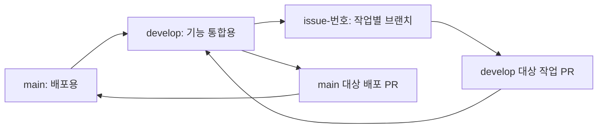

# 협업 규칙

사용자가 정한 브랜치, 이슈, 커밋, PR 규칙을 따른다.

## 브랜치 흐름

- 기본 브랜치와 배포 기준은 `main`이다.
- 기능 변경은 `develop`에서 만든 작업별 브랜치에서 진행한다.
- 기능 브랜치의 실제 이름은 `issue-18`처럼 `issue-번호`로 한다. `feature`는 브랜치의 역할이며, `feature/`나 `codex/` 접두사는 붙이지 않는다.
- 이슈 하나와 작업 브랜치 하나, 작업 PR 하나를 대응시킨다.
- 서로 의존하는 작업은 선행 작업이 develop에 병합된 뒤 최신 develop에서 시작한다. 의존성은 이슈의 기타 항목에 적는다.
- main이나 develop에 작업 커밋을 직접 푸시하지 않는다. 초기 develop 생성은 main의 기존 커밋을 가리키게 한다.
- 커밋·푸시 권한과 PR 병합·운영 배포 권한은 구분한다. 별도 지시 없이 병합하거나 배포하지 않는다.
- 이미 작성한 미커밋 변경을 분리할 때는 먼저 백업하고, 파일뿐 아니라 같은 파일 안의 기능별 변경도 확인한다. 완료 이력이나 테스트 결과를 소급해서 꾸미지 않는다.
- 이름은 사용자가 제시한 Github-flow 전략을 따르되, 이 저장소는 develop 통합 브랜치를 추가한 형태로 운영한다.

## 작업 순서

1. 기존 이슈와 중복되는지 확인한다.
2. 작업 목적, 상세 목록, 완료 조건, 기타 사항을 적어 이슈를 만든다.
3. 발급된 실제 이슈 번호로 `issue-번호` 브랜치를 만든다.
4. 해당 이슈 범위의 코드, 테스트, 필요한 설명만 수정한다.
5. 관련 테스트와 변경 내용을 확인한 뒤, 파일이나 변경 구간을 선별해서 add한다.
6. 아래 규칙으로 commit하고 해당 작업 브랜치만 push한다.
7. develop 대상 PR을 만들고 이슈 번호를 적는다.
8. CI 결과와 리뷰를 확인한다. 실패·미실행·외부 설정 대기 상태는 그대로 기록한다.
9. 병합은 별도 승인 후 진행한다. 배포는 develop에서 main으로 보내는 별도 PR로 구분한다.

## 이슈 제목

`분류: 작업내용` 형식으로 작성하고 같은 이름의 GitHub 라벨을 붙인다.

| 분류 | 예시 |
|---|---|
| Backend | Backend: 회원가입 기능 구현 |
| Fix | Fix: 로그인 유효성 검사 오류 수정 |
| Docx | Docx: 리드미 작성 |
| Build | Build: 의존성 추가 |
| Chore | Chore: 코드 포매팅 |
| Frontend | Frontend: 회원가입 UI 구현 |

`Docx`는 사용자가 정한 문서 작업 라벨 이름이다. 임의로 `Docs`로 바꾸지 않는다.
제목에 `[Backend]`처럼 대괄호를 추가하지 않고 위 예시를 따른다.

이슈 본문은 작업 요청 내용, 작업 상세 리스트, 기타 세 부분을 기본으로 한다.
작업 목적과 완료 조건도 구체적으로 적는다. 기타 사항이 없으면 반드시 `없음.`이라고 명시한다.
아직 확인하지 않은 완료 조건에는 체크하지 않는다.

## 커밋 제목

`type: 세부 작업내용` 형식을 사용한다.

| type | 용도 |
|---|---|
| feat | 새로운 기능 구현 |
| refactor | 기능 변화 없는 코드 수정 |
| fix | 오타, 빠진 설정 등 작은 실수 수정 |
| bugfix | 재현되는 오류 해결 |
| docs | 문서 수정 |
| build | 의존성, 환경변수, 빌드 설정 수정 |
| chore | 위에 해당하지 않는 기타 작업 |

예: `feat: 지원별 면접 일정 추가 기능 구현`

이슈 라벨과 커밋 type은 서로 다르다. 예를 들어 `Backend` 이슈에서 기능을 구현한 커밋은 `feat:`, 학습 문서를 보완한 커밋은 `docs:`를 쓴다.
자동 생성된 하나의 큰 커밋으로 서로 다른 이슈의 변경을 묶지 않는다.

## PR 본문과 이슈 종료

PR에는 작업 내용, 확인 사항, 관련 이슈를 작성한다.
확인 사항은 직접 수행한 항목만 체크한다. AI 리뷰가 CI·사람의 확인을 대신하지 않는다.

사용자 템플릿의 `Close to #번호` 표기를 유지한다. 다만 이는 GitHub 자동 종료 키워드가 아니다.
또한 기본 브랜치가 main일 때 develop 대상 PR에서는 `Closes #번호`를 써도 자동 종료되지 않는다.
따라서 작업 PR을 생성하거나 CI가 통과했다는 이유만으로 이슈를 닫지 않는다.
기본 흐름에서는 배포 PR에 해당하는 이슈의 `Closes #번호`를 각각 적고, main 병합 시 종료한다.
develop 병합 시점에 이슈를 닫는 운영 방식으로 바꾸려면 별도로 합의한다.

공식 근거: [GitHub PR과 이슈 연결](https://docs.github.com/en/issues/tracking-your-work-with-issues/using-issues/linking-a-pull-request-to-an-issue).

## 자동화 적용 원칙

- CI는 develop 대상 작업 PR과 main 대상 배포 PR을 모두 검증하도록 구성한다.
- Gemini 리뷰는 develop 대상 작업 PR에서도 실행되도록 이벤트 필터와 코드 내부의 대상 브랜치 검사 모두 맞춘다.
- Gemini Secret이 없거나 호출에 실패하면 리뷰 완료로 표시하지 않는다.
- 이 문서는 운영 규칙이다. 문서가 존재한다고 브랜치 보호, CI, Gemini 설정이 이미 적용된 것은 아니다.
