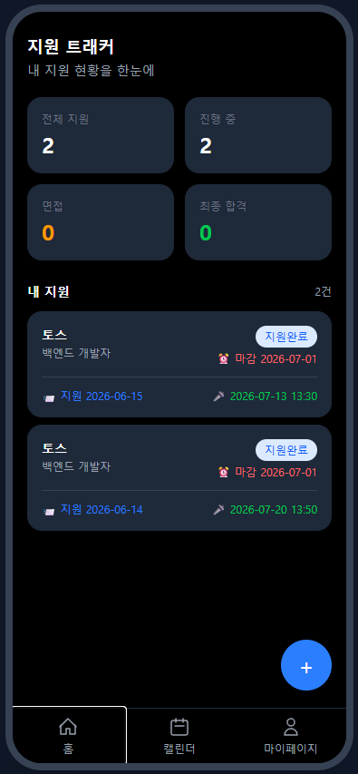
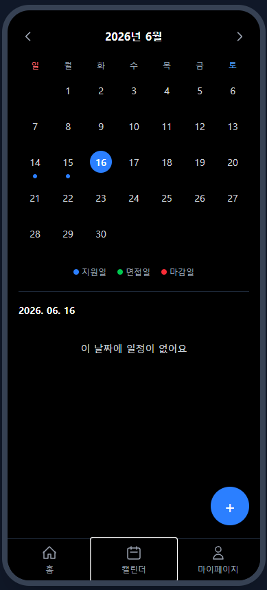
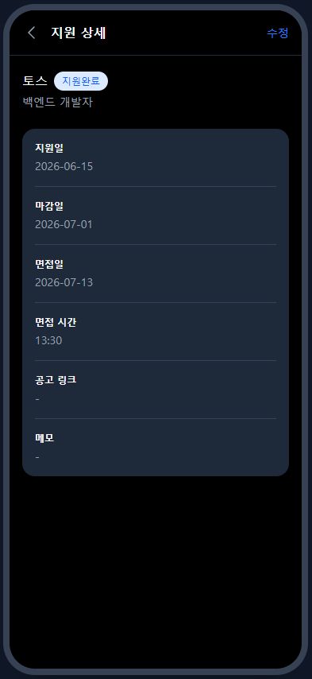
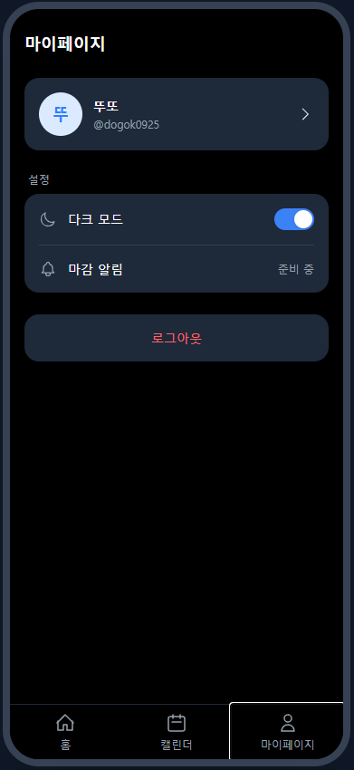
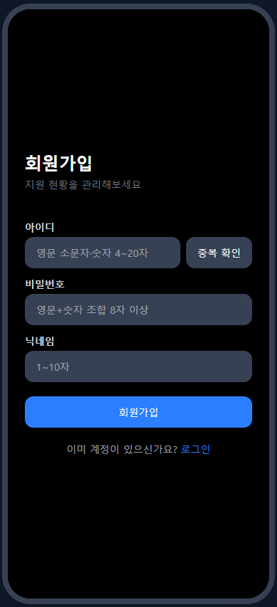
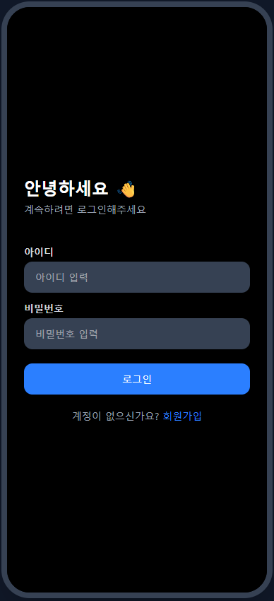
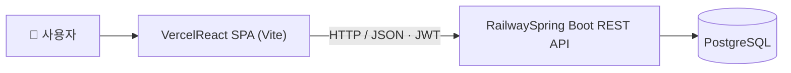
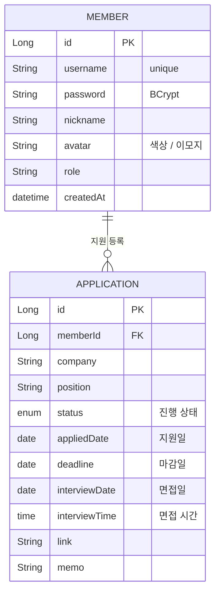

<!-- 이 README는 GitHub 레포 페이지에서 봐야 제대로 렌더링됩니다 (뱃지·표·다이어그램) -->
<div align="center">


### 📒 취준노트 — 구직 지원 현황 트래커


지원한 채용공고를 등록하고 **진행 상태**를 관리하는 풀스택 서비스입니다.

`지원예정 → 지원완료 → 서류합격 → 면접 → 최종합격 / 불합격`

**모바일 우선(Mobile-First)** 디자인 · 지원일·면접일·마감일을 **캘린더**에서 한눈에

### 🔗 [▶ 라이브 데모](https://job-application-tracker-sand-two.vercel.app) &nbsp;·&nbsp; [📖 API 문서 (Swagger)](https://job-application-tracker-production-f244.up.railway.app/swagger-ui/index.html)

## 📑 문서

🧪 [테스트 케이스](docs/TEST_CASES.md) · 테스트 검증 내역
&nbsp;

🔧 [트러블슈팅](TROUBLESHOOTING.md) · 개발 중 마주친 문제와 해결 과정

</div>

<br/>

## 📱 스크린샷

<div align="center">

| 홈 (대시보드) | 캘린더 | 지원 상세 |
|:--:|:--:|:--:|
|  |  |  |

| 마이페이지 | 회원가입 | 로그인 |
|:--:|:--:|:--:|
|  |  |  |

</div>

<br/>

## 🛠️ Tech Stack

<div align="center">


-6DB33F?style=for-the-badge&logo=springsecurity&logoColor=white)


</div>

<br/>

| 분류 | 기술 |
|------|------|
| **Backend** | Java 21 · Spring Boot 3.5 |
| **인증/인가** | Spring Security · JWT (BCrypt) |
| **ORM** | Spring Data JPA (Hibernate) |
| **Database** | PostgreSQL (운영) · MySQL (로컬) · H2 (테스트) |
| **API 문서** | Swagger (springdoc-openapi) |
| **Frontend** | React · Vite · Tailwind CSS · React Router · Axios |
| **배포** | Vercel (프론트) · Railway (백엔드 · PostgreSQL) |
| **CI** | GitHub Actions |
| **빌드 도구** | Gradle · pnpm |

<br/>

## 🏗️ 시스템 아키텍처



- React SPA(Vercel) ↔ Spring Boot REST API(Railway)가 HTTP(JSON)로 통신
- 모든 요청은 **JWT 토큰** 기반 인증 (Authorization 헤더)
- **환경 분리**: 로컬 개발은 MySQL · 운영 배포는 PostgreSQL · 테스트는 H2
- 모노레포 구조: `backend/` (Spring Boot) + `frontend/` (React)

<br/>

## 🗂️ ERD



**진행 상태 (ApplicationStatus)**

| 값 | 설명 |
|----|------|
| `TO_APPLY` | 지원예정 |
| `APPLIED` | 지원완료 |
| `DOC_PASSED` | 서류합격 |
| `INTERVIEW` | 면접 |
| `ACCEPTED` | 최종합격 |
| `REJECTED` | 불합격 |

<br/>

## 📌 API 목록

<details open>
<summary><b>🔐 인증 / 회원 (Member)</b></summary>

<br/>

| Method | URL | 설명 | 인증 |
|--------|-----|------|:--:|
| `POST` | `/api/v1/members/join` | 회원가입 | ❌ |
| `POST` | `/api/v1/members/login` | 로그인 (JWT 발급) | ❌ |
| `GET` | `/api/v1/members/check-username` | 아이디 중복 확인 | ❌ |
| `GET` | `/api/v1/members/me` | 내 정보 조회 | ✅ |
| `PATCH` | `/api/v1/members/me/nickname` | 닉네임 수정 | ✅ |
| `PATCH` | `/api/v1/members/me/avatar` | 아바타 수정 | ✅ |
| `PATCH` | `/api/v1/members/me/password` | 비밀번호 변경 | ✅ |
| `DELETE` | `/api/v1/members/me` | 회원 탈퇴 | ✅ |

</details>

<details>
<summary><b>📋 지원 현황 (Application)</b></summary>

<br/>

> 모두 JWT 필요 · 본인 지원만 접근 가능

| Method | URL | 설명 |
|--------|-----|------|
| `GET` | `/api/v1/applications` | 내 지원 목록 |
| `GET` | `/api/v1/applications/{id}` | 단건 조회 |
| `POST` | `/api/v1/applications` | 지원 등록 |
| `PUT` | `/api/v1/applications/{id}` | 수정 |
| `PATCH` | `/api/v1/applications/{id}/status` | 상태 변경 |
| `DELETE` | `/api/v1/applications/{id}` | 삭제 |
| `GET` | `/api/v1/applications/stats` | 상태별 통계 |

</details>

<br/>

## ✨ 주요 기능

| # | 기능 | 설명 |
|:-:|------|------|
| 1️⃣ | **JWT 인증** | 토큰 기반 로그인 · BCrypt 비밀번호 암호화 · 아이디 중복 확인 · 입력 유효성 검사 |
| 2️⃣ | **지원 현황 관리** | 등록·조회·수정·삭제 + 진행 상태(지원예정→…→합격/불합격) 관리 |
| 3️⃣ | **소유권 기반 인가** | 본인의 지원만 조회·수정·삭제 가능 (403/404 분기) |
| 4️⃣ | **필터·정렬·검색** | 상태별 필터 · 지원일/마감일/면접일 정렬 · 회사명 검색 |
| 5️⃣ | **캘린더** | 지원일·면접일·마감일을 월별 캘린더에 색상 점으로 표시 · 날짜별 일정 조회 |
| 6️⃣ | **통계 대시보드** | 전체·진행 중·면접·최종합격 개수 집계 |
| 7️⃣ | **인앱 알림** | 면접·마감 D-day 임박 일정 알림 |
| 8️⃣ | **계정 관리** | 닉네임 수정 · 아바타(색상/이모지) 선택 · 비밀번호 변경 · 회원 탈퇴 |
| 9️⃣ | **다크 모드** | 라이트/다크 테마 토글 (설정 유지) |

> 🚧 **개발 예정** — 채용정보 API 연동(공고 검색 후 원클릭 등록) · 푸시 알림 · 플레이스토어 출시

<br/>

## 📁 프로젝트 구조
job-application-tracker/

├── backend/                         # Spring Boot REST API

│   └── src/main/java/com/bin/jobtracker/

│       ├── config/                  # Security · CORS · Swagger 설정

│       ├── controller/              # REST 컨트롤러

│       ├── dto/                     # 요청/응답 DTO

│       ├── entity/                  # JPA 엔티티

│       ├── enums/                   # 상태·출처 enum

│       ├── exception/               # 커스텀 예외 · 핸들러

│       ├── repository/              # JPA 레포지토리

│       ├── security/                # JWT 필터 · 토큰 provider

│       └── service/                 # 비즈니스 로직

│

└── frontend/                        # React SPA

└── src/

├── api/                     # axios 클라이언트

├── store/                   # 토큰 관리

├── components/layout/       # 레이아웃 · 탭바 · 폰 프레임

├── utils/                   # 알림 등 유틸

└── pages/                   # 화면 (홈·캘린더·지원·마이페이지 등)

<br/>

## ⚙️ 로컬 실행

<details open>
<summary><b>1. 백엔드 (Spring Boot)</b></summary>

<br/>

```bash
cd backend
./gradlew bootRun
```

서버      : http://localhost:8080

Swagger   : http://localhost:8080/swagger-ui/index.html

> 로컬은 MySQL을 사용합니다. `jobtracker` 데이터베이스를 생성한 뒤,
> JWT 시크릿과 DB 비밀번호를 `application-secret.yml`(gitignore 처리)에 설정합니다.

</details>

<details>
<summary><b>2. 프론트엔드 (React)</b></summary>

<br/>

```bash
cd frontend
pnpm install
pnpm dev
```
http://localhost:5173

> 백엔드 주소는 `VITE_API_URL` 환경변수로 주입합니다. (미설정 시 localhost:8080)

</details>

<br/>

## ✅ 테스트 & CI

- 단위 · 통합 테스트 (JUnit 5 · Mockito · MockMvc)
- **GitHub Actions**: `push` 시 테스트 자동 실행
- 버그는 **GitHub Issues**로 트래킹

<br/>

## 🌿 브랜치 전략
feat/*  ─►  main

| 브랜치 | 설명 |
|--------|------|
| `main` | 배포 가능한 안정 브랜치 |
| `feat/*` | 기능 개발 브랜치 |

<br/>

<div align="center">


</div>