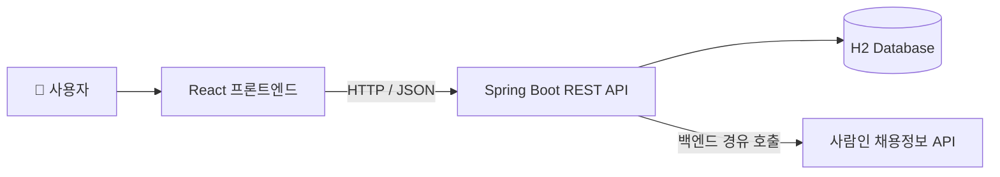
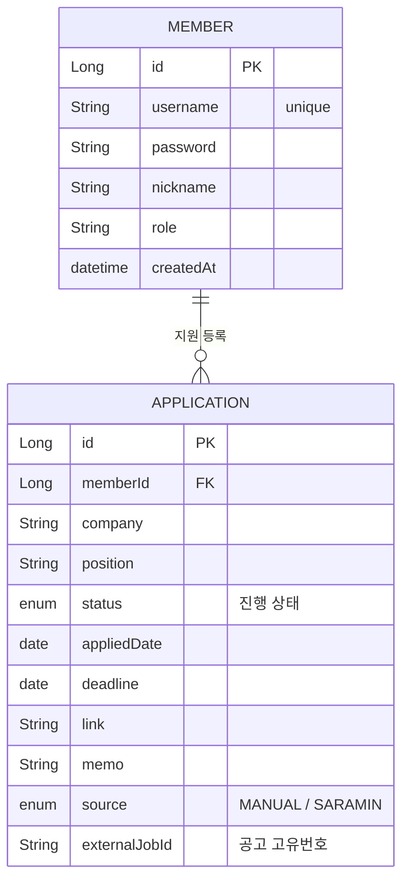

<!-- 이 README는 GitHub 레포 페이지에서 봐야 제대로 렌더링됩니다 (뱃지·표·다이어그램) -->
<!-- HEADER -->
<div align="center">


### 🗂️ 구직 지원 현황 트래커


지원한 채용공고를 등록하고 **진행 상태(지원 → 서류 → 면접 → 합격/탈락)**를 관리하는 풀스택 서비스입니다.
**사람인 채용정보 API**로 실제 공고를 검색해 바로 트래커에 등록할 수 있습니다.

<br/>

<!-- TODO: 배포 후 아래 링크 교체 -->
[](#)
[](#)

</div>

<br/>

## 🛠️ Tech Stack

<div align="center">


-6DB33F?style=for-the-badge&logo=springsecurity&logoColor=white)


</div>

<br/>

| 분류 | 기술 |
|------|------|
| **Language** | Java 21 |
| **Framework** | Spring Boot 3.5 |
| **인증/인가** | Spring Security · JWT |
| **ORM** | Spring Data JPA (Hibernate) |
| **Database** | H2 <!-- (운영 전환 시 MySQL) --> |
| **외부 API** | 사람인 채용정보 API |
| **API 문서** | Swagger (springdoc-openapi) |
| **CI** | GitHub Actions |
| **빌드 도구** | Gradle |
| **Frontend** | React |

<br/>

## 🏗️ 시스템 아키텍처



- React 프론트엔드 ↔ Spring Boot REST API 서버가 HTTP(JSON)로 통신
- 외부 **사람인 API는 프론트가 직접 호출하지 않고, 백엔드를 경유**해 호출 (API 키 보호 + 응답 정규화)
- 공고 검색은 `JobSearchProvider` 인터페이스로 추상화 → 공급자(사람인 등) 교체 가능

<br/>

## 🗂️ ERD



**진행 상태 (ApplicationStatus)**

| 값 | 설명 |
|----|------|
| `TO_APPLY` | 지원예정 |
| `APPLIED` | 지원완료 |
| `DOC_PASSED` | 서류합격 |
| `INTERVIEW` | 면접 |
| `ACCEPTED` | 최종합격 |
| `REJECTED` | 불합격 |

<br/>

## 📌 API 목록

> <!-- TODO: 구현하면서 요청/응답 예시 채우기 -->

<details open>
<summary><b>🔐 인증 (Member)</b></summary>

<br/>

| Method | URL | 설명 | 인증 |
|--------|-----|------|:--:|
| `POST` | `/api/v1/members/join` | 회원가입 | ❌ |
| `POST` | `/api/v1/members/login` | 로그인 (JWT 발급) | ❌ |

</details>

<details>
<summary><b>📋 지원 현황 (Application)</b></summary>

<br/>

> 모두 JWT 필요 · 본인 지원만 접근 가능

| Method | URL | 설명 |
|--------|-----|------|
| `GET` | `/api/v1/applications` | 내 지원 목록 (필터·정렬·페이징) |
| `GET` | `/api/v1/applications/{id}` | 단건 조회 |
| `POST` | `/api/v1/applications` | 지원 등록 |
| `PUT` | `/api/v1/applications/{id}` | 수정 |
| `PATCH` | `/api/v1/applications/{id}/status` | 상태 변경 |
| `DELETE` | `/api/v1/applications/{id}` | 삭제 |
| `GET` | `/api/v1/applications/stats` | 상태별 통계 |

</details>

<details>
<summary><b>🔎 공고 검색 (Job)</b></summary>

<br/>

| Method | URL | 설명 |
|--------|-----|------|
| `GET` | `/api/v1/jobs/search` | 사람인 API로 공고 검색 (백엔드 경유) |

</details>

<br/>

## ✨ 주요 기능

| # | 기능 | 설명 |
|:-:|------|------|
| 1️⃣ | **JWT 인증** | 액세스 토큰 기반 로그인 / 비밀번호 암호화(BCrypt) |
| 2️⃣ | **지원 현황 관리** | 등록·조회·수정·삭제 + 상태(지원→서류→면접→합격/탈락) 변경 |
| 3️⃣ | **소유권 기반 인가** | 본인의 지원만 조회·수정·삭제 가능 |
| 4️⃣ | **사람인 API 연동** | 실제 공고 검색 후 원클릭 등록 · 공급자 교체 가능한 인터페이스 설계 |
| 5️⃣ | **통계 대시보드** | 상태별 지원 개수 집계 |

<!-- 확장 예정: 면접 D-day 표시 · 결과 예정일 확인 알림 · 이메일 리마인더 -->

<br/>

## 📁 프로젝트 구조

```
src/main/java/com/bin/jobtracker/
├── global/          # 공통 (BaseEntity, 예외, 설정)
├── member/          # 회원 (엔티티 · 인증/인가)
├── application/     # 지원 현황 (CRUD · 상태 관리)
└── job/             # 외부 채용공고 검색 (사람인 API 연동)
```
<!-- 진행하면서 controller/service/repository/dto 등으로 세분화 -->

<br/>

## ⚙️ 로컬 개발 환경 설정

<details>
<summary><b>1. 실행</b></summary>

<br/>

```bash
./gradlew bootRun
```

</details>

<details>
<summary><b>2. H2 콘솔 & Swagger 확인</b></summary>

<br/>

```
H2 콘솔   : http://localhost:8080/h2-console   (JDBC URL: jdbc:h2:mem:jobtracker)
Swagger   : http://localhost:8080/swagger-ui/index.html
```

</details>

<details>
<summary><b>3. 사람인 API 키 설정</b></summary>

<br/>

<!-- TODO: 발급받은 키 적용 방법 작성 -->
`application-secret.yml`(또는 환경변수)에 사람인 access-key를 설정합니다. (키 파일은 `.gitignore` 처리)

</details>

<br/>

## ✅ 테스트 & CI

- 단위 · 통합 테스트 (JUnit · MockMvc)
- **GitHub Actions**: `push`/`PR` 시 테스트 자동 실행
- 버그는 **GitHub Issues**로 트래킹

<!-- TODO: 테스트 커버리지 / CI 배지 추가 -->

<br/>

## 🌿 브랜치 전략

```
feat/*  ─►  main
```

| 브랜치 | 설명 |
|--------|------|
| `main` | 배포 가능한 안정 브랜치 |
| `feat/*` | 기능 개발 브랜치 (작업 후 PR로 머지) |

<br/>

<!-- FOOTER -->
<div align="center">


</div>