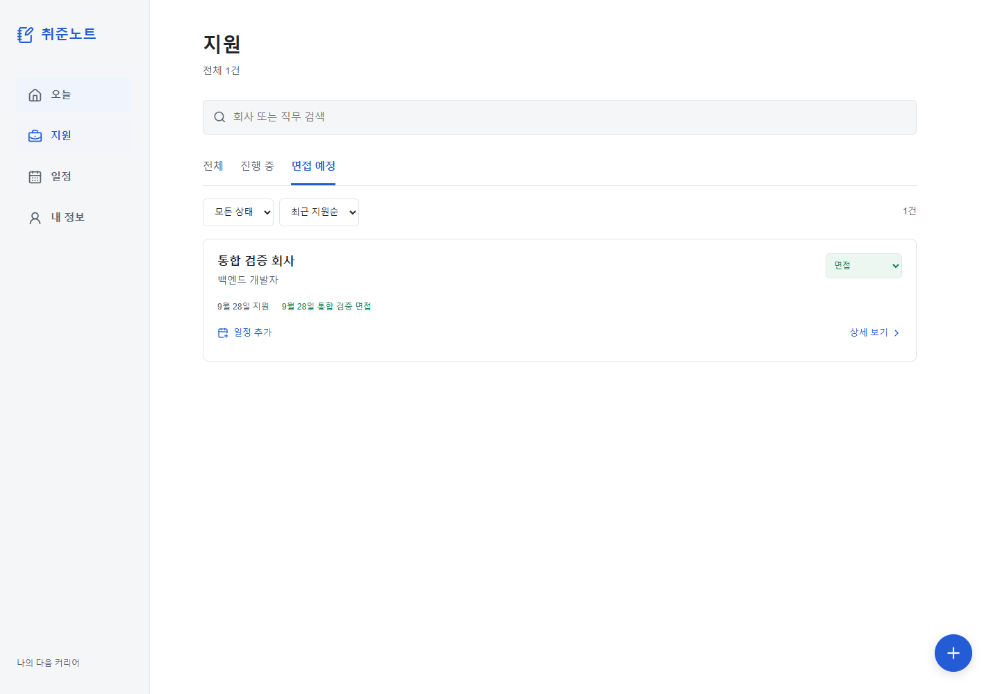
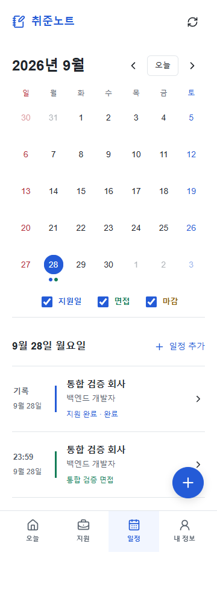
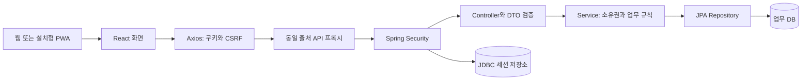
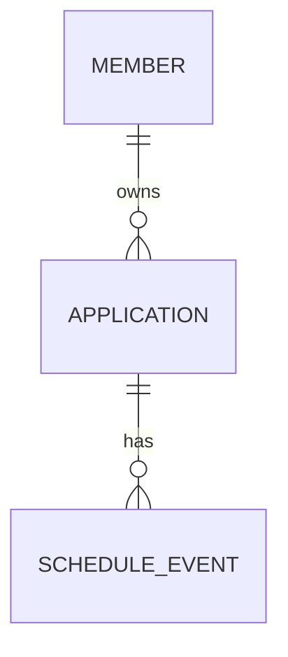
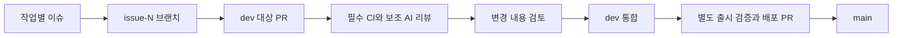

# 취준노트

지원 기록, 채용 진행 상태, 면접·마감 일정을 관리하는 모바일 우선 웹/PWA 프로젝트입니다.


> **2026-10-04 현재 `dev` 기준입니다.** 핵심 기능·세션 인증·PWA·CI·Gemini 실제 리뷰 연결을 구현하고 검증했습니다. 운영 환경으로의 이번 버전 전환, Web Push, 원스토어 출시는 아직 완료하지 않았습니다.
>
> 배포는 예산 결정 전 보류합니다. Railway 통합을 우선 고려하고 이후 EC2에서 AWS 운영을 직접 학습하려는 방향입니다. 환경 생성·결제·이전 일정은 아직 확정하지 않았습니다.

## 현재 화면

| 지원 목록 | 월간 캘린더 |
|---|---|
|  |  |

위 이미지는 개발 버전 QA 기록입니다. [기존 라이브 데모](https://job-application-tracker-sand-two.vercel.app)와 [기존 배포 API 문서](https://job-application-tracker-production-f244.up.railway.app/swagger-ui/index.html)는 이전 배포 기준으로, 현재 개발 코드의 화면·인증·API와 다를 수 있습니다.

## 주요 기능

| 기능 | 현재 구현 |
|---|---|
| 오늘 | 오늘·다가오는 일정, 진행 중·면접 예정 지원 수, 카드에서 필터 목록으로 이동 |
| 지원 관리 | 회사·직무·지원일·메모·공고 주소 등록/수정/삭제, 상태 변경 |
| 검색·필터 | 회사/직무 검색, 상태·진행 중·면접 예정 필터, 최근 지원순·회사명순 정렬, URL에 조건 보관 |
| 복수 일정 | 지원별 여러 면접·마감 등록/수정/삭제, 예정·완료·취소, 이전 단일 날짜의 호환 표시와 변환 |
| 월간 캘린더 | 이전/다음/오늘 이동, 날짜별 일정, 지원일·면접·마감 표시 선택. 지원일은 기본 숨김 |
| 인증 | JDBC 세션 + HttpOnly 쿠키, 로그인 시 세션 ID 교체, CSRF 검사 |
| 계정 관리 | 닉네임·비밀번호 변경, 현재/전체 로그아웃, 현재 비밀번호 재확인 후 탈퇴 |
| 화면 | 모바일 하단 탐색·데스크톱 좌측 탐색, 라이트/다크 모드 |
| PWA | manifest·설치 아이콘·서비스 워커·업데이트 안내, 정적 자산 캐시, API NetworkOnly |
| 입력 보호 | 작성/저장 중 업데이트 보류, 취소 확인, 오프라인 저장 실패 후 입력 유지, 재연결 시 쓰기 자동 재전송 없음 |
| 연결 복구 | 일시적인 세션 재확인 실패 시 폼 유지·저장 제한·재확인 제공. 401·계정 변경 시 이전 계정 화면 제거 |
| 인증 화면 전환 | 로그인·가입 간 오류·입력값 분리, 떠난 화면의 진행 중 요청 취소 및 늦은 응답 무시 |
| 조회 일관성 | 여러 목록 조회가 겹쳐도 최신 요청의 성공·오류·로딩만 반영 |

지원 상태: `TO_APPLY` → `APPLIED` → `DOC_PASSED` → `INTERVIEW` → `ACCEPTED` / `REJECTED`. 일반적인 흐름을 표현하며 모든 상태 이동을 강제하는 상태 머신은 아닙니다.

**집계 기준:** 진행 중은 지원 완료·서류 합격·면접입니다. 면접 예정은 그중 미래의 예정 면접을 하나 이상 가진 **지원 건수**이며, 한 지원의 여러 면접을 중복 집계하지 않습니다.

아바타 변경 API는 유지하지만 새 UI의 아바타 편집과 별도 인앱 알림 목록은 이식하지 않았습니다. 일정 표시를 Web Push 구현으로 간주하지 않습니다.

## 기술과 선택 이유

| 영역 | 사용 기술 | 선택 이유·한계 |
|---|---|---|
| 서버 | Java 21, Spring Boot 3.5, Spring Security | 기존 기반 유지, 검증·인증·트랜잭션을 일관되게 처리 |
| 데이터 | JPA/Hibernate, PostgreSQL, Flyway | 객체와 관계형 데이터 연결, 편집 버전 충돌 처리, SQL 변경 이력 관리 |
| 세션 | Spring Session JDBC, BCrypt | 기존 DB로 로그인 상태·폐기를 관리. 비밀번호는 해시 저장 |
| 요청 방어 | Bucket4j, Caffeine | IP·계정·전체 인증 예산 제한과 메모리 상한. 단일 서버 기준 |
| 프론트 | React, JavaScript, React Router, Axios | 기존 기반 유지, URL 필터와 공통 쿠키·CSRF 통신 규칙 |
| UI | CSS custom properties, Lucide, date-fns | 테마·아이콘 통일, 날짜 계산을 라이브러리에 위임 |
| PWA | Vite, vite-plugin-pwa, Workbox | 설치·정적 캐시·버전 교체 기반. 개인정보 API 캐시는 사용하지 않음 |
| 테스트 | JUnit, Mockito, MockMvc, Testcontainers, Node test, Playwright | 로직·HTTP·실제 DB·브라우저를 나눠 검증 |
| 협업 | GitHub Actions, Gemini API | CI 반복 검증과 보조 리뷰. AI가 승인·병합을 결정하지 않음 |
| 도구 | Gradle, pnpm, sharp | 서버·프론트 빌드와 PNG 설치 아이콘 재생성 |

현재 새 UI는 Tailwind를 사용하지 않고 JWT/localStorage 인증도 사용하지 않습니다. MySQL은 기존 개발 설정에 남아 있고 H2는 테스트·로컬 demo용입니다. PostgreSQL 테스트 성공과 기존 운영 DB 이전 성공은 별개입니다.

선택의 근거와 대안: [핵심 흐름·PWA ADR](docs/adr/0001-workflow-and-pwa.md), [세션 인증 ADR](docs/adr/0002-jdbc-session-auth.md), [요청 제한·마이그레이션 ADR](docs/adr/0003-release-foundation.md).

## 구조와 데이터 흐름


```mermaid
flowchart LR
    U[웹 또는 설치형 PWA] --> F[React 화면]
    F --> A[Axios: 쿠키와 CSRF]
    A --> P[동일 출처 API 프록시]
    P --> S[Spring Security]
    S --> C[Controller와 DTO 검증]
    C --> B[Service: 소유권과 업무 규칙]
    B --> J[JPA Repository]
    J --> D[(업무 DB)]
    S --> T[(JDBC 세션 저장소)]
```

개발 프록시는 Vite 설정에 있습니다. 실제 배포에서는 별도 HTTPS·쿠키·프록시 검증이 필요하며 이 그림이 운영 배포 완료를 뜻하지 않습니다.


```mermaid
erDiagram
    MEMBER ||--o{ APPLICATION : owns
    APPLICATION ||--o{ SCHEDULE_EVENT : has
```

회원 한 명이 여러 지원을 소유하고 지원 하나에 여러 일정을 연결합니다. 지원 전체 수정과 일정 수정은 `version`으로 오래된 편집을 거부합니다. 회원의 `authVersion`은 전체 로그아웃·비밀번호 변경 후 오래된 세션을 거부하는 별도 값입니다.

```text
backend/src/main/java/com/bin/jobtracker/
  controller/  dto/  service/  repository/  entity/  security/  config/  exception/
backend/src/main/resources/db/migration/  # Flyway SQL
backend/src/test/                        # 서버와 DB 테스트
frontend/src/api/                        # 공통 쿠키·CSRF 클라이언트
frontend/src/store/                      # 로그인 상태
frontend/src/domain/                     # 집계·필터·PWA 보호 규칙
frontend/src/workspace/                  # 화면·편집·설치·업데이트
frontend/tests/                         # Playwright
.github/workflows/                      # CI와 Gemini
scripts/                                # 로컬 실행·검증
```

## 보안과 한계

- 세션 쿠키: HttpOnly, SameSite=Lax, 운영 프로필 Secure. 로그인 시 세션 ID 교체.
- CSRF: 로그인·회원가입·로그아웃을 포함한 변경 요청에 적용. 변경 직전 토큰을 조회하며 쓰기를 자동 재시도하지 않습니다.
- 서버에서 회원 소유권·일정 소속·입력 조건을 검사합니다. 비밀번호 변경·탈퇴 시 현재 비밀번호를 재확인합니다.
- API는 `private, no-store`, 서비스 워커는 API NetworkOnly입니다. 비밀번호·초안을 localStorage에 저장하지 않습니다.
- 인증 관련 요청에 IP·계정·전체 예산을 적용하고 429/Retry-After를 반환합니다. API 본문은 기본 32KiB 제한입니다.
- 일시적 세션 확인 실패 중에는 입력을 보존하되 저장을 제한합니다. UI 보호이며 서버 인증·인가를 대체하지 않습니다.
- **남은 검증:** HTTPS·신뢰 프록시 IP·운영 DB 이전/복원·실기기. 다중 서버 공유 요청 제한, 강제 종료 후 초안 복구, 모든 내부 이동의 초안 보호는 제공하지 않습니다.

테스트 통과나 AI 리뷰의 무지적 결과는 보안 감사·운영 안전 보증이 아닙니다.

## API

기본 경로는 `/api/v1`입니다. 공개 회원가입·로그인에도 CSRF는 필요합니다.

| 메서드 | 회원 경로 | 역할 |
|---|---|---|
| GET | `/members/csrf` | CSRF 토큰 조회 |
| POST | `/members/join` | 회원가입 |
| GET | `/members/check-username` | 아이디 중복 확인 |
| POST | `/members/login` | 세션 로그인 |
| POST | `/members/logout` | 현재 세션 로그아웃 |
| POST | `/members/logout-all` | 모든 세션 폐기 |
| GET | `/members/me` | 내 정보 |
| PATCH | `/members/me/nickname` | 닉네임 변경 |
| PATCH | `/members/me/avatar` | 아바타 변경 API |
| PATCH | `/members/me/password` | 비밀번호 변경 및 세션 폐기 |
| DELETE | `/members/me` | 현재 비밀번호 재확인 후 탈퇴 |

지원·일정 경로는 모두 로그인과 서버 소유권 검사를 거칩니다.

| 메서드 | 경로 | 역할 |
|---|---|---|
| GET / POST | `/applications` | 목록 / 등록 |
| GET / PUT / DELETE | `/applications/{id}` | 단건 / 전체 편집 / 삭제 |
| GET | `/applications/stats` | 상태별 통계 API |
| PATCH | `/applications/{id}/status` | 상태·필요한 지원일 변경 |
| POST | `/applications/{id}/schedules` | 일정 추가 |
| PUT / DELETE | `/applications/{id}/schedules/{scheduleId}` | 일정 편집 / 삭제 |
| PUT / DELETE | `/applications/{id}/legacy-schedules/{type}` | 이전 단일 날짜의 변환 / 삭제 |

## 로컬 실행

필요 도구: JDK 21, Node.js 24, pnpm 11.19.0, Docker Desktop(Linux 엔진). 기본 로컬 DB는 영구 PostgreSQL입니다.

Windows PowerShell에서 JDK 21의 `JAVA_HOME` 또는 `java` 경로를 설정한 후:

```powershell
cd backend
.\gradlew.bat test bootJar
cd ..\frontend
pnpm install --frozen-lockfile
cd ..
.\scripts\Start-Local.ps1
```

- 화면: `http://127.0.0.1:5173`, API: `http://127.0.0.1:8080/api/v1`.
- 실행기는 `postgres` 프로필과 `jobtracker-postgres` 컨테이너를 사용합니다. `jobtracker-postgres-data` 볼륨에 저장하므로 재시작 후에도 기록이 남습니다. 운영 배포가 아닌 로컬 개발 DB입니다.
- 다른 JDK 경로는 `-JavaHome`, 사용 중인 포트는 `-BackendPort`·`-FrontendPort`로 지정합니다.
- 비밀번호는 첫 실행 시 생성해 `.local/postgres`에만 보관하고, 앱에는 관리자 권한 없는 `jobtracker` 계정을 사용합니다. 기존 MySQL/H2 데이터는 자동 이전하지 않습니다.
- `./scripts/Stop-Local.ps1`은 앱만 종료합니다. DB 종료는 `docker stop jobtracker-postgres`이며 볼륨은 유지됩니다. `down -v`로 데이터를 삭제하지 않도록 주의합니다.
- H2 demo는 `-Database demo`로 명시합니다. PID·로그·비밀번호 등 로컬 파일은 커밋하지 않습니다. [영구 DB 실행·보존·백업 안내](docs/LOCAL_POSTGRESQL.md).
- 로컬 백업: PowerShell 7에서 `./scripts/Backup-Postgres.ps1`. 세션을 제외한 덤프를 별도 임시 DB에 복원해 검증합니다. [안전 장치·결과·한계](docs/POSTGRES_BACKUP.md). 외부 보관과 정기 예약은 아직 설정하지 않았습니다.
- 기본 API 주소는 `/api/v1`입니다. `VITE_API_URL`은 공개 프론트 설정이므로 비밀값을 넣지 않습니다.
- PWA 확인은 `frontend`에서 `pnpm build` 후 `pnpm preview`로 진행합니다. 개발 서버와 배포 산출물 검증은 구분합니다.

## 테스트와 자동 리뷰

| 필수 CI | 검증 내용 |
|---|---|
| Frontend and PWA | lint, Node 테스트 16개, 빌드·PWA 검사, Playwright 17개 |
| Backend tests and build | H2/단위·통합 테스트 55개와 bootJar |
| PostgreSQL migrations and sessions | Testcontainers 이전·복원 6개 + 세션 11개, 실제 백업/격리 복원 스크립트 검증 |
| Workflow tests | Gemini 모의 검증 14개 + 영구 DB 구성 2개 + 부하 설정 안전 검사 2개 |

숫자는 이 README 기준 개발 버전의 검증 범위입니다. 브라우저 테스트의 API fixture는 실제 백엔드 검증을 대신하지 않습니다.

로그인·가입 전환 시 오류/입력 초기화와 지연 응답 처리, 캘린더의 월 이동·선택 날짜·일정 추가 기본값 일치도 브라우저 회귀 테스트로 검증합니다. 월 이동은 해당 월의 1일을 선택하며 윤년·연도 경계·오늘 복귀를 포함합니다. HTTP k6 부하 테스트는 이런 화면 동작이나 전체 보안 검증을 대신하지 않습니다.

```powershell
# frontend
pnpm lint
pnpm test
pnpm build
pnpm check:pwa
pnpm exec playwright install chromium
pnpm test:e2e

# backend, Docker 실행 필요
.\gradlew.bat postgresTest

# .github
npm ci --ignore-scripts
npm test
```

Gemini는 같은 저장소의 열린 일반 PR(`dev`/`main` 대상)의 변경된 소스만 검토합니다. fork·draft·닫힌 PR·검토 대상 소스가 없는 문서 PR은 건너뜁니다.

- 키는 Actions Repository secret `GEMINI_API_KEY`, 모델은 Repository variable `GEMINI_REVIEW_MODEL`을 사용합니다.
- 기본 모델은 `gemini-3.8-flash`이며 실제 API 호출과 한국어 COMMENT 리뷰를 확인했습니다.
- 선택된 diff를 Google로 전송합니다. 최대 60개 파일·120,000 diff 문자, 한 실행당 API 요청 1회, 최대 8개 줄별 의견으로 제한합니다.
- 키와 오류 응답 본문은 출력하지 않습니다. 이미 리뷰한 같은 커밋은 중복 호출하지 않습니다.
- 자동 승인·병합하지 않으며, 사용량·과금은 Google 계정에서 별도로 확인해야 합니다.
- [실제 리뷰 연결 PR #27](https://github.com/Bin-925/job-application-tracker/pull/27), [입력 보호 보강 PR #30](https://github.com/Bin-925/job-application-tracker/pull/30).

## 로컬 부하 테스트

k6로 실제 PostgreSQL API의 기본 여정·계정/권한·요청 제한·일반 부하·급증·단기 지속·대량 기록·동시 수정 8개 프로필을 검증합니다. Docker Desktop과 JDK 21, k6를 준비한 후 저장소 루트에서 `./scripts/Run-LoadTests.ps1`로 실행합니다.

`jobtracker-load-postgres`는 기존 DB와 분리된 임시 컨테이너이며 테스트 후 중지됩니다. 최대 30 VU, 계정당 최대 500개 지원을 사용합니다. 로컬 측정은 운영 수용량 보장이 아닙니다. [실행 방법·안전 장치·검증 한계](docs/LOAD_TESTING.md)를 먼저 확인하세요.

[2026-10-03 측정 결과](docs/LOAD_TEST_RESULTS_2026-10-03.md): 최종 8개 프로필 통과, 준비 요청 포함 총 40,188건, 예상하지 않은 응답 0건. 운영 부하나 장시간 안정성 검증 완료를 뜻하지 않습니다.

## 협업 흐름


```mermaid
flowchart LR
    I[작업별 이슈] --> B[issue-N 브랜치]
    B --> P[dev 대상 PR]
    P --> C[필수 CI와 보조 AI 리뷰]
    C --> R[변경 내용 검토]
    R --> D[dev 통합]
    D --> G[별도 출시 검증과 배포 PR]
    G --> M[main]
```

`main`은 배포용, `dev`는 통합용, `issue-번호`는 작업용입니다. 두 장기 브랜치는 PR·필수 CI·대화 해결을 요구하고 강제 푸시·삭제를 금지합니다. 개인 저장소에서 작성자 자신의 Approve를 독립 승인으로 표시하지 않습니다.

템플릿은 [CONTRIBUTING.md](CONTRIBUTING.md)를 따릅니다. 필수 CI는 배포 작업이 아닙니다. 연결된 Vercel Preview 등의 배포 결과도 CI 테스트와 구분합니다.

## 남은 단계

1. **예산·배포 방식 결정:** Railway 통합과 향후 EC2 실습을 검토하되 현재 실행은 보류합니다. AWS 직접 활용과 운영 학습도 기술 선택의 이유로 기록합니다.
2. **[#20 HTTPS 스테이징](https://github.com/Bin-925/job-application-tracker/issues/20):** 동일 출처 API, Secure 쿠키, 신뢰 프록시, 운영 복제 데이터 이전·복원 검증.
3. **[#21 Web Push](https://github.com/Bin-925/job-application-tracker/issues/21):** 동의·구독·발송·재시도·일정 변경/취소·기기별 수명주기.
4. **[#22 원스토어 준비](https://github.com/Bin-925/job-application-tracker/issues/22):** 패키징 적합성, 도메인 검증, 서명, 개인정보 문서, Galaxy S25 Ultra, 심사 준비.
5. **운영 게이트:** 계정 복구, 오류·비용 관측, 백업/복원, 개인정보 정책, 출시·롤백 절차.

EC2·Redis·TypeScript 등을 이름만 추가하기 위해 도입하지 않습니다. 제품 요구뿐 아니라 명확한 학습 목표도 이유가 되며 비용·완료 조건·운영 책임을 함께 기록합니다.

## 관련 문서

- [문서 안내](docs/README.md) — 어떤 문서가 최신이고 어떤 문서가 시점 기록인지
- [기획 PRD](PRD.md) · [협업 규칙](CONTRIBUTING.md) · [AI 작업 규칙](AGENTS.md)
- [세션 전환과 배포 전 확인](docs/SESSION_AUTH_MIGRATION.md) · [PostgreSQL 이전 절차](docs/POSTGRES_MIGRATION.md)
- [PWA 업데이트 보호](docs/PWA_UPDATE_PROTECTION.md) · [브라우저 CI 실패 분석](docs/PWA_CI_REGRESSION.md)
- [CI와 Gemini 설정](docs/CI_AND_AI_REVIEW.md) · [배포 방식 비교](docs/DEPLOYMENT_COMPARISON.md)
- [이전 dev 통합 보고서](docs/DEV_INTEGRATION_2026-09-28.md) · [AI 협업 기록](AI_COLLABORATION.md)

각 보고서는 작성 시점의 기록입니다. 현재 기능·보류 항목은 이 README를 기준으로 보고 구체적인 코드·검증 근거는 연결된 파일과 PR에서 확인합니다.
