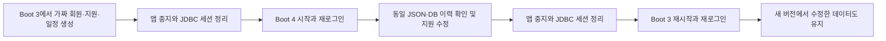

# Spring Boot 4 전환과 되돌리기

관련 이슈: #85. 기준일: 2026-10-09. 운영 배포를 실행했다는 문서가 아닙니다.

## 왜 지금 바꾸나

Boot 3.5 기반의 2026-10-08 점검에는 Spring MVC 보안 공지 2건이 남았습니다. 현재 사용하지 않는 기능에 대한 공지라는 이유로 숨기지 않고, 공개 패치를 제공하는 Framework 7.0.9 기반으로 옮깁니다. 단순히 가장 최신 버전을 사용하기 위한 전환은 아닙니다.

- 유지: Java 21, Gradle 8.14.5, Spring MVC, JPA, JDBC 세션, PostgreSQL, 기존 REST API.
- 대안: 기존 버전 유지와 노출 기능 제한, 상용 유지보수 패치, Boot 4 전환.
- 선택: 별도 유료 유지보수 없이 패치 경로를 확보하되, 가장 큰 위험인 JSON·세션·DB 호환성을 먼저 검증합니다.
- 비용: 패키지 이동과 테스트 라이브러리 변경, 재로그인 안내, 전환/롤백 검증이 필요합니다.
- 재검토: BOM이 보안 패치를 포함하면 수동 버전 고정을 제거할 수 있는지 다시 검사합니다.

## 바뀐 기술

| 항목 | 이전 | 이번 선택과 이유 |
|---|---|---|
| Spring Boot | 3.5.15 | 4.0.8: Framework 7.0.9와 Security 7 계열로 전환 |
| JSON | Jackson 2 | Jackson 3.1.7. `tools.jackson.databind` 사용, `use-jackson2-defaults: true`로 기존 API 기본값 유지 |
| 남은 Jackson 2 소비자 | 2.21.7 | 별도 `jackson-2-bom.version`으로 보안 하한 유지 |
| 웹 컨테이너 | Tomcat 10.1 | Servlet 6.1 기반 Tomcat 11.0.26 |
| 웹/세션/DB 초기화 | 기존 스타터·직접 의존성 | Boot 4의 webmvc, session-jdbc, flyway 스타터로 자동 설정 모듈 명시 |
| 테스트 | Boot 3 테스트 모듈 | webmvc-test, `MockitoSpyBean`, Testcontainers 2 모듈과 새 PostgreSQLContainer 패키지 |
| API 문서 | springdoc 2.8 | Boot 4.0과 호환되는 springdoc 3.0.3 |

처음 선택한 Boot 4.0.8 BOM에도 Jackson 3.1.5와 Tomcat 11.0.24의 공지가 남았습니다. 같은 minor 계열의 Jackson 3.1.7 및 Tomcat 11.0.26으로 보완한 뒤 감사를 다시 통과했습니다. PostgreSQL 등 BOM이 더 높은 안전 버전을 관리하는 과거 고정값은 제거해 다운그레이드를 피했습니다.

## 데이터와 로그인은 어떻게 되나



회원·지원·일정 테이블 변경은 없습니다. 적용된 Flyway V1~V7 SQL도 수정하지 않았습니다. Hibernate `validate`가 구조를 확인합니다.

반면 JDBC 세션에는 직렬화된 Spring Security 객체가 들어갑니다. 서로 다른 메이저 버전 간 세션 직렬화 호환성을 가정하지 않습니다. 전환과 롤백 시 모든 사용자를 로그아웃시키고 다시 로그인하도록 하는 **계획된 세션 정리**가 전제입니다. 비밀번호·회원·지원 데이터 삭제와는 다릅니다. 진행 중인 Google 인증 흐름도 다시 시작해야 합니다.

## 실행 전환 절차

아래는 향후 실제 환경 전환용 절차입니다. 이번 자동 검사는 전용 임시 DB에서만 수행했습니다.

1. 현재 버전·JAR 해시·설정과 DB 백업을 기록하고, 별도 DB로 복원이 가능한지 확인합니다.
2. 재로그인과 저장 중 작업 종료를 안내한 뒤 신규 요청을 차단하고 모든 구버전 프로세스를 중지합니다.
3. 작업 대상 DB의 이름·서버·사용자를 사람이 확인합니다. 업무 테이블은 수정하지 않습니다.
4. 해당 DB의 `spring_session` 행만 트랜잭션으로 삭제합니다. V3의 외래 키에 따라 세션 속성 행도 삭제됩니다. 새 앱과 이전 앱을 동시에 실행하지 않습니다.
5. 새 JAR을 시작하고 Flyway 검증·로그인·내 정보·지원 조회·일정 조회·수정 충돌 검사를 실행합니다.
6. 문제가 있으면 신규 요청을 차단하고 새 앱 중지 → 세션 정리 → 보관한 구버전 JAR 재시작 → 재로그인·데이터 검증 순서로 되돌립니다.

**중요:** 코드 롤백에 과거 DB 백업 복원을 자동으로 묶지 않습니다. 새 버전에서 사용자가 입력한 내용을 잃을 수 있기 때문입니다. 스키마가 바뀌지 않은 이번 전환은 현재 DB를 유지하고 JAR만 되돌리는 검증을 합니다. 운영 DB 대상으로 실행하는 자동 정리 스크립트는 추가하지 않았습니다.

## 재현 가능한 검사

`tests/upgrade/run.cjs`는 기준 JAR과 후보 JAR의 절대 경로를 받습니다. Java 21, Docker, frontend의 Playwright 의존성이 필요합니다.

```text
node tests/upgrade/run.cjs <기준-JAR-절대경로> <후보-JAR-절대경로>
```

- 기준 소스: `cab180b0aba3fc7c58a25f530eb5722b8e70304b` (Boot 3.5.15).
- 전용 PostgreSQL 17 tmpfs 컨테이너와 127.0.0.1 포트 15591/18591 사용. 기존 서비스가 포트를 사용하면 실패하고 멈춥니다.
- 매번 다른 Compose 프로젝트 이름과 임시 비밀번호를 사용하며 실제 DB 환경파일을 읽지 않습니다.
- 회원·지원·면접 생성 → 버전 전환 → 정확한 JSON 및 Flyway 체크섬 비교 → 변경 저장 → 오래된 version의 409 → 롤백 → 변경 보존을 확인합니다.
- 전환 전후의 기존 세션은 401이 되고, 재로그인은 성공해야 합니다.
- 기준 버전에서 실제 사용한 비밀번호 재설정 토큰과 만료 토큰이 전환·롤백 후에도 400으로 거절되는지 확인합니다. 비밀번호 해시와 `authVersion`도 유지되어야 합니다.
- 가짜 계정 삭제 후 업무 행 0개를 확인하고 자신의 컨테이너만 정리합니다.
- `.local/upgrade-results/<실행 ID>/result.json`에 JAR 해시·검사 단계·성공 여부를 기록합니다. 요청 본문·비밀번호·쿠키·토큰은 결과에 넣지 않습니다.

CI의 `Registration cold-start checks`에서 고정된 기준 커밋을 별도 경로에 체크아웃해 두 JAR을 빌드하고 같은 검사를 실행합니다. 구버전 JAR은 이 격리 검사에만 사용하며 배포하지 않습니다.

## 확인한 결과

| 검사 | 2026-10-09 결과 |
|---|---|
| H2/단위/통합 | 126개 통과, 실패·스킵 0 |
| 실제 PostgreSQL 통합 | 76개 통과, 실패·스킵 0 |
| 실행 JAR | 빌드 성공 |
| 전환·롤백 | 동일 JSON·V1~V7 체크섬·새 버전 쓰기 보존, 세션 폐기, 오래된 쓰기 거절 확인 |
| 의존성 | 프론트·자동화 감사 0건, 백엔드 런타임 130개 OSV 경고 0건 |
| 실제 가입 | 정상·백엔드/프론트 콜드 스타트·API/SMTP 지연·메일 실패 후 재시작 6개 조건 통과 |
| 백업 | 복원 데이터·소유권·시퀀스·제약·세션 제외·원본 불변, 손상/누락/세션 포함 백업 거절 확인 |
| 자동화 계약 | 워크플로 테스트 19개 통과 |

검증 후보 JAR SHA-256: `ee14851de7be206c195e02c5522e351b622d267917cb8a053824b7036b2e2c29`.
기준 JAR SHA-256: `73a818f64e091b5c42ef0b31ecec6ffc16c501bcb09465a0133790a2bd5c0b7c`.
빌드 환경에 따라 JAR 해시는 달라질 수 있습니다. CI는 각 실행의 실제 해시를 별도로 기록합니다.

백엔드 CI는 `scripts/Audit-Dependencies.ps1 -BackendOnly`로 실제 런타임 의존성을 OSV에 조회합니다. 공지 발견뿐 아니라 조회 실패·불완전 응답도 통과 처리하지 않습니다. 전체 로컬 감사는 옵션 없이 실행합니다. 외부 서비스 장애로 CI가 실패하면 원인을 확인한 후 재실행하며 검사를 임의로 건너뛰지 않습니다.

## 아직 증명하지 않은 것

- 운영 DB 이전, 실제 HTTPS 프록시·쿠키, Google 실계정과 외부 SMTP, 실기기 PWA, Web Push와 원스토어 출시.
- 모든 공격·입력 조합에 대한 무결함 보장. 의존성 공지 0건도 이를 보장하지 않습니다.
- #87의 최초 일시 가입 실패 원인. 재현 시도 성공을 원인 해결로 바꾸어 쓰지 않습니다.
- 서로 다른 프레임워크 버전 간 기존 JDBC 세션 유지. 이번 정책은 재로그인입니다.

## 공식 근거

- [Boot 4.0 요구 사항](https://docs.spring.io/spring-boot/4.0/system-requirements.html)
- [Boot 4.0 마이그레이션 가이드](https://github.com/spring-projects/spring-boot/wiki/Spring-Boot-4.0-Migration-Guide)
- [springdoc 호환표](https://springdoc.org/)
- [Tomcat 11 보안 공지](https://tomcat.apache.org/security-11.html)
- [CVE-2026-47890](https://spring.io/security/cve-2026-47890/), [CVE-2026-47884](https://spring.io/security/cve-2026-47884/)
