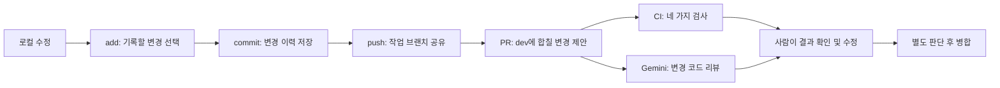

# CI와 Gemini PR 리뷰

## 왜 필요한가

로컬에서 한 번 실행되는 것과 다른 컴퓨터에서도 재현되는 것은 다르다. GitHub Actions는 변경할 때마다 같은 검사를 실행하고 결과를 PR에 남긴다. Gemini는 변경 내용에서 놓친 버그를 찾는 보조 리뷰어다. 테스트 성공이나 AI의 무지적 결과가 보안 보증은 아니다.

## CI 검사

| 작업 | 검사 내용 | 이유 |
|---|---|---|
| Workflow tests | YAML과 Gemini 리뷰 로직의 모의 테스트 | 자동화 자체의 잘못된 권한·댓글·API 호출 방지 |
| Frontend and PWA | lint, Node 테스트, Vite 빌드, PWA 산출물 및 Playwright 다중 탭·오프라인 검사 | 화면 코드와 배포 파일·업데이트 입력 보호 검증 |
| Backend tests and build | Java 21, Gradle 일반 테스트, bootJar | 기능·세션 보안·요청 제한과 실행 파일 검증 |
| PostgreSQL migrations and sessions | Testcontainers PostgreSQL 17, Flyway, JDBC 세션, pg_dump/restore | H2로 확인할 수 없는 실제 DB 동작 검증 |

`main`/`dev` push와 두 브랜치 대상 PR에서 실행한다. 작업 PR은 dev로, 배포 PR은 main으로 구분한다. 수동 실행도 가능하다. 실패한 백엔드 테스트 보고서는 Actions의 Artifacts에서 7일 동안 받을 수 있다. 운영 DB에 접속하지 않으며 배포도 수행하지 않는다.

## Gemini 설정

기존 개인용 Gemini Code Assist GitHub 앱은 2026-07-17 리뷰 제공이 종료되었다. 이 프로젝트는 대신 Gemini API를 GitHub Actions에서 호출한다. 따라서 댓글 작성자는 Gemini 앱이 아닌 `github-actions[bot]`으로 보인다.

1. Google AI Studio에서 Gemini API 키를 발급한다. 키를 코드·채팅·PR에 붙여 넣지 않는다.
2. GitHub 저장소의 Settings → Secrets and variables → Actions → New repository secret에서 이름을 `GEMINI_API_KEY`로 등록한다.
3. 해당 Google 프로젝트의 모델 접근 권한, 할당량, 결제 설정을 확인한다. API 사용 비용이 발생할 수 있다.
4. 실패한 Gemini 작업을 Re-run failed jobs로 다시 실행한다. 설정 파일이 main에 병합된 이후에는 Run workflow에서 PR 번호로 수동 실행할 수도 있다.

기본 모델은 `gemini-3.8-flash`다. Repository variable `GEMINI_REVIEW_MODEL`로 지원 모델을 변경할 수 있다. API 키가 없으면 명시적으로 실패하며, 리뷰한 것처럼 성공 처리하지 않는다.

## 권한과 데이터 흐름

- 읽기: GitHub의 PR 변경 코드. 쓰기: 해당 PR의 COMMENT 리뷰. 자동 승인·병합·배포하지 않는다.
- 같은 저장소의 열린 일반 PR만 자동 리뷰한다. fork PR에는 키를 보내지 않는다.
- 소스 체크아웃, npm 설치, PR 코드 실행, 모델 도구 호출을 하지 않는다.
- 파일 이름·코드·주석은 지시가 아니라 검토할 데이터로 전달한다.
- 최대 60개 파일, 120,000 diff 문자, 한 실행당 API 요청 1회로 제한한다. 초과 파일·잠금 파일·환경 파일·바이너리·삭제 파일은 제외한다. 전체 저장소 리뷰가 아니다.
- 결과의 파일 경로와 추가된 줄 번호를 검증하고, 최대 8개 의견을 게시한다. PR이 바뀌면 오래된 의견은 게시하지 않는다.
- 동일 커밋의 봇 리뷰가 이미 있으면 중복 API 호출을 막는다.
- `store: false`로 Interactions 대화 저장을 사용하지 않는다. 이것이 공급자의 모든 로그·보존 정책을 없앤다는 뜻은 아니다.
- 공개 코드라도 Gemini로 diff가 전송된다. 경로 필터는 비밀 탐지기가 아니므로 키를 일반 소스에 넣으면 보호할 수 없다. 커밋 전 비밀 관리가 먼저다.
- 같은 저장소에 쓰기 권한이 있는 사람은 워크플로도 수정할 수 있다. 위 설정은 신뢰할 수 없는 내부 협업자로부터 Secrets를 격리하는 보안 경계가 아니다.

## 아직 남은 설계

| 순서 | 남은 일 | 완료 기준 |
|---|---|---|
| 1 | CI와 PR 리뷰 연결 | 현재 PR의 CI 성공, 실제 Gemini 리뷰 게시 확인 |
| 2 | 운영 PostgreSQL 이전 준비 | 실제 기존 스키마 비교, 백업, 별도 환경에서 복원·이전·롤백 리허설 |
| 3 | HTTPS 스테이징 | 같은 origin, Secure 쿠키, 프록시 IP 신뢰 설정, Galaxy S25 Ultra 실기기 검증 |
| 4 | PWA 업데이트 보호 실기기 검증 | #19에서 브라우저 기반 보호·회귀 검사 구현. S25 Ultra 종료·복귀·설치 환경 검증은 남음 |
| 5 | Web Push | 구독·해제, 예약 작업, 실패 재시도, 일정 변경·삭제 시 취소, 관측 지표 |
| 6 | 원스토어 출시 | TWA/앱 패키징, 도메인 검증, 서명 키, 개인정보 문서, 실기기·심사 검증 |

계정 복구와 운영 모니터링도 출시 전 결정해야 한다. 다중 서버로 확장하면 현재 메모리 기반 요청 제한을 공유 저장소 방식으로 바꾸어야 한다. 아직 EC2 이전이나 운영 DB 변경, 스토어 제출은 수행하지 않았다.

## 직접 확인할 파일

- `.github/workflows/ci.yml`: 언제 어떤 검사를 실행하는지
- `.github/workflows/gemini-review.yml`: 비밀 키 사용 범위, 모델에 보내는 자료, 리뷰 게시 과정
- `.github/tests/gemini-review.test.cjs`: 실제 과금 없이 실패·경계 조건을 검증하는 모의 테스트
- `docs/POSTGRES_MIGRATION.md`: 운영 DB 이전 절차와 주의점

## 공식 자료

- [개인용 GitHub 코드 리뷰 종료 안내](https://developers.google.com/gemini-code-assist/docs/deprecations/consumer-code-review)
- [Gemini API 시작과 REST 응답 구조](https://ai.google.dev/gemini-api/docs/get-started)
- [Interactions API](https://ai.google.dev/api/interactions-api)

이 문서의 연결 방법과 실제 실행 성공 여부는 구분한다. 키 미등록 상태에서는 코드와 모의 테스트만 검증할 수 있다.
