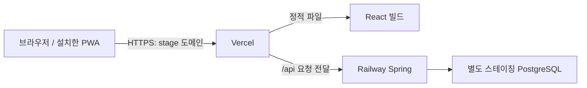

# 취준노트 배포 방식 비교

기준일: 2026-09-28. 관련 이슈: #20. 상태: **비교·권고 단계이며 사용자 선택 전**.

기존 기록은 Vercel 프론트와 Railway 백엔드를 사용했다고 설명한다. 현재 계정의 요금제·잔액·백엔드 가동 상태는 이번 비교에서 확인하지 않았다. 저장소의 Vercel 설정은 SPA fallback만 있어 동일 출처 API 프록시는 아직 구성되지 않았다.

## 결론부터

지금은 **기존 Vercel·Railway의 별도 스테이징으로 검증을 시작하는 안**을 우선 권고한다. 이유는 인프라 이전보다 세션·PWA·DB 복구·실사용을 먼저 완성하는 것이 현재 목표에 가깝기 때문이다. 이것은 비용이 가장 싸다는 측정 결과가 아니라, 변경 범위와 운영 부담을 줄이려는 설계 판단이다.

이후 비용이나 프록시 복잡성이 실제로 문제가 되면 Railway 단일 출처 통합 또는 AWS로 바꾸는 것이 좋다. AWS를 경험하는 것 자체도 유효한 학습 목적이지만, 그것을 제품에 반드시 필요한 기술이라고 설명하지는 않는다.

## 비교표

| 안 | 구조 | 장점 | 감수할 점 | 지금의 판단 |
|---|---|---|---|---|
| A. Vercel + Railway | 정적 프론트는 Vercel, `/api`는 Railway Spring으로 프록시, DB는 별도 서비스 | 기존 구조 재사용, 프론트 미리보기 편리 | 두 플랫폼의 배포·프록시·쿠키·원본 서버 접근 경계 검증 | **첫 스테이징 권고** |
| B. Railway로 통합 | 하나의 공개 출처에서 프론트와 API 제공, DB는 별도 서비스 | 플랫폼 수·출처 경계 감소 | 프론트 서빙/프록시 구성 변경 또는 Spring과 배포 단위 결합 | A의 복잡성이 실제 문제가 되면 검토 |
| C. Lightsail 단일 VM | HTTPS 리버스 프록시 + Spring + PostgreSQL | 월 기본 비용 예측 용이, Linux 운영 학습 | OS 패치·방화벽·인증서·장애 복구·백업 직접 책임, 단일 장애점 | 인프라 학습을 다음 목표로 정할 때 |
| D. EC2 + 별도 DB | 네트워크·컴퓨트·DB를 분리 구성 | AWS 네트워크·권한·배포 구조를 깊게 학습 | 비용 항목·운영 요소 증가, 현재 규모에는 과설계 가능 | 아직 기본 선택으로 삼지 않음 |

B는 Spring이 빌드한 React 파일을 함께 제공하거나, 별도 정적 서버가 `/api`를 내부 Spring으로 전달하는 두 구현이 가능하다. 전자는 구성 요소가 적지만 프론트와 백엔드를 함께 배포하게 된다. 후자는 독립 배포가 가능하지만 프록시 서비스의 자원과 설정이 추가된다. 아직 둘 중 하나를 구현한 상태는 아니다.

## 같은 출처가 왜 중요한가



브라우저는 화면과 API를 같은 출처로 본다. `HttpOnly` 세션 쿠키를 유지하면서 제3자 쿠키 의존성을 피할 수 있다. Vercel의 외부 rewrite는 이 구조를 지원한다. 다만 프록시가 있다고 CSRF나 인증 검사가 사라지는 것은 아니다. [Vercel rewrites](https://vercel.com/docs/routing/rewrites)

선택 후에는 다음을 실제 배포에서 확인한다.

- `/api` 전달 규칙이 SPA fallback보다 먼저 적용된다.
- 세션 쿠키의 `Secure`, `HttpOnly`, `SameSite`, 경로와 호스트 범위를 확인한다. Railway 전용 Domain을 쿠키에 고정하지 않는다.
- 로그인·CSRF·로그아웃 요청과 `Set-Cookie`가 전달되고, 로그인 성공 뒤 세션 ID가 바뀐다.
- 개인정보 API는 브라우저·CDN·서비스 워커 모두 캐시하지 않는다. 외부 rewrite의 캐싱 최적화를 API에 켜지 않는다.
- 실제 클라이언트 IP를 어떤 신뢰 경계에서 확정할지 검증한다. 외부 요청의 `X-Forwarded-For`를 무조건 신뢰하지 않는다.
- 원본 API에 직접 접근했을 때 인증·CSRF·요청 제한을 우회할 수 없는지 확인한다.
- Preview 프론트가 운영 DB/API에 연결되지 않도록 환경을 분리한다. CORS 전체 와일드카드는 사용하지 않는다.

## 비용을 비교하는 방법

아래 금액은 **USD 기준 공개 단가**이며 부가세·환율·도메인·백업·초과 트래픽 등의 전체 비용이 아니다. 무료 체험이나 일회성 크레딧을 지속 운영 비용으로 계산하지 않는다. 계정의 기존 계약·프로모션은 별도 확인한다.

### A/B: Railway 사용량 기준

Hobby는 월 최소 $5이며 $5의 리소스 사용량을 포함한다. $5에 서버와 DB가 무제한 포함되는 요금제가 아니다. 공개 컨테이너 단가는 RAM $10/GB-month, CPU $20/vCPU-month, 볼륨 $0.15/GB-month, 외부 전송 $0.05/GB다. [Railway 요금 문서](https://docs.railway.com/pricing/plans)

```text
Hobby 예상 기본 청구 = max(5, 전체 서비스 리소스 사용량 합계)
리소스 사용량 예시 = 10 × RAM + 20 × CPU + 0.15 × 볼륨 + 0.05 × 전송
```

**설명용 가정:** 앱+DB의 월평균 RAM 합계 1GB, CPU 합계 0.05vCPU, 볼륨 1GB, 전송 1GB라면 `10 + 1 + 0.15 + 0.05 = $11.20`다. 현재 앱의 실측이나 견적이 아니다. 운영과 스테이징을 함께 켜 두면 둘의 사용량을 합산해야 한다.

A에서 Vercel Hobby를 사용할 수 있다면 프론트 기본 요금은 무료지만 개인·비상업적 사용으로 제한된다. 수익화·광고·상업적 운영 계획이 생기면 자격과 유료 요금을 다시 확인한다. 스토어에 올린다는 사실만으로 무조건 상업적/비상업적이라고 판정하지 않는다. [Vercel 요금제](https://vercel.com/docs/plans), [공정 사용 정책](https://vercel.com/docs/limits/fair-use-guidelines)

Railway에는 사용량 상한이 있지만, 한도에 도달하면 서비스가 중단된다. 비용 보호와 서비스 연속성 사이의 선택이다. 알림 기준과 중단 상한을 따로 정해야 한다. [Railway 비용 통제](https://docs.railway.com/pricing/cost-control)

### C: Lightsail 묶음 요금

공개 IPv4가 포함된 Linux 일반형 표에는 1GB $7, 2GB $12, 4GB $24/월이 안내되어 있다. 이는 VM 묶음 비용이며 DB 백업·스냅샷·초과 전송·별도 환경 등 모든 비용을 뜻하지 않는다. 리전·계정과 최종 선택 옵션을 다시 확인한다. [Lightsail 공식 요금](https://aws.amazon.com/lightsail/pricing/)

Spring과 PostgreSQL을 같은 VM에 놓을 경우 2GB는 검토 시작점일 뿐 충분하다는 보장이 없다. CI에서 빌드해 산출물만 배포하고 JVM 메모리·DB 메모리·OS 여유·최대 동시 요청을 측정해야 한다. 작은 VM 하나에 모든 것을 넣으면 저렴할 수 있지만, VM 장애 때 앱과 DB가 함께 영향을 받는다.

### D: EC2는 인스턴스 가격만 비교하지 않는다

`EC2 실행 시간 + EBS + 공인 IPv4 + 전송 + 백업 + DB + 선택한 네트워크/로드밸런서 비용`을 합산한다. EC2 문서도 사용 중이거나 유휴 상태인 Elastic IP에 요금이 있다고 명시한다. 이 문서에서는 리전·인스턴스·DB 구성이 결정되지 않아 총액을 만들지 않았다. [EC2 온디맨드 요금](https://aws.amazon.com/ec2/pricing/on-demand/)

## DB와 알림 운영에서 놓치기 쉬운 점

Railway PostgreSQL 템플릿은 공식 문서에서 **unmanaged**로 설명한다. 배포 버튼이 있다고 DB 업그레이드·복구 검증 책임까지 없어지는 것은 아니다. 자동 백업 설정, 외부 복사본, 별도 DB 복원과 복구 시간을 직접 확인한다. [Railway PostgreSQL](https://docs.railway.com/databases/postgresql)

Flyway는 DB 구조 변경 이력 도구이지 백업 도구가 아니다. CI 복원 테스트는 테스트 데이터로 절차를 검증한 것이며 실제 운영 데이터 리허설을 대신하지 않는다.

향후 Web Push 예약 작업이 Spring 내부에서 실행된다면 서버가 정해진 시간에 살아 있어야 한다. Railway Serverless는 비활성 상태에서 잠들고 요청을 받아 깨어나므로, 단순히 비용을 줄이려 켜고 예약 알림이 제때 발송된다고 가정하면 안 된다. 항상 실행하거나 외부 스케줄러 구조를 별도로 선택해야 한다. 이는 서비스 수명주기 문서에 근거한 설계 판단이다. [Railway Serverless](https://docs.railway.com/deployments/serverless)

## 선택 후 실행 순서

1. 월 지출 상한, 스테이징 사용 시간, 도메인과 환경 소유자를 정한다. 이 단계 전에는 유료 리소스를 만들지 않는다.
2. 운영과 별도인 앱 환경·DB·비밀값을 구성한다. 처음에는 가짜 테스트 데이터만 사용한다.
3. 비용 알림·백업·접근 제어를 먼저 설정하고 HTTPS 동일 출처 인증을 검증한다.
4. S25 Ultra로 설치·로그인·키보드·뒤로가기·오프라인·업데이트를 확인한다.
5. 7일 정도 메모리/CPU/응답 시간/재시작과 일별 비용을 기록한다. 기간은 계획이며 아직 측정하지 않았다.
6. 결과를 보고 A 유지, B 단순화, C/D 운영 학습 중 하나를 선택하고 ADR에 확정 이유를 기록한다.

## 현재 제안하는 선택 기준

- **우선 실사용 완성:** A로 시작해서 기능·복구·보안 검증에 시간을 쓴다.
- **플랫폼과 프록시 수를 줄이고 싶음:** B를 별도 작은 변경으로 검증한다.
- **Linux·네트워크·배포 운영을 다음 학습 목표로 삼음:** C를 운영 데이터와 분리한 실습 환경부터 경험한다.
- **AWS 권한·네트워크·DB 분리 자체가 구체적인 학습 목표:** D의 구성과 예산을 먼저 설계한다.

면접에서는 “AWS가 유명해서 옮겼다”보다 “현재 규모에서 운영 요소를 줄여 출시 품질을 먼저 검증했고, 어떤 비용·복구·규모 지표가 생기면 구조를 바꾸기로 했다”라고 실제 기록을 붙여 설명하는 편이 좋다.

## 미완료 표시

#20은 이 비교 문서만으로 완료하지 않는다. 배포 방식 선택, 실제 스테이징 설정, HTTPS·DB·실기기 검증이 남아 있다. #21 Web Push와 #22 원스토어 준비도 열어 둔다. 기존 운영 환경이나 `main`은 변경하지 않았다.
