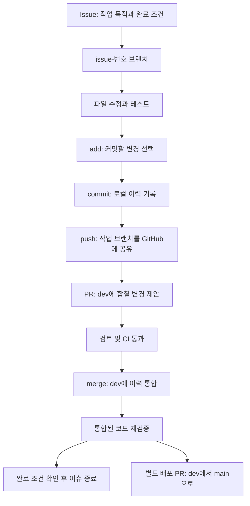

# dev 통합 검증과 협업 흐름 학습

기준일: 2026-09-28. 이 문서는 개발 코드와 운영 배포를 구분한다. 기존 변경을 작업별 PR로 분리해 dev에 통합했으며 main의 운영 코드는 이번 작업으로 바꾸지 않는다.

## 화면에 나온 보호 알림의 의미

GitHub의 "Your main branch isn't protected"는 실행 오류가 아니다. 중요한 브랜치에 강제 푸시·삭제를 막거나 병합 전 검사를 요구하는 규칙이 없다는 뜻이다.

main과 dev에 다음 규칙을 적용했다.

- 강제 푸시 금지, 브랜치 삭제 금지, 관리자에게도 규칙 적용.
- PR을 통한 변경과 최신 기준 브랜치에 대한 CI 통과 요구.
- 필수 검사: Workflow tests, Frontend and PWA, Backend tests and build, PostgreSQL migrations and sessions.
- 리뷰 대화 해결 요구. 개인 프로젝트이므로 다른 사람의 승인 1명을 필수로 강제하지 않는다.

연결된 계정이 작성자인 PR에는 GitHub Approve를 남길 수 없다. 코드 검토와 CI 결과를 기록하고 사용자가 위임한 범위에서 병합했다. 다른 사람이 독립적으로 승인한 것처럼 표시하지 않는다.

## Git 동작을 구분하기

add만으로 GitHub에 코드가 올라가지 않는다. push만으로 dev에 합쳐지지도 않는다. PR 생성과 병합도 서로 다른 작업이다. 완료한 기능 브랜치를 삭제해도 병합 커밋과 PR 기록은 남는다.

예전 develop은 dev와 역할이 중복되어, dev에 없는 커밋과 열린 PR이 없음을 확인하고 삭제했다. 앞으로 배포 기준은 main, 통합 기준은 dev, 작업 이름은 issue-번호다.

## 작업을 어떻게 나눴나

| 이슈 | 작업 | PR |
|---|---|---|
| #1 | 협업 규칙·템플릿·dev 이름 정리 | [#10](https://github.com/Bin-925/job-application-tracker/pull/10) |
| #3 | 지원 관리 화면·다중 일정 | [#11](https://github.com/Bin-925/job-application-tracker/pull/11) |
| #4 | PWA 설치·캐시 기본 구성 | [#12](https://github.com/Bin-925/job-application-tracker/pull/12) |
| #2 | 세션 인증·계정 관리 | [#13](https://github.com/Bin-925/job-application-tracker/pull/13) |
| #5 | 요청 제한·입력 방어 | [#14](https://github.com/Bin-925/job-application-tracker/pull/14) |
| #6 | PostgreSQL 이전·복원 검증 | [#15](https://github.com/Bin-925/job-application-tracker/pull/15) |
| #7 | CI 파이프라인 분리 | [#16](https://github.com/Bin-925/job-application-tracker/pull/16) |
| #8 | Gemini PR 리뷰 연결 | [#17](https://github.com/Bin-925/job-application-tracker/pull/17), 실제 API 리뷰는 대기 |
| #9 | 전체 문서 정리와 이 보고서 | 이 문서가 포함된 PR |

과거의 큰 미커밋 변경을 분리한 것이므로 이슈 번호 순서가 실제 병합 순서는 아니다. 동작 가능한 중간 상태를 만들기 위해 기존 화면·일정 구현을 먼저 반영하고 세션 인증을 다음에 연결했다. 기존 변경을 작성 시점부터 이슈별로 개발한 것처럼 꾸미지 않았다.

## 실제 검증 결과

| 검사 | 결과 | 무엇을 확인했나 |
|---|---|---|
| 백엔드 일반 테스트 | 55개 통과 | 기능, 인증·CSRF·세션, 소유권, 입력과 요청 제한 |
| PostgreSQL 테스트 | 17개 통과, 건너뜀 0개 | 마이그레이션·백업 복원 6개, JDBC 세션 11개 |
| 프론트 테스트 | 10개 통과 | 요약·필터·일정 도메인과 세션 API 클라이언트 |
| 자동화 모의 테스트 | 13개 통과 | PR 대상·권한·줄 번호·중복·실패·모델 응답 처리 |
| 빌드 | 성공 | bootJar, 프론트 lint·Vite 빌드·PWA 산출물 |
| Chrome 통합 검사 | 6개 시나리오 성공 | 실제 화면 입력과 HTTP 요청의 전체 흐름 |

근거: [실제 PostgreSQL 실행](https://github.com/Bin-925/job-application-tracker/actions/runs/36384189961), [네 가지 CI 작업 실행](https://github.com/Bin-925/job-application-tracker/actions/runs/36385241344).

Chrome 통합 검사는 다음을 확인했다.

1. 회원가입·로그인 후 HttpOnly 세션이 생기고 localStorage에는 기존 access_token이 남지 않는다.
2. 지원 등록 후 홈의 진행 중 카드를 누르면 해당 지원이 보이는 필터 목록으로 이동한다.
3. 상태 변경과 면접 일정 추가 후 면접 예정 카드가 같은 지원을 보여준다.
4. 월간 캘린더, 지원일 표시 선택, 이전·다음 달 이동이 동작한다. 360·412·1440px에서 가로 넘침이 없다.
5. 실제 HTTP로 CSRF 없는 쓰기 거부, 오래된 수정 버전의 409, 다른 계정의 데이터 접근 거부를 확인한다.
6. 전체 로그아웃 후 서버가 세션을 거부하고 화면이 로그인으로 돌아온다. 브라우저 실행 오류가 없고 성공 시 생성한 검증 계정을 삭제한다.

테스트에는 분리된 메모리 H2 DB와 임시 계정을 사용했다. 기존 사용자 DB와 운영 DB에는 테스트 자료를 넣지 않았다. 최초 브라우저 검사에서 화면 전환 완료를 기다리지 않아 목록을 너무 일찍 읽은 부분은 테스트 대기 조건을 보완하여 재실행했다.

화면 증거와 결과는 [검증 자료](qa/2026-09-28-dev/)에 있다. 이 자료는 데스크톱 Chrome과 모바일 크기 에뮬레이션이며, Galaxy S25 Ultra 실기기 검사와 동일하지 않다.

## 아직 완료하지 않은 것

- Gemini: API 키가 없어 실제 모델 호출·리뷰 게시를 하지 못했다. #8은 열린 상태다. 모의 테스트 성공은 실제 서비스 연결 성공이 아니다.
- 운영 데이터 이전: 합성 데이터 백업·복원은 통과했지만, 실제 운영 스키마 비교와 데이터 이전·롤백 리허설은 별도다.
- HTTPS 스테이징·프록시 IP 신뢰·실제 Secure 쿠키·Galaxy S25 Ultra 설치 확인.
- 작성 중 내용이 있을 때 PWA 업데이트로 내용을 잃지 않게 하는 보호.
- Web Push 예약·취소·재시도 및 운영 관측.
- 원스토어 패키징·서명·도메인 검증·개인정보 문서·심사.

따라서 "개발 코드가 정상 동작한다"와 "운영 출시가 끝났다"는 같은 말이 아니다.

## 학습 순서

처음부터 공부할 때는 [통합 학습 노트](study/PROJECT_STUDY_NOTE.md) 또는 [그림이 렌더링되는 HTML](study/PROJECT_STUDY_NOTE.html)을 먼저 읽는다. 23개 장·22개 다이어그램·12개 실습을 포함하고, 이번 구현 상태로 갱신했다.

1. [구현 현황](IMPLEMENTATION_STATUS.md)에서 현재 기능과 미완료 항목을 확인한다.
2. [첫 기술 선택 ADR](adr/0001-workflow-and-pwa.md)과 [기존 설계](planning/IMPLEMENTATION_DESIGN.md)로 화면·기술의 목적을 읽는다.
3. [세션 인증 가이드](SESSION_AUTH_MIGRATION.md)와 [인증 선택 ADR](adr/0002-jdbc-session-auth.md)을 함께 읽는다.
4. [보안·DB 학습 보충](LEARNING_2026-09-28.md)과 [DB 이전 절차](POSTGRES_MIGRATION.md)를 연결한다.
5. [CI·Gemini 학습 문서](CI_AND_AI_REVIEW.md)에서 자동화가 보장하는 것과 보장하지 않는 것을 구분한다.

## 공식 근거

- [GitHub 보호 브랜치](https://docs.github.com/en/repositories/configuring-branches-and-merges-in-your-repository/managing-protected-branches/about-protected-branches)
- [PR 승인 제한](https://docs.github.com/en/pull-requests/how-tos/review-pull-requests/approving-a-pull-request-with-required-reviews)
- [PR과 이슈 자동 연결·종료](https://docs.github.com/en/issues/tracking-your-work-with-issues/using-issues/linking-a-pull-request-to-an-issue)
