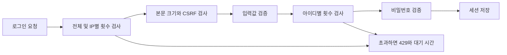
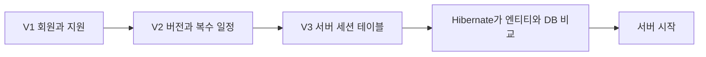

# 학습 노트 보충: 요청 제한과 DB 변경 이력

기존 통합 학습 노트의 13장(보안), 15장(테스트), 16장(DB 변경)에 연결되는 보충 자료다. 2026-09-28의 구현을 설명한다.

## 로그인 비밀번호를 계속 추측하면?

기존 코드는 비밀번호가 맞는지, 로그인 세션이 유효한지 확인했다. CSRF를 정상적으로 조회하는 공격자는 틀린 비밀번호를 계속 보낼 수 있으므로 요청 빈도도 제한해야 한다.

이 그림은 해당 검사들의 흐름을 단순화한 것이다. Spring의 전체 보안 필터가 모두 그려진 것은 아니다.

IP별 검사는 같은 컴퓨터/네트워크에서 여러 아이디를 빠르게 시도하는 것을 줄인다. 아이디별 검사는 IP가 달라도 같은 계정에 시도가 모이는 상황을 줄인다. 회원가입에는 별도 제한이 있고, 비밀번호 변경·탈퇴는 회원 식별자를 기준으로 추가 제한한다.

## Bucket4j와 Caffeine을 왜 추가했나

Bucket4j는 토큰 버킷 방식으로 남은 요청 예산과 보충 시간을 계산한다. 동시 요청에서도 정해진 예산보다 많이 소비하지 않도록 라이브러리가 관리한다. Caffeine은 각각의 아이디/IP에 대응하는 버킷을 제한된 메모리에 보관한다.

예를 들어 용량 10, 보충 900초면 처음 10번을 연속 시도할 수 있고 이후에는 대략 90초마다 한 번의 여유가 돌아온다. 10번 실패하면 영구적으로 계정을 잠그는 기능이 아니다. 성공 요청도 예산을 소비한다.

이 선택은 서버가 한 개인 현재 구조에 맞춘 시작점이다. 서버를 두 개로 늘리면 각 서버가 별도 예산을 가지므로 공유 제한 저장소가 필요해진다. 서버 재시작이나 메모리 퇴출에도 제한 기록이 사라진다. 계정 공격으로 정상 사용자가 잠시 기다릴 가능성도 남는다.

관련 코드: `security/AuthRateLimiter.java`, `AuthRateLimitProperties.java`, `ApiRequestGuardFilter.java`.

## 429, 413, 400의 차이

| 코드 | 이번 구현의 의미 | 사용자 행동 |
|---|---|---|
| 429 | 요청이 너무 빈번함 | 안내된 시간 뒤 다시 시도 |
| 413 | API 본문이 32KiB 한도를 초과함 | 입력 내용과 전송 형태 확인 |
| 400 | 너무 긴 필드나 잘못된 JSON 등 | 입력값 수정 |

프론트는 기존 공통 오류 처리로 서버 메시지를 표시하고 변경 요청을 자동 재전송하지 않는다. API가 받은 본문의 실제 길이를 검사하므로 Content-Length가 없는 전송도 크기 제한을 우회하지 못한다.

## Flyway는 왜 필요한가

엔티티에 version을 추가했다고 기존 DB의 값이 항상 적절히 채워지는 것은 아니다. 배포 중 누가 어떤 순서로 DB를 바꿨는지도 남겨야 한다.

Flyway는 SQL 파일의 버전·체크섬과 적용 결과를 DB 이력에 기록한다. 이미 적용한 파일을 수정하면 검증에서 불일치를 발견할 수 있다. Hibernate validate는 그다음 실제 테이블이 엔티티의 기대와 맞는지 확인한다.

빈 DB는 V1부터 시작한다. 이미 데이터가 있는 DB는 구조를 비교한 다음 어디까지를 기준점으로 인정할지 결정해야 한다. 그 기록이 baseline이다. 자동 baseline을 끈 이유는 DB 구조가 맞는지 확인하지 않은 채 업그레이드를 진행하지 않기 위해서다.

## 이번 테스트에서 발견한 문제

여러 Spring 테스트 설정이 모두 이름이 testdb인 H2 메모리 DB를 사용하고 있었다. 한 설정이 회원 테이블을 새로 만들 때 세션 테이블에는 다른 설정의 행이 남을 수 있었다. 그 결과 한 회원의 세션이 예상 1개 대신 2개로 계산됐다.

테스트 설정마다 DB 이름을 다르게 만들어 해결했다. 테스트 데이터 격리가 깨지면 제품 코드가 정상이어도 테스트가 순서에 따라 실패할 수 있다는 사례다.

## 현재 검증과 다음 확인

- H2 및 단위 테스트 55개와 bootJar 빌드 통과.
- PostgreSQL 마이그레이션·복원 테스트 6개와 세션 흐름 11개 작성.
- 로컬 Docker 런타임 오류는 남아 있지만 GitHub CI의 PostgreSQL 검증 17개는 모두 통과했다. 실행 환경과 검증 결과를 구분한다. [dev 통합과 CI 학습 보충](DEV_INTEGRATION_2026-09-28.md).
- 운영 DB 이관·실제 사용자 데이터 복원·HTTPS 배포·원스토어 출시는 아직 미완료.

학습 질문: ① CSRF가 있어도 왜 요청 제한이 필요한가? ② 서버가 두 개면 메모리 버킷은 어떻게 달라지는가? ③ V2 SQL을 적용한 뒤 왜 파일을 직접 수정하면 안 되는가? ④ 빈 DB와 기존 DB의 시작 절차는 왜 다른가?

정답의 핵심: CSRF는 요청 빈도를 검사하지 않으며, 메모리 제한은 서버마다 독립적이다. 적용한 SQL은 체크섬과 이력으로 추적하므로 새 변경은 새 버전으로 추가한다. 기존 DB는 데이터와 구조의 기준점을 먼저 검증해야 한다.
