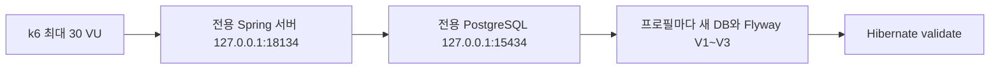

# k6 부하 테스트

## 목적과 범위

지원 조회·등록·상태 변경·복수 일정·세션 인증을 실제 HTTP API로 실행한다. 브라우저 mock API가 아니다. 사용자별 쿠키/CSRF와 독립된 계정을 사용한다. 검색·상태 필터·월간 캘린더는 프론트에서 지원 목록을 가공하므로 별도 검색 API를 만들어낸 것처럼 측정하지 않는다.

모든 가능한 상황을 증명하는 테스트는 아니다. 이 도구는 제한된 로컬 성능 실험이며 운영 용량 인증이나 침투 테스트를 대체하지 않는다.

k6를 선택한 이유는 가상 사용자·부하 단계·쿠키·통과 기준을 재현 가능한 JavaScript로 정의할 수 있고, HTTP 결과를 수치로 남길 수 있기 때문이다. 프론트에서 쓰는 언어 지식을 재사용하지만 React나 Node 서버를 추가하는 것은 아니다. PostgreSQL을 따로 띄우는 이유는 H2 호환 모드만으로 실제 DB의 잠금·트랜잭션·JDBC 세션 동작을 입증할 수 없기 때문이다.

## 실행

Windows PowerShell, JDK 21, Docker Desktop Linux 엔진, k6가 필요하다. k6 JavaScript는 애플리케이션 코드와 별도로 실행되며 추가 npm 런타임 의존성은 없다.

저장소 루트에서 실행한다.

```powershell
$env:JAVA_HOME = 'JDK 21 설치 경로'
node --test tests/load/config.test.mjs
./scripts/Run-LoadTests.ps1

# 일부 프로필만 다시 실행 (기본은 항상 bootJar 빌드)
./scripts/Run-LoadTests.ps1 -Profiles smoke,contract,limits

# 방금 빌드한 동일 소스를 재사용할 때만
./scripts/Run-LoadTests.ps1 -Profiles load,spike -SkipBuild
```

Docker Desktop에는 `jobtracker-load` 그룹의 `jobtracker-load-postgres`로 표시된다. PostgreSQL 17을 실행하며 `127.0.0.1:15434`로만 연결할 수 있다. 기존 MySQL·Redis·다른 프로젝트 컨테이너에는 접근하지 않는다.

**임시 DB다. 실제 기록을 넣지 않는다.** 데이터는 tmpfs에 있어 컨테이너를 중지하면 사라진다. 재실행 시 같은 이름의 전용 테스트 컨테이너만 다시 생성한다. 이름이 같아도 소유 라벨이 다른 컨테이너는 거부한다. 완료 시 테스트 서버와 DB를 자동 중지하지만 컨테이너 항목은 Docker Desktop에 남는다. 일반 개발용 DB가 필요하면 별도 영구 볼륨을 가진 구성을 사용해야 한다.

결과: `.local/load-results/실행시각/`. 여기에 프로필별 집계 JSON, 서버 로그, k6 오류 로그, 서버 프로세스 CPU 시간/메모리 표본, 환경·JAR 해시를 기록한다. 이 폴더는 Git에서 제외된다. 세션 쿠키·CSRF·응답 본문은 결과 JSON으로 내보내지 않는다.

## 시나리오

| 프로필 | 동시 가상 사용자 | 데이터/계정 | 본 측정 시간 | 확인 내용 |
|---|---:|---:|---|---|
| smoke | 1 | 지원 5개 | 2회 반복 | 조회, 지원·일정 CRUD와 응답 계약 |
| contract | 1 | 3계정, 지원 각 2개 | 1회 | 401/403, CSRF 누락, 남의 기록 접근/변경/삭제, 400/413, 오래된 지원·일정 버전 409, 로그아웃/전체 로그아웃/비밀번호 변경/탈퇴 |
| limits | 1 | 최대 5개 가입 | 1회 | 가입 6번째, 같은 계정 로그인 11번째, 여러 아이디 시도, CSRF 연속 요청 차단, Retry-After와 IP 예산 회복 |
| load | 2 → 10 → 0 | 지원 30개 | 70초 | 보통 사용량 가정의 읽기 중심 혼합 부하 |
| spike | 2 → 30 → 0 | 지원 30개 | 40초 | 급격한 동시 사용 증가와 하강 |
| soak | 10 | 지원 30개 | 120초 | 단기 지속 실행, 정리 누락/반복 실패 관찰 |
| volume | 5 | 지원 500개 | 30초 | 계정별 전체 목록을 읽는 현 구조의 데이터 규모 영향 |
| conflict | 10 | 동일 계정·동일 지원 1개 | 20초 | 경쟁 갱신 시 200/409, 정상 성공 시 버전 증가 |

세팅·계정 생성 시간은 위 시간에 추가된다. 5개 지원마다 면접 일정 1개를 생성한다. 일반 여정은 내 정보·목록·통계·상세를 읽고, 4회 중 1회에 새 지원 생성 → 내용 수정 → 상태 변경 → 면접/마감 2개 추가 → 일정 완료 처리 → 일정 삭제 → 지원 삭제 → 삭제 확인을 수행한다. 마지막에 0.3~0.7초 대기한다. 임시 지원은 반복 내에 삭제하고 다음 반복에서 기본 목록 수를 확인한다.

`conflict`만 의도적으로 동일 세션과 지원을 공유한다. 다른 부하 프로필은 VU별 계정/세션/지원이 다르다. VU는 가상 사용자 수이지 초당 요청 수 또는 가입 회원 수가 아니다. closed-model이므로 서버가 느려지면 요청률도 내려간다.

## 측정 기준

- 모든 응답·데이터 확인 `checks = 100%`, 예상하지 않은 응답 0, HTTP 실패율 1% 미만.
- 업무 응답 시간 p95 < 1초, p99 < 2초. 목록 조회·POST 응답의 p95도 별도 표시한다.
- `conflict`에서는 409가 실제로 한 번 이상, `limits`에서는 429가 실제로 한 번 이상 발생해야 한다.
- 401/403/404/409/413/429는 **그 상태를 예상하는 특정 요청에서만** 정상으로 분류한다. 업무 조회가 429를 받는 것은 통과가 아니다.
- 실패 상태나 데이터 불일치가 발견되면 해당 실행을 중단하고 실패로 기록한다. 후속 프로필은 별도 서버/DB에서 진행한다.
- `business_duration`은 세팅 트래픽을 제외한다. 전체 `http_reqs`/`http_req_duration`에는 세팅도 포함되므로 서로 같은 지표처럼 비교하지 않는다.

임계값은 최초 회귀 기준으로 정한 로컬 목표다. 실사용자의 트래픽 자료에서 도출한 SLA가 아니고, 모든 요청이 1초 이내라는 뜻도 아니다. p95는 관측한 요청의 95%가 해당 시간 이내라는 의미다.

## 격리와 설정 차이



- 전용 주소/포트 범위 외 요청을 거부하고 리다이렉트를 따라가지 않는다.
- 실행 전 포트 충돌을 확인하고, 실제 리스너 PID가 방금 만든 서버인지 확인한다.
- Spring JVM 최대 힙 512MiB, Hikari 최대 10개 연결, Tomcat 최대 50개 스레드. DB는 최대 1 CPU/768MiB, 데이터 tmpfs 최대 512MiB.
- 시나리오당 360초 외부 안전 타임아웃. k6 요청별 10초 타임아웃. 상한 없는 VU/기록 수 입력을 허용하지 않는다.
- DB 비밀번호는 실행마다 임의 생성하며 운영 Secret을 가져오지 않는다. `application-secret.yml` import도 비운다.
- `limits`는 요청 제한 기본값을 유지한다. 나머지는 한 IP에서 테스트 계정/세션을 만들기 위해 인증 관련 예산만 100,000으로 올린다. CSRF·소유권·세션·본문 크기 제한은 끄지 않는다. **로그인 공격 차단 성능은 이 완화된 부하 결과로 판단하지 않는다.**
- 인증 세션은 fixture에서 미리 생성한다. 그러므로 일반 부하는 동시 로그인/BCrypt 처리량 테스트가 아니다.

## 아직 검증하지 않는 것

HTTPS/프록시/모바일 브라우저 렌더링, PWA 오프라인·업데이트, 서버 재시작 복구, 네트워크 단절, PostgreSQL 디스크 I/O·영구 볼륨, 장시간 메모리 누수, 수천 명 규모, 여러 IP/서버 간 전역 제한, 계정 탈퇴와 쓰기 요청의 경합은 별도 실험이 필요하다. Web Push는 아직 구현되지 않아 테스트 대상이 아니다.

같은 PC에서 k6·JVM·Docker가 경쟁하며, DB tmpfs는 디스크 병목을 숨긴다. 운영 환경 용량이나 비용 산정에 이 수치를 그대로 사용하지 않는다. 120초 soak는 짧은 반복 안정성 확인일 뿐 장시간 안정성 통과가 아니다. APM·쿼리 추적 없이 특정 원인을 병목이라고 단정하지 않는다.

CI는 안전 설정 단위 테스트를 실행한다. 성능 수치는 공유 GitHub 러너에서 변동이 커서 필수 CI 성능 게이트로 추가하지 않았다. 실제 실행 결과는 날짜별 보고서에 남긴다.

공식 참고: [k6 시나리오](https://grafana.com/docs/k6/latest/using-k6/scenarios/), [쿠키 관리](https://grafana.com/docs/k6/latest/using-k6/cookies/), [옵션](https://grafana.com/docs/k6/latest/using-k6/k6-options/reference/).
