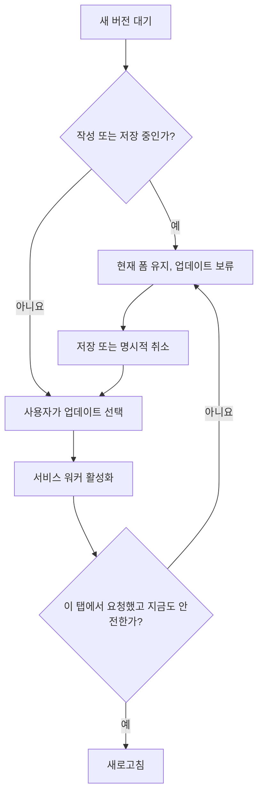

# PWA 업데이트와 작성 중 입력 보호

관련 작업: #19. 프론트 코드와 서비스 워커 수명주기 개선이며 운영 배포나 원스토어 출시 완료를 뜻하지 않는다.

## 왜 필요한가

PWA의 새 서비스 워커는 기다리다가 사용자의 업데이트 요청으로 활성화된다. 활성화 후 무조건 페이지를 새로고침하면 React가 메모리에 보관한 지원·일정·계정 입력이 사라진다. 한 브라우저의 여러 탭은 서비스 워커를 공유하므로 다른 탭이 업데이트할 때도 같은 위험이 있다.

## 선택한 방법

- 기존 JavaScript·React·Vite PWA를 유지한다. 이 문제를 풀기 위해 언어·상태 관리 프레임워크를 추가할 필요는 없다.
- `useSyncExternalStore`로 작은 메모리 저장소를 구독한다. 이 저장소는 폼별 **보호 필요 여부만** 저장하며 메모·비밀번호·개인정보 값은 저장하지 않는다.
- 편집 창이 열려 있거나 입력·저장이 진행 중이면 업데이트 버튼을 비활성화한다. 저장·명시적 취소 후 사용자가 다시 눌러 적용한다.
- 설치된 Vite PWA의 `onNeedReload` 콜백으로 자동 새로고침을 제어한다. 다른 탭의 업데이트는 native `waiting`/`controllerchange` 상태도 확인한다. 서비스 워커 생성·캐시 정책은 기존 Workbox를 사용한다.
- 업데이트를 요청한 뒤 새 입력을 시작한 경우도 **실제 활성화 시점에 다시 검사**한다. 버튼 클릭 시점의 검사만으로는 부족하다.
- 지원·일정 편집을 닫거나 Escape를 누르면 입력을 버릴지 확인한다. 작성·저장 중 새로고침이나 창 닫기는 `beforeunload` 경고를 요청한다.
- 오프라인 저장 실패는 폼에 표시하고 입력을 유지한다. 재연결 시 조회만 갱신하며 쓰기를 자동 재전송하지 않는다. 자동 재전송은 중복 생성 방지 설계 없이는 위험하다.
- 계정 화면을 조회하는 데 실패해도 기존 화면을 제거하지 않는다. 닉네임·비밀번호 폼의 취소는 해당 입력의 보호 상태를 해제한다.

## 테스트

`pnpm test`는 기존 10개와 보호 저장소·업데이트 순서 6개를 검사한다.

`pnpm build && pnpm test:e2e`는 Playwright에서 실제 브라우저와 생성된 서비스 워커를 사용한다. 테스트 전용 HTTP 서버의 API fixture를 사용하므로 백엔드 인증 통합 검증과 혼동하지 않는다. 테스트 서버는 루프백에만 열고 각 테스트 뒤 종료한다.

브라우저 테스트는 다음을 다룬다.

1. A 탭의 입력을 B 탭의 업데이트로부터 보호하고, 닫기 취소·확인 후 명시적으로 새 버전을 적용한다.
2. 비밀번호 입력 중 업데이트를 막고, 취소 후 해제한다. 로컬/세션 저장소에 비밀번호가 남지 않는지 확인한다.
3. 오프라인 계정 조회 실패·재연결 중 닉네임 입력을 유지한다.
4. 오프라인 저장 실패 후 입력을 유지하고 쓰기를 자동 재전송하지 않는다. 저장 요청이 진행 중일 때 업데이트를 막는다.

CI는 Chromium을 설치하고 프론트 필수 작업에서 이 검사를 실행한다. 실패 시 trace를 Artifact로 보관한다. 로컬에서는 `pnpm exec playwright install chromium` 후 실행하거나 `PLAYWRIGHT_CHROME_PATH`에 설치된 Chrome 경로를 지정한다. 360px·1440px 화면의 넘침도 검사한다.

## 보장하지 않는 것

- 개인정보를 브라우저 저장소에 보관하지 않으므로 OS가 앱 프로세스를 강제 종료한 뒤 초안을 복구하지 못한다.
- `beforeunload`는 모바일 강제 종료 등 모든 상황에서 실행되지 않는다. 실제 S25 Ultra 검증은 #20/#22에서 진행한다.
- 계정 만료·로그아웃 후에는 이전 계정의 입력을 보존하지 않는다. 계정 화면에서 다른 내부 페이지로 이동하는 모든 경로를 차단하는 라우터 가드는 이번 범위가 아니다.
- 새 보호 코드가 없는 예전 배포 버전까지 소급하여 보호할 수 없다. 운영 API는 이전 프론트와 공존하는 동안 호환성을 유지해야 한다.
- 오프라인 편집 큐·Web Push는 별도 기능이다.

## 읽을 코드

- `frontend/src/domain/updateProtection.js`: 값이 아닌 보호 상태와 활성화 순서
- `frontend/src/workspace/useFormProtection.js`: React 폼과 종료 경고 연결
- `frontend/src/workspace/PwaStatus.jsx`: 기존 PWA 라이브러리와 업데이트 UI 연결
- `frontend/tests/pwa-update.spec.js`: 다중 탭·오프라인 브라우저 회귀 검증

## 공식 참고

- [Vite PWA 업데이트 안내](https://vite-pwa-org.netlify.app/guide/prompt-for-update.html)
- [MDN controllerchange](https://developer.mozilla.org/en-US/docs/Web/API/ServiceWorkerContainer/controllerchange_event)
- [MDN beforeunload 한계](https://developer.mozilla.org/en-US/docs/Web/Events/beforeunload)
