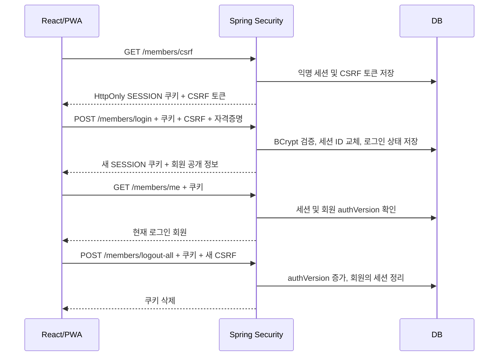

# ADR 0002: JWT/localStorage에서 JDBC 세션 인증으로 전환

- 결정일: 2026-09-24
- 상태: 코드 구현 및 로컬 검증. 운영 전환은 보류.
- 관련 설계: [초기 구현 설계](../planning/IMPLEMENTATION_DESIGN.md)
- 적용 절차: [인증 전환 가이드](../SESSION_AUTH_MIGRATION.md)

## 왜 바꾸는가

취준노트의 우선 클라이언트는 웹, 설치형 PWA, 향후 TWA다. 별도의 네이티브 API 생태계보다 같은 웹 서비스를 여러 설치 경로로 제공하는 것이 목표다. 따라서 브라우저에 JWT를 저장하고 refresh token의 발급·회전·폐기를 직접 구현하기보다 Spring Security와 Spring Session의 세션 관리를 사용한다.

이는 JWT가 본질적으로 나쁘다는 뜻이 아니다. 기존 구현은 localStorage의 JWT를 삭제하면 해당 브라우저에서만 로그아웃됐고, 이미 복사된 토큰은 서버의 추가 폐기 체계 없이는 만료 전까지 유효했다. JWT에 서버 측 폐기 기능을 추가할 수도 있지만, 지금 규모에서는 서버 세션이 요구사항에 더 직접적으로 대응한다.

## 선택

| 항목 | 결정과 이유 |
|---|---|
| 인증 정보 | 브라우저는 불투명 SESSION 쿠키, 서버 DB는 로그인 상태를 저장 |
| 저장소 | Spring Session JDBC. 이미 사용하는 관계형 DB로 재시작·여러 인스턴스의 세션 공유 기반 제공. Redis를 별도 운영하지 않음 |
| 쿠키 | HttpOnly, SameSite=Lax, Path=/, Domain 미지정. prod에서 Secure 강제 |
| 유효 기간 | 서버 비활성 만료 7일, 쿠키 발급 후 최대 7일. 둘 중 먼저 끝나면 재로그인 |
| CSRF | HttpSessionCsrfTokenRepository. 변경 요청 직전 `/members/csrf` 조회, `X-CSRF-TOKEN` 전송. 로그인·회원가입·로그아웃도 예외 없음 |
| 로그인 | 기존 BCrypt 유지, 세션 ID 교체, SecurityContext 명시적 저장, 이전 CSRF 토큰 폐기 |
| 폐기 | 현재 로그아웃, 전체 로그아웃, 비밀번호 변경, 탈퇴. 비밀번호 변경 후 현재 기기도 재로그인 |
| 폐기 경합 | 회원 authVersion을 잠금 안에서 증가시키고 모든 요청에서 대조. 정리와 경합해 이전 세션이 DB에 남아도 거부 |
| 회원 정보 변경 | 닉네임·아바타도 같은 회원 행 잠금 사용. 다른 변경이 오래된 authVersion/비밀번호를 덮어쓰지 않도록 함 |
| 프론트 | localStorage 토큰 제거. `/members/me` 결과로 로그인 확인, 다른 탭의 로그인 변화도 재조회 |
| 캐시·출처 | API 응답 private, no-store. 서비스 워커의 API NetworkOnly 유지. CORS 와일드카드 제거 |

## 비용과 한계

- 세션 조회/갱신과 회원 인증 버전 조회가 DB 부하를 만든다. 사용자 수와 실제 지연을 측정한 뒤 저장소·조회 전략을 재검토한다.
- HttpOnly는 JavaScript의 쿠키 읽기를 막지만 XSS 코드가 사용자 대신 요청하는 것까지 막지 않는다. 입력 처리, 출력 이스케이프, CSP 등은 별도 방어다.
- CSRF 방어는 XSS 방어를 대체하지 않는다. 토큰은 화면 스크립트에 노출되지만 로그인 자격증명 자체는 아니다.
- 이미 인증 검사를 통과해 실행 중인 요청을 소급 취소하지는 않는다. 버전 검사는 이후 인증 검사에서 오래된 세션을 거부한다.
- 쿠키 인증에는 동일 origin 프록시와 HTTPS 배포 검증이 필요하다. 다른 사이트의 API에 직접 요청하고 제3자 쿠키 허용에 의존하지 않는다.
- DB가 중단되면 인증도 실패한다. 영속 저장은 무중단/백업/호환성을 자동 보장하지 않는다.
- 로그인 실패 횟수 제한, 운영 DB 마이그레이션, 실제 기기의 PWA 재실행·업데이트 검증은 아직 남아 있다.
- 향후 별도 네이티브 클라이언트나 외부 API가 필요해지면 OAuth/OIDC 등 적합한 인증 방식을 다시 평가한다.

## 초기 설계에 대한 판단

초기 설계의 세션, Flyway, 실제 PostgreSQL 테스트, HTTPS와 실기기 검증은 출시 준비를 위해 계속 추진한다. 다만 제안한 기술을 모두 사용하는 것이 목표는 아니다.

- TypeScript는 다음 일정/알림 API 변경부터 점진 도입하면 계약 실수를 줄이는 데 도움이 된다. 전체 재작성은 필요하지 않다.
- Tailwind와 현재 CSS 중 어느 쪽이 항상 우월하지는 않다. 현재 화면을 Tailwind로 재작성할 뚜렷한 유지보수 이득이 없으면 되돌리지 않는다.
- 지금의 generateSW는 설치·정적 캐시에 충분하다. 직접 push/click 처리가 필요해지는 알림 단계에서 injectManifest로 전환한다.
- TWA와 EC2는 출시·운영 요구로 판단한다. 포트폴리오에 기술 이름을 더하기 위해 도입하지 않는다.

## 근거

- [Spring Security 6.5 세션 관리](https://docs.spring.io/spring-security/reference/6.5/servlet/authentication/session-management.html): 직접 구현한 로그인에서 세션 전략과 컨텍스트 저장을 명시적으로 연결.
- [Spring Security 6.5 CSRF](https://docs.spring.io/spring-security/reference/6.5/servlet/exploits/csrf.html): SPA의 토큰 조회와 인증 후 갱신.
- [Spring Session JDBC](https://docs.spring.io/spring-session/reference/configuration/jdbc.html): JDBC 세션 저장소와 principal 인덱스.
