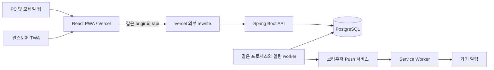
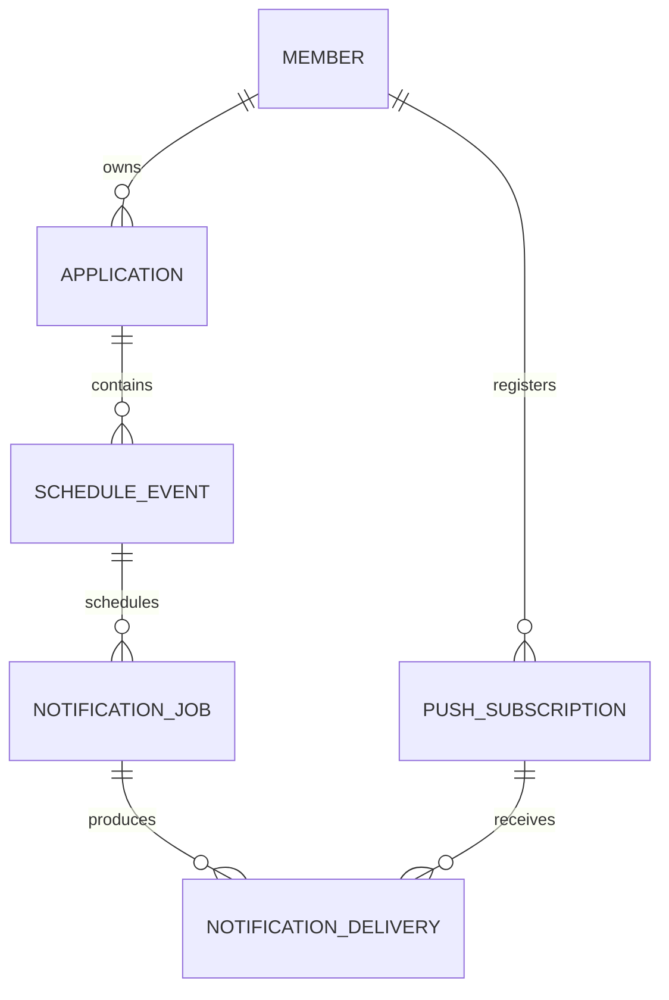

# 취준노트 PWA 및 원스토어 출시 상세 설계

작성일: 2026-09-23. 상태: 구현 전 제안 설계. 실제 구현과 운영 검증 결과가 생기면 해당 항목을 갱신한다.

## 1. 기준과 목표

- 저장소: https://github.com/Bin-925/job-application-tracker
- 확인한 main: `5775d25b390463b1627a036ffa106c9ea73aaf30`, 커밋 날짜 2026-07-13.
- GitHub 검토 사본: `reference/github-current/`. 민감 설정을 제외한 비교 대상 101개 파일은 ZIP 검토 사본과 대응하며, 텍스트는 CRLF/LF 정규화 후 내용 차이가 없었다.
- 사용자가 확인한 조건: 실사용과 취업 포트폴리오 병행, EC2 전환 미착수, 운영비 미정, 실기기 Samsung Galaxy S25 Ultra.
- 정적 코드 검토와 공식 문서 조사에 근거한다. 현재 앱 테스트 실행, 운영 환경 접근, 실기기 검증은 수행하지 않았다.
- 이 설계는 첫 출시 범위를 결정하기 위한 제안이다. 저장소 코드 변경, GitHub 이슈/PR 생성, 배포는 하지 않았다.

제품 목표: 여러 채용 사이트의 지원 기록을 모으고 다음 행동과 중요한 일정을 놓치지 않도록 돕는다.

### 첫 출시 범위

지원 CRUD/검색/상태 관리, 복수 면접 일정, 일정 기반 홈과 캘린더, 안정적인 로그인/로그아웃/탈퇴, 선택한 기기의 Web Push, PWA 설치, 원스토어 설치와 업데이트다. 상태/일정/알림이 서로 일관되게 동작하는 것이 중심이다.

채용 API 가져오기, AI 추천, 오프라인 데이터 수정, 팀 공유, 광고/결제, iOS 스토어 출시는 후속 범위다. 외부 공고 URL 수동 저장은 유지한다. 원스토어 출시를 채용 API 승인에 종속시키지 않는다.

## 2. 주요 기술 결정

모든 항목의 상태는 제안이다. 기존 기술의 최초 선택 동기를 새로 만들어내지 않고, 향후 유지/변경 이유를 기록한다.

| 결정 | 선택안 | 이 프로젝트에서의 이유 | 비용 / 재검토 조건 |
|---|---|---|---|
| 백엔드 | Java 21 + Spring Boot 3.5 계열 유지 | 기존 인증/검증/트랜잭션 코드를 활용하며 Java 백엔드 역량을 깊게 쌓음 | 유지보수 버전과 라이브러리 호환성은 구현 시 확인. 4.x 업그레이드와 출시 작업을 묶지 않음 |
| 구조 | 단일 Spring 프로세스, 기능별 서비스 경계 | 사용자 규모보다 데이터 일관성과 개발 속도가 우선 | 알림 작업이 API 지연을 유발하면 같은 코드의 worker 프로세스 분리를 먼저 검토 |
| DB | 로컬/운영 PostgreSQL, 중요한 통합 테스트도 PostgreSQL | FK, 시간 타입, 마이그레이션 차이를 실제 DB에서 검증 | 개발용 Docker 실행 필요. Mockito 단위 테스트는 계속 유지 |
| DB 변경 | Flyway, 운영 `ddl-auto: validate` | 기존 기록을 보존하며 변경 순서를 재현 | 기존 DB baseline 검증 및 복원 연습 필요 |
| 프론트 | React/Vite/Tailwind 유지, 변경하는 도메인/API부터 TypeScript | 일정/상태/API 필드 불일치를 컴파일 단계에서 확인 | 점진 전환. 타입이 서버 입력 검증을 대체하지 않음 |
| 인증 | 같은 origin API + Spring Security 세션 + Spring Session JDBC | 웹/PWA/TWA에서 로그인 유지와 즉시 폐기를 지원하고 refresh token 체계를 직접 만들 필요를 줄임 | 기존 JWT에서 전환 필요, CSRF 및 DB 세션 비용 발생. 독립 네이티브 클라이언트가 확정되면 재검토 |
| 일정 알림 | DB 예약 + Spring scheduler + Web Push | 앱이 닫혀도 처리하고 서버 재시작 후 예약 복구 | 서버 상시 실행 및 발송 실패/중복 처리 필요 |
| PWA | vite-plugin-pwa의 injectManifest 방식 | 기존 Vite에 설치/리소스 캐시를 연결하고 push/click 처리를 하나의 SW에서 관리 | SW 버전 전환과 작성 중인 폼 보호 필요 |
| Android | TWA + Bubblewrap 우선 | 기존 PWA의 화면/인증을 활용해 스토어 설치 경로 제공 | 도메인 소유 검증, 브라우저 지원, 실기기/심사 검증 필요 |
| Android 대안 | Capacitor | 필수 네이티브 기능이 TWA 검증에서 막힐 때 | 플러그인/권한/인증/배포의 별도 설계 필요. 첫 출시안과 동시 구현하지 않음 |
| 운영 | 기존 Vercel + Railway 우선 평가 | EC2 미착수 상태에서 제품 검증과 인프라 이전을 분리 | 상시 실행 비용과 기존 서비스 상태 확인 후 실제 배포 구성 확정 |
| 검증 | JUnit/Mockito 유지, Testcontainers + Vitest + Playwright 추가 | DB 무결성, 날짜 규칙, 브라우저 사용자 흐름을 각 계층에서 검증 | 커버리지 숫자보다 실패 영향이 큰 시나리오를 우선 |

React Router, Axios, Gradle, pnpm, springdoc은 그대로 활용한다. 기존 선택의 상세 근거는 [발전 전략](DEVELOPMENT_STRATEGY.md)을 따른다. 전역 상태 라이브러리나 서버 상태 라이브러리는 이번 설계에 필수로 추가하지 않는다.

## 3. 배포 구조와 모듈 경계



- 공개 URL은 실제 소유할 HTTPS 도메인으로 최종 결정한다. TWA 배포 전에 origin을 고정한다. 예시 도메인을 실제 구매/설정된 주소로 오해하지 않는다.
- 브라우저는 상대 주소 `/api/...`만 호출한다. 개발은 Vite proxy, 운영은 Vercel external rewrite를 우선 검증한다.
- API 경로는 SPA fallback보다 우선한다. `/api` 오류가 `index.html` 200으로 바뀌면 실패다.
- 모든 인증/개인 API 응답은 `Cache-Control: private, no-store`. CDN 캐시도 비활성임을 두 계정으로 확인한다.
- `Set-Cookie`, cookie 전달, `Secure`, 로그인/로그아웃, CSRF, POST/DELETE, 원래 origin 전달을 staging에서 검증한 뒤 인증 전환을 확정한다.
- 외부 rewrite가 쿠키/정책 요구를 만족하지 못하면 같은 도메인에서 정적 파일과 `/api`를 제공하는 reverse proxy 구성을 선택한다. 이 경우 운영 플랫폼 변경 여부와 비용을 별도 결정한다. 브라우저 제3자 쿠키 허용 설정에 의존하지 않는다.
- 최초 운영은 Spring 1 인스턴스다. 재배포 중 잠깐 두 인스턴스가 있어도 알림을 중복 점유하지 않도록 DB lease를 사용한다.
- 기존 계층 패키지 구조를 유지한다. `AuthService`, `ScheduleEventService`, `NotificationPlanner`, `NotificationDispatcher`, `PushSubscriptionService`를 필요한 위치에 추가한다. 전체 폴더 재배치는 하지 않는다.
- `PushGateway`는 외부 Push 요청의 작은 경계다. 실제 Web Push 구현과 테스트 대역만 둔다. 여러 미래 채널을 위한 범용 메시지 프레임워크는 만들지 않는다.

## 4. 사용자 흐름과 화면

프론트 디자인 상세는 [프론트 디자인 명세](FRONTEND_DESIGN.md)를 따른다. 오늘/지원/일정/내 정보 탐색과 오늘 중심 홈을 선택했다. 사용자 요청에 따라 캘린더는 월간으로 확정하고 홈의 진행 중/면접 예정 박스를 필터된 지원 목록에 연결하도록 수정 시안을 만들었다.

### 핵심 흐름

1. 회원가입/로그인 -> 회사·직무·상태만으로 지원 기록 생성 -> 필요한 마감/면접 추가.
2. 홈에서 오늘/7일 이내 일정을 확인 -> 해당 지원 상세에서 상태 변경 또는 일정 수정.
3. 일정이 생긴 뒤 사용자가 '이 기기 알림 켜기' 선택 -> 브라우저 권한 요청 -> 테스트 알림 확인.
4. 앱을 닫은 상태에서 알림 수신 -> 클릭 -> 로그인 필요 시 로그인 -> 해당 지원 상세로 복귀.
5. 계정에서 현재 기기 알림 해제/로그아웃, 전체 로그아웃, 재인증 후 회원 탈퇴.

### 화면 구조

| 화면 | 주된 작업 | 필요한 상태 |
|---|---|---|
| 홈 | 오늘 할 일, 가까운 일정, 지원 상태 요약 | 로딩 / 오류+재시도 / 실제 빈 목록 / 정상 |
| 지원 목록 | 회사 검색, 상태 필터, 날짜 정렬, 빠른 등록 | 필터 결과 없음과 전체 기록 없음 구분 |
| 지원 상세 | 기본 정보, 복수 면접, 마감, 메모, 상태 변경 | 저장 중 / 실패 / 다른 기기 수정 충돌 |
| 일정 편집 | 날짜, 선택적 시간, 면접 구분, 알림 켜기 | 시간 미정 / 지난 일정 / 취소 / 완료 |
| 캘린더 | 월별 일정과 선택한 날짜의 목록 | 기간 이동, 일정 유형, 날짜만 있는 일정 |
| 알림/계정 | 권한 상태, 현재 기기 테스트, 로그아웃, 탈퇴 | 미지원 / 거절 / 허용했으나 미등록 / 정상 등록 |

모바일은 하단 탐색, PC는 목록과 상세를 넓게 사용하는 반응형 화면을 설계한다. 기존 휴대폰 장식 프레임을 실제 PC 작업 화면에 강제하지 않는다. 알림 권한을 첫 방문 직후 자동 요청하지 않는다. 쓰기 실패 시 폼을 닫지 않고 입력값을 보존한다. 첫 구현에서는 저장 완료 후 화면을 갱신하고, 낙관적 갱신은 복구 동작을 검증한 곳에 한해 적용한다.

## 5. 데이터 모델

기존 `member`, `application`을 유지하며 아래 테이블은 해당 기능을 구현하는 단계에서 추가한다. DB 이름은 제안이며 실제 Hibernate 생성 스키마와 대조해 migration으로 확정한다.



| 테이블 | 핵심 필드 | 무결성/인덱스 |
|---|---|---|
| `member` | 기존 필드와 `auth_version` 추가. `deleted_at` 없이 hard delete | 기존 username unique 유지, 가입 동시 충돌은 409로 변환 |
| `application` | 기존 기본 정보, `status`, `applied_date`, `version` | `(member_id, updated_at, id)`, `@Version` |
| `schedule_event` | `id`, `application_id`, `type`, `label`, `event_date`, nullable `event_time`, `zone_id`, `state`, `reminder_enabled`, `version` | `type=DEADLINE/INTERVIEW`, `state=SCHEDULED/COMPLETED/CANCELED`, `(application_id,event_date)`, 한 지원에 취소되지 않은 DEADLINE 최대 1개 |
| `push_subscription` | `id`, `member_id`, `endpoint`, `endpoint_hash`, `p256dh`, `auth`, `binding_version`, `active`, `last_seen_at` | endpoint hash unique 및 원문 일치 확인, 회원별 active 조회 인덱스 |
| `notification_job` | `id`, `event_id`, `event_version`, `rule_code`, `scheduled_at`, `expires_at`, `status` | `(event_id,event_version,rule_code)` unique, `(status,scheduled_at)` |
| `notification_delivery` | `id`, `job_id`, `subscription_id`, `binding_version`, `status`, `attempts`, `next_attempt_at`, `lease_until`, `lease_token`, `last_error_code`, `accepted_at` | `(job_id,subscription_id)` unique, `(status,next_attempt_at)` |

세션은 Spring Session 공식 PostgreSQL 스키마의 `SPRING_SESSION`, `SPRING_SESSION_ATTRIBUTES`를 사용하고 Flyway로 관리한다. 사용자에게 소유된 세션 조회 키는 변경되지 않는 member ID 문자열로 통일한다. JPA 엔티티 전체를 세션에 저장하지 않는다.

### 날짜와 상태 규칙

- `applied_date`와 `event_date`는 SQL DATE다. `event_time`이 없으면 '시간 미정'이며 자정으로 꾸미지 않는다.
- 1차 시간대는 `Asia/Seoul`로 고정한다. 예약 순간은 `timestamptz`/Java Instant로 저장하며 DB와 worker 시간 계산은 UTC 기준이다.
- 기존 감사 필드 `LocalDateTime`은 기존 서버 시간대 확인 전 UTC로 임의 변환하지 않는다. 새 알림 필드와 별도로 migration을 결정한다.
- 기존 여섯 상태를 유지하고 v2에서 `WITHDRAWN`(지원 철회)을 추가한다. 합격/불합격/철회는 종료 상태다.
- 상태는 실제 채용 절차가 다르므로 직선 순서를 강제하지 않는다. 종료 -> 진행 상태도 재개 확인 후 가능하다.
- 마감 알림은 `TO_APPLY`에서만 보낸다. 면접 알림은 `APPLIED`, `DOC_PASSED`, `INTERVIEW`에서만 보낸다. 일정 완료/취소 또는 지원 종료 시 관련 미발송 작업을 취소한다.
- 상태를 변경해도 과거 면접 기록을 지우지 않는다. 재개 시 앞으로 남은 일정만 재예약한다. 단순 상태 변경 이력 테이블은 첫 출시 필수에서 제외한다.
- 지원 완료 날짜는 과거 기록 입력을 허용한다. 일괄적으로 '면접일 >= 지원일', '마감일 >= 지원일'을 강제하지 않는다. 비정상으로 보이는 조합은 경고하고 업무상 금지 규칙만 서버에서 거부한다.
- 시간만 있고 날짜가 없는 일정은 422. 문자열 길이와 URL http/https 제한은 서버가 검증한다. 공고 URL을 서버에서 임의로 가져오지 않는다.

### 수정 충돌과 삭제

- 수정/삭제에는 읽을 때 받은 `version`을 전달한다. 먼저 저장한 변경을 덮어쓰려 하면 409 `VERSION_CONFLICT`로 최신 데이터 확인을 유도한다.
- 상태 변경과 일정 변경, 관련 예약 취소/생성은 하나의 DB 트랜잭션에서 수행한다. 일정 수정과 지원 종료가 교차할 때 application 행을 먼저 잠그는 순서를 공통으로 사용한다. 지원 상태 변경으로 알림 대상 여부가 바뀌면 영향받는 event의 version도 올려, 취소 후 재개된 알림이 과거 작업 키와 충돌하지 않게 한다.
- 신규 POST의 무조건 자동 재전송은 금지한다. 저장 응답이 유실되면 목록을 재조회하고 사용자가 확인한다. 필요해지면 별도 idempotency 키를 추가한다.
- 지원 삭제: 관련 delivery/job/event/application을 FK cascade 또는 명시적 서비스 삭제로 한 트랜잭션에서 제거한다. 방식은 migration에서 명시하고 실제 FK 동작을 테스트한다.
- 회원 탈퇴: 비밀번호 재확인 -> 모든 구독 무효화 -> 회원 소유 지원/일정/알림 데이터 삭제 -> 회원 삭제 및 모든 세션 폐기. 실제 삭제 경로를 운영과 같은 DB에서 검증한다.
- 인증 필터는 member 존재 및 `auth_version` 일치를 확인한다. 이로써 세션 저장소의 지연 정리/경쟁에도 삭제된 계정이나 폐기된 인증이 다음 요청에서 유효해지지 않는다.

## 6. 인증 상세

### 선택 이유

출시 대상이 웹, PWA, 웹을 브라우저로 실행하는 TWA이므로 서버 세션을 기본안으로 제안한다. 현재 JWT 경험은 그대로 설명할 수 있으며, 실사용에서 즉시 로그아웃과 기기 세션 관리가 필요해져 방식을 바꾼다는 근거를 남긴다. JWT + refresh token도 가능하지만 회전, 재사용 탐지, 동시 갱신, 폐기를 추가해야 한다.

### 정책

- 세션 cookie: `__Host-jobnote_session`, `HttpOnly`, `Secure`, `SameSite=Lax`, `Path=/`, `Domain` 미지정. 로컬 HTTP에서는 별도 개발용 이름/설정.
- 제안 만료값: 일반 로그인 비활성 24시간, '로그인 유지' 선택 시 비활성 14일, 두 경우 모두 절대 30일. absolute expiry는 별도 session 속성과 검사로 구현하며 기본 기능으로 가정하지 않는다. 제품 검증 후 조정 가능.
- 로그인 유지 여부에 맞는 cookie 수명과 서버 만료를 함께 구현하고 실기기 브라우저 재시작으로 검증한다. 쿠키가 남는다고 서버 세션이 유효하다고 판단하지 않는다.
- 로그인 성공 시 세션 ID 교체, `SecurityContext` 명시 저장, principal에는 member ID와 인증 버전만 포함한다.
- `GET /api/v2/auth/csrf`로 Spring이 발급한 CSRF 값을 받아 메모리에 보관한다. 로그인/회원가입 포함 모든 상태 변경 요청은 CSRF 검증 대상이다. 로그인/로그아웃 후 토큰을 다시 받는다.
- 공개 origin은 서버 설정으로 고정하고 수정 요청의 Origin 검사와 허용 목록을 적용한다. proxy의 임의 전달 헤더를 무조건 신뢰하지 않으며, 실제 플랫폼의 전달/덮어쓰기 동작을 검증한다.
- 클라이언트 로그인 판단은 `/members/me` 결과에 따른 `checking/authenticated/anonymous/error` 상태다. localStorage 토큰 존재로 판단하지 않는다.
- 401이면 개인정보 메모리 캐시를 비우고 안전한 내부 `returnTo`와 함께 로그인으로 이동한다. 네트워크 오류는 로그아웃으로 처리하지 않는다. 외부 URL을 returnTo로 허용하지 않는다.
- 현재 로그아웃은 현재 브라우저 구독을 비활성화하고 세션을 폐기한다. 다른 탭에 로그아웃을 전파한다. 같은 브라우저의 TWA/웹이 세션·구독을 공유할 수 있으므로 '현재 기기'의 실제 범위를 검증한다.
- 전체 로그아웃/비밀번호 변경은 `auth_version`을 증가시키고 모든 세션/구독을 무효화한다. 다음 요청부터 차단하며, 비밀번호 변경 후 다시 로그인한다. 이미 처리 중이던 요청의 소급 취소를 보장하지 않는다.
- 로그인 재시도 제한은 staging에서 정책을 정해 적용한다. 최초 제안은 계정+출처 기준 반복 실패 시 지연/429이며, 계정 존재 여부가 드러나는 메시지는 통일한다.
- 현재 이메일이 없으므로 자동 이메일 비밀번호 복구는 제공할 수 없다. 소규모 베타에서는 이를 명확히 안내한다. 넓은 공개 모집 전 이메일 검증 기반 복구 또는 별도 복구 수단을 추가할지 결정한다. 운영자가 임의로 비밀번호를 전달하는 방식을 두지 않는다.

## 7. API 계약

변경 폭이 큰 인증/일정은 `/api/v2`로 분리한다. v1은 현재 웹 전환을 위한 짧은 호환 기간만 유지하며, Android 첫 배포 전에 종료한다. 기존 v1 JWT는 로그아웃/인증 전환 완료 시 더 이상 허용하지 않는다.

| 메서드/경로 (기본 `/api/v2`) | 입력/동작 | 결과 |
|---|---|---|
| GET `/auth/csrf` | CSRF 초기화 | 200 token/headerName |
| POST `/auth/login` | username,password,rememberMe | 200 member 요약, cookie 설정 |
| POST `/auth/logout` | 현재 구독 ID(있는 경우) 및 세션 폐기 | 204 |
| POST `/auth/logout-all` | 최근 재인증 필요 | 204 |
| POST `/members` | 기존 가입 필드 | 201 |
| GET `/members/me` | 로그인 세션 | 200 또는 401 |
| PATCH `/members/me/password` | currentPassword,newPassword | 204, 전체 인증 폐기 |
| DELETE `/members/me` | currentPassword 재확인 | 204, 전체 데이터/인증 제거 |
| GET `/applications` | view,status,q,sort (`q`는 회사/직무 검색) | 200 목록; 초기 페이지 처리 없이 조건에 맞는 목록 조회 |
| POST `/applications` | 기본 정보, 선택적 초기 일정 | 201 + version |
| GET/PUT/DELETE `/applications/{id}` | 수정/삭제 시 version | 200/204, 충돌 409 |
| PATCH `/applications/{id}/status` | status,version | 변경 결과와 새 version |
| GET/POST `/applications/{id}/events` | 일정 조회/등록 | 200/201 |
| PUT/DELETE `/applications/{id}/events/{eventId}` | 일정 수정/삭제, version | 200/204 |
| GET `/events?from=&to=` | 반열린 날짜 범위, 최대 93일 | 소유 일정 목록 |
| GET `/dashboard` | 서버 기준 오늘과 7일 범위 | asOf, 기준 날짜/시간대, inProgressApplicationCount, upcomingInterviewApplicationCount, 다음 일정 |
| GET `/push/public-key` | VAPID public key | 200, private key는 반환하지 않음 |
| POST `/push/subscriptions` | endpoint,keys | 소유 구독 upsert + ID |
| DELETE `/push/subscriptions/{id}` | 소유권 확인 | 204 |
| POST `/push/subscriptions/{id}/test` | 현재 사용자의 active 구독, 속도 제한 | 202, 실제 수신 성공과 구분 |

지원 조회의 기존 403/404 구분은 유지하고 모든 신규 경로도 부모 지원의 소유권을 검사한다. 정렬 필드는 allowlist로 제한한다. `/events`는 날짜 범위로 DB 조회하며 전체 지원 목록을 내려받아 달력을 계산하지 않는다.

`view`는 `all/in-progress/upcoming-interviews`만 허용한다. `in-progress`는 APPLIED/DOC_PASSED/INTERVIEW이며 `upcoming-interviews`는 이 상태 중 미래의 SCHEDULED 면접이 존재하는 지원이다. 시간 미정 면접은 Asia/Seoul 오늘 이후 날짜에 포함한다. 종료된 지원과 완료/취소 면접은 제외한다. DB의 EXISTS 또는 동등한 고유 지원 조회를 사용해 복수 면접으로 행이 중복되지 않게 한다. dashboard의 두 count도 동일 조건으로 계산한다. `view`는 `status` 조건과 AND 결합하며 홈 링크 진입 시 다른 검색/상태 조건을 초기화한다. 면접 예정 기본 정렬은 가장 가까운 유효 면접 날짜/시간, 동률은 지원 ID로 안정화한다. 시간 미정은 같은 날짜의 시간이 정해진 면접 뒤에 둔다. 집계/목록 사이의 시간 경과나 수정으로 건수가 바뀌면 최신 결과를 보여주고 복귀 시 집계를 갱신한다.

닉네임/아바타 수정과 아이디 중복 확인은 기존 기능을 v2에도 제공한다. API 표는 주요 변경 경로를 중심으로 작성한 것이며 이 기능들을 제거한다는 뜻은 아니다. `logout-all`의 재인증은 현재 비밀번호를 요청 본문으로 확인하는 방식부터 시작한다. 저장된 재인증 토큰 체계는 필요할 때 추가한다.

오류 형식은 `{code,message,fieldErrors,requestId}`로 통일한다. 인증 실패 401, 권한/CSRF 실패 403, 없음 404, 충돌 409, 값 검증 422, 속도 제한 429, 예상 밖 오류 500을 구분한다. v1의 기존 400 계약은 v1 종료까지 유지한다. 클라이언트에 stack trace나 SQL을 반환하지 않는다.

예시: 면접 등록 요청과 버전 충돌 응답.

```json
{"type":"INTERVIEW","label":"2차 면접","eventDate":"2026-10-15","eventTime":"14:00","zoneId":"Asia/Seoul","state":"SCHEDULED","reminderEnabled":true}
```

```json
{"code":"VERSION_CONFLICT","message":"다른 곳에서 수정된 기록입니다. 최신 내용을 확인해 주세요.","fieldErrors":{},"requestId":"example-request-id"}
```

## 8. 알림 규칙과 처리 설계

### 첫 버전 규칙

| 이벤트 | 알림 시각 | 유효 기간 |
|---|---|---|
| 날짜만 있는 지원 마감 | 전날 18:00, 당일 09:00 KST | 각 예약 시각부터 최대 2시간, 해당 날짜 종료 전까지 |
| 시간이 있는 지원 마감 | 마감 24시간 전, 2시간 전 | 각 예약 시각부터 최대 30분, 실제 마감 전까지 |
| 시간이 있는 면접 | 면접 24시간 전, 1시간 전 | 각 예약 시각부터 최대 30분, 실제 시작 전까지 |
| 시간이 없는 면접 | 전날 18:00, 당일 09:00 KST | 각 예약 시각부터 최대 2시간, 해당 날짜 종료 전까지 |

첫 버전은 일정별 켜기/끄기와 위 고정 규칙을 제공한다. 알림 시각 자유 편집은 후속 기능이다. 이미 지난 예약 시점은 새로 생성하지 않는다. 예를 들어 30분 뒤 면접을 처음 등록하면 1시간 전 알림은 만들지 않고 화면에서 예정 시각이 지났음을 알린다. 날짜만 있는 마감의 당일 09:00은 안내 시각이며 공고의 실제 마감 시각이라는 뜻이 아니다.

### 예약부터 발송까지

1. 일정 변경/상태 변경 트랜잭션에서 관련 event version을 기준으로 이전 PENDING job과 이미 EXPANDED된 job의 미발송 delivery도 취소하고 미래 작업을 upsert한다. 접수된 delivery는 과거 결과로 유지한다. `Clock`을 주입해 테스트 가능하게 한다.
2. 같은 Spring 앱의 scheduler가 제안값 30초 간격으로 due job을 읽는다. 짧은 DB 트랜잭션에서 `FOR UPDATE SKIP LOCKED`로 가져와 현재 active 구독별 delivery를 생성하고 job을 EXPANDED로 표시한다. 이 트랜잭션이 실패하면 둘 다 롤백된다. 구독이 없으면 SKIPPED다.
3. due delivery를 배치 최대 50개, 제한된 동시성으로 점유한다. 점유 시 lease token과 만료를 기록한다. 최초 lease 60초, 외부 요청 timeout은 그보다 짧게 둔다.
4. 실제 요청 직전에 회원/구독 소유권과 binding version, 일정 version/state, 지원 상태, 만료 시각을 다시 검사한다. 조건이 바뀌었으면 CANCELED 또는 EXPIRED다.
5. 외부 Push 네트워크 요청은 DB lock을 잡은 채 실행하지 않는다. 응답 기록은 lease token이 여전히 같은 경우에만 갱신한다. 죽은 worker의 lease가 만료되면 다른 실행이 회수한다.
6. 제공자가 접수하면 ACCEPTED로 저장한다. 제공자 접수는 실기기 표시 보장이 아니다. 구독 404/410은 비활성화, 429/5xx/timeout은 재시도 후보, 그 외 설정/인증 오류는 FAILED로 남기고 운영 확인 대상으로 삼는다.
7. 재시도는 jitter를 둔 1분/5분/15분 간격, 전체 최대 4회 시도를 초기값으로 한다. `Retry-After`가 있으면 존중하며 유효 기간을 넘으면 EXPIRED다. Push TTL은 남은 유효 기간 이하로 설정한다.
8. job ID를 알림 tag로 사용해 기기 중복 표시를 줄인다. 외부 접수 직후 프로세스가 죽으면 접수 기록이 없어 재발송할 수 있으므로 exactly-once를 주장하지 않는다.

일정 변경과 외부 발송 사이의 경쟁을 완전히 제거할 수는 없다. 이미 제공자에 접수된 알림은 회수되지 않을 수 있다. payload는 '확인할 취업 일정이 있습니다'처럼 민감정보를 최소화하고, 클릭 후 서버에서 최신 일정과 소유권을 다시 조회한다. 취소됐으면 취소 안내를 보여준다.

Push endpoint는 클라이언트 제공 외부 URL이므로 HTTPS, 지원 Push 서비스 host, 외부 연결 정책을 검증한다. 사설/loopback/link-local 주소와 외부 redirect를 차단하는 정책을 정하고 검증한다. 임의 URL 요청 기능으로 만들지 않는다. 라이브러리의 VAPID/암호화 구현을 활용하되 선택 버전과 의존성 호환성을 별도 검사한다.

### 구독 수명과 개인정보

- 동일 endpoint를 다른 계정이 등록할 때 기존 pending delivery를 취소하고 소유권 바인딩 버전을 올린다. 오래된 job이 새 계정으로 전달되지 않는지 테스트한다.
- 로그인 상태에서만 구독을 생성/갱신한다. session 자연 만료 후에도 사용자가 켜 둔 비민감 알림은 유지하고 클릭 시 재로그인을 요구한다. 명시적 로그아웃/전체 로그아웃/비밀번호 변경/탈퇴는 해당 범위의 구독을 해제한다.
- 서버 로그에 endpoint 전체, 구독 auth key, cookie, 비밀번호, 메모를 기록하지 않는다.
- 완료/실패 delivery의 상세 기술 기록은 제안 30일 후 정리한다. 지원 기록은 회원 삭제/사용자 삭제까지 유지한다. 백업의 삭제 반영과 보존 기간은 공개 안내에 맞춰 운영한다.

## 9. PWA 및 Android 설계

### PWA

- manifest: 안정된 `id`, `start_url`, `scope=/`, name/short_name, `display=standalone`, 192/512 아이콘과 maskable 아이콘을 준비한다.
- service worker는 하나로 관리한다. Vite PWA injectManifest에 Workbox precache와 push/notificationclick 처리를 통합한다.
- 캐시 표: 해시가 붙은 JS/CSS/아이콘은 precache, 화면 navigation은 온라인 우선+오프라인 안내, `/api/**`와 인증 응답은 network-only. `/.well-known/**`는 SPA/캐시 fallback에 넣지 않는다.
- 첫 출시의 오프라인 범위는 앱 기본 화면과 연결 안내다. 개인 일정의 영구 로컬 저장과 오프라인 수정은 후속 설계로 둔다. 따라서 로그아웃 시 지워야 할 개인 API 캐시를 처음부터 만들지 않는다.
- 업데이트는 '새 버전 적용'을 사용자가 선택하게 하고 작성 중인 폼을 보호한다. 구버전 탭이 활성인 동안 이전 해시 자산을 성급히 정리하지 않는지 검증한다. API v2는 추가 필드 중심으로 진화시킨다.
- 서비스워커만으로 시각 예약을 실행하지 않는다. 서버가 발송 시각을 관리하고 SW는 수신/표시/클릭을 담당한다.
- 푸시가 다른 계정에 연결되지 않도록 등록/로그아웃과 SW 메시지 처리를 검증한다. 외부 URL을 payload에 받아 그대로 열지 않고 허용한 내부 경로로만 이동한다.

### TWA와 원스토어

- 앱 package ID는 배포 전 확정하고 고정한다. Bubblewrap 프로젝트는 향후 `android/`에 두고 재현 가능한 빌드 설정을 기록한다.
- 공개 origin과 최종 배포 서명의 SHA-256 인증서 지문으로 `/.well-known/assetlinks.json`을 제공한다. 업로드 키와 실제 배포 서명 키를 혼동하지 않는다.
- Vercel은 `/.well-known`의 rewrite에 제약이 있으므로 정적 파일로 정확한 경로에서 JSON 200이 제공되는지 검증한다. SPA HTML, redirect, 인증 요구가 나오면 실패다.
- 초기 원스토어 바이너리는 직접 관리하는 서명 키로 서명한 APK를 기본안으로 검증한다. AAB 필요성이 있으면 최초 제출 전에 비교한다. 원스토어 공식 안내상 AAB 전환 후 APK 복귀가 불가하므로 편의만으로 전환하지 않는다.
- 서명 키는 저장소 밖에서 관리하고 암호화된 별도 백업과 복구 절차를 둔다. 버전마다 `versionCode`를 올리고 이전 설치 위 업데이트를 실제 확인한다.
- S25 Ultra에서 Chrome/삼성 인터넷의 버전과 Android/One UI 버전을 기록한다. TWA가 실제 선택한 provider, 지원 provider 부재 시 fallback, 웹 로그인 상태 공유 여부를 확인한다. 기종만으로 브라우저 동작을 보장하지 않는다.
- TWA 설치, 알림 권한, 외부 공고 링크, 뒤로가기, 키보드, 콜드 스타트, 화면 잠금/절전, 업데이트를 확인한다. 지원 provider에서 필수 경험이 실패하거나 네이티브 공유 수신/로컬 알람이 필수로 확정되면 Capacitor 전환 ADR을 작성한다.
- 스토어 심사 통과 여부는 구현 방식에서 추론하지 않는다. 최신 검증 기준, 계정/테스트 접근 요구, 최소/대상 Android 버전, 상품 자료와 데이터 안내를 제출 시점에 확인한다.

## 10. 기존 데이터와 API 이전

1. 운영 DB 접근 시 먼저 스키마와 row 수, 시간대, orphan/중복, 현재 사용 여부를 확인하고 백업을 만든다. 예전 문서의 '서비스 중지'를 현재 사실로 가정하지 않는다.
2. 같은 PostgreSQL 버전의 별도 DB에 복원한다. FK, 회원별 지원 수, 메모, 날짜를 대조하고 기존 앱으로 조회할 수 있는지 확인한다.
3. Flyway V1은 확인된 기존 스키마다. 새 DB는 V1부터 생성한다. 기존 DB는 동일성 검사 후 수동 baseline으로 V1 적용 상태를 기록한다. `baselineOnMigrate`로 알 수 없는 스키마를 자동 승인하지 않는다.
4. V2는 version/auth_version/세션 스키마, V3는 schedule_event, V4는 Push/job/delivery 스키마처럼 기능 순서대로 추가한다. 버전 번호는 실제 작업 시 충돌 없이 확정한다.
5. 기존 deadline 하나 -> DEADLINE 이벤트 하나, interviewDate 하나 -> INTERVIEW 이벤트 하나. interviewTime null은 유지한다. 과거 기록의 완료 여부를 추정해 바꾸지 않고, 과거 시각의 알림 생성을 금지한다.
6. 예외 데이터는 migration 보고서로 분리한다. 회원별 이벤트 개수와 원래 날짜/시간을 대조해 검증한다. 새로운 앱이 읽을 수 있다는 이유만으로 이전 성공으로 처리하지 않는다.
7. 데이터 모델 cutover는 소규모 서비스에 맞게 짧은 쓰기 점검 시간을 두는 방식을 기본안으로 한다. 직전 백업 -> 마지막 backfill -> 구 v1 쓰기 차단 -> v2 프론트 배포 -> smoke test -> 쓰기 재개 순서다. 구 API는 410/업데이트 안내를 반환한다.
8. 구버전으로 되돌려야 하면 쓰기를 열기 전에는 직전 앱/DB 복원으로 되돌릴 수 있다. 쓰기 재개 후에는 새 데이터를 보존하는 forward fix를 우선한다. 오래된 백업 복원으로 새 기록을 잃는 것을 일반적인 앱 rollback처럼 취급하지 않는다.
9. 기존 deadline/interview 컬럼은 안정화 전 삭제하지 않는다. 하지만 v2 cutover 뒤 최신값의 원본은 schedule_event이며, 구 앱을 그대로 재배포해서는 안 된다. 인증 전환 시 기존 localStorage 토큰을 지우고 한 번 재로그인을 요청한다.

## 11. 운영/배포/검증

### 운영 기본안

EC2는 아직 없으므로 Vercel/Railway를 먼저 점검한다. 정기 발송을 맡는 Spring 서비스는 상시 실행이 전제다. Railway Serverless 설정이나 서비스 중지에 의존해 예약을 보장하지 않는다. Railway cron은 5분 이상의 간격과 시각 오차 제약이 있어 본 설계의 30초 due scan과 동일한 대안이 아니다.

초기 관측 항목은 API 오류/지연, DB 연결, 가장 오래 대기 중인 알림, 발송 시도/제공자 접수/만료/실패 수, 월 비용이다. 공개 health는 최소 정보만 노출하고 상세 metrics는 내부 접근으로 제한한다. 관리자 콘솔을 먼저 만들지 않고 로그와 DB 조회/대시보드로 확인한다.

성능 수치는 실측 결과가 아닌 초기 검증 목표다: 소규모 staging 데이터 1,000개 지원/5,000개 일정에서 주요 API p95 1초 이내, due job 첫 점유 60초 이내를 관찰한다. 테스트 환경/동시 사용자/콜드 스타트 포함 여부를 함께 기록하고 결과에 따라 목표를 조정한다. 푸시 실제 도착에 같은 SLA를 적용하지 않는다.

백업은 제안 일 1회, 별도 저장 위치 7일 보존으로 시작하고 복원 시험을 한다. 이 경우 목표 RPO는 최대 24시간, RTO는 2시간 이내로 제안하되 달성했다고 주장하지 않는다. 실제 사용자에게 허용 가능한 손실 범위를 확인하고 필요하면 빈도/PITR을 올린다. 탈퇴 데이터는 백업 만료까지 남을 수 있다는 안내와 복원 시 재삭제 방법을 마련한다. 복구 검증 전 공개 출시를 완료로 처리하지 않는다.

월 예산은 미정이다. 상시 Spring, DB, 저장 공간/백업, 트래픽, 도메인, 세금/환율을 합산해 비교한다. EC2 이전은 이 비용과 운영 학습 목표, 패치/보안/복구 부담을 확인한 뒤 결정한다. 무료 운영이나 특정 가격을 가정하지 않는다.

### CI/CD

- PR: 백엔드 단위/통합 테스트, 프론트 lint/typecheck/build/로직 테스트, 핵심 E2E를 실행한다. Windows 한글 경로 문제 재현 시 실제 개발 경로를 별도 결정한다.
- Testcontainers는 실제 운영 PostgreSQL 주 버전과 맞춘다. 운영 버전 미확인 상태에서 최신 버전을 임의로 고정하지 않는다.
- dependency lock/Gradle wrapper/Node·pnpm·JDK 버전을 고정한다. Spring 연동 라이브러리는 Boot의 호환 버전 관리에 맞춘다.
- 테스트가 통과하기 전에 main 자동 배포가 실행되지 않도록 기존 Vercel/Railway 연결을 점검한다. 인증/스키마 cutover는 호환되는 API를 먼저 올리고 smoke test 후 웹을 올리는 순서를 보장한다.
- 배포에는 commit SHA를 연결하고 검증된 산출물을 승격한다. 모바일 서명 빌드는 처음에는 별도 통제된 release 작업으로 두며 일반 PR에 키를 제공하지 않는다.

### 필수 검증 시나리오

| 영역 | 통과해야 할 사례 |
|---|---|
| 인증 | 재실행 후 로그인 유지, 만료/서버 오류 구분, CSRF 없는 수정 거부, 비밀번호 변경/탈퇴 후 구 세션 거부 |
| 소유권 | 다른 회원의 지원/일정/구독 조회·수정·삭제 불가 |
| 데이터 | 기존 기록 이전, 복수 면접, 시간 미정, 같은 기록 동시 수정 409, 지원이 있는 회원 탈퇴 |
| 알림 | 앱 닫힘, 일정 수정/삭제/종료 후 예약 취소, 서버 재시작, worker 두 개, timeout 후 재시도, 410 구독 폐기, 만료 후 미발송 |
| 계정 전환 | A 로그아웃 후 B 로그인 시 A 데이터/예약이 B에게 전달되지 않음 |
| PWA | 설치/재실행, 오프라인 안내, 입력 중 업데이트, 딥링크 새로고침, API 오류가 HTML로 치환되지 않음 |
| 실기기 | S25 Ultra의 브라우저/PWA/TWA에서 잠금·절전·권한 거절·재허용·링크·뒤로가기·키보드 |
| 출시 | 서명된 최초 설치와 버전 업데이트, Digital Asset Links, 심사 자료와 실제 기능 일치 |
| 복구 | 운영 복제 DB에 복원, 데이터 비교, 배포 실패 복구, 탈퇴 데이터 재삭제 |

Playwright는 화면/권한 모의/흐름 검증에 사용한다. OS 절전과 실제 Web Push/스토어 업데이트는 실기기 검증으로 보완한다. 각 결과에는 날짜, commit SHA, OS/브라우저 버전, 성공/실패 증거를 남긴다.

## 12. 기술 설명을 증거로 만드는 방법

각 구현 묶음에는 ADR 한 장과 검증 결과를 연결한다. 이 설계서만으로 기술을 적용/검증한 성과라고 서술하지 않는다.

- 인증: JWT의 최초 장점, 실사용에서 확인한 폐기 요구, 세션 대안 비교, 구 세션 거부 테스트.
- DB: H2와 운영 DB의 차이, 실제 FK 실패 재현, PostgreSQL 통합 테스트와 migration 검증.
- 알림: 브라우저 내 계산의 한계, 영속 예약, lease/재시도/중복 한계, 서버 종료·복구 실험.
- PWA: 설치와 앱 재실행, SW 업데이트 중 입력 보호, 오프라인 범위 선택 이유.
- 원스토어: 웹 자산 재사용 결정, 서명/도메인 검증, 실제 설치·업데이트 및 사용자 피드백.

실제 개발 순서와 PR별 완료 기준은 [구현 로드맵](IMPLEMENTATION_ROADMAP.md)에 정리한다.

## 13. 참고한 공식 자료

조회일: 2026-09-23. 설계 원리의 근거이며 설치 버전을 그대로 복사하는 목록이 아니다.

- [Spring Security 6.5 CSRF](https://docs.spring.io/spring-security/reference/6.5/servlet/exploits/csrf.html): SPA에서 CSRF 전달과 로그인/로그아웃 후 갱신.
- [Spring Session 3.5 JDBC](https://docs.spring.io/spring-session/reference/3.5/configuration/jdbc.html): JDBC 세션 및 PostgreSQL 스키마.
- [Vercel rewrites](https://vercel.com/docs/routing/rewrites): 외부 origin API proxy, well-known 경로 제약.
- [PostgreSQL SELECT](https://www.postgresql.org/docs/current/sql-select.html): queue 유형 작업에서 SKIP LOCKED의 특성과 제한.
- [MDN Push API](https://developer.mozilla.org/en-US/docs/Web/API/Push_API): service worker 기반 push 구독/수신.
- [webpush-java](https://github.com/web-push-libs/webpush-java): Java Web Push/VAPID 라이브러리 후보.
- [Vite PWA injectManifest](https://vite-pwa-org.netlify.app/guide/inject-manifest), [갱신 프롬프트](https://vite-pwa-org.netlify.app/guide/prompt-for-update): 커스텀 SW 및 갱신 흐름.
- [Chrome TWA](https://developer.chrome.com/docs/android/trusted-web-activity), [Android 서명/도메인 개념](https://developer.chrome.com/docs/android/trusted-web-activity/android-for-web-devs): 브라우저 재사용과 Digital Asset Links.
- [원스토어 앱 서명](https://onestore-dev.gitbook.io/dev/tools/tools/app-signing): APK/AAB와 서명 관리.
- [Railway 상시 서비스](https://docs.railway.com/services), [Serverless](https://docs.railway.com/deployments/serverless), [cron](https://docs.railway.com/cron-jobs): 상시 실행과 예약 실행의 차이.
