# 취준노트: 내 코드로 이해하는 프로젝트 학습 노트

> **2026-09-28 통합판** · 기존 학습 내용에 요청 제한, Flyway, 실제 PostgreSQL 테스트와 dev 통합 결과를 반영했습니다.
> 최신 검증 근거와 브랜치 흐름: [dev 통합 기록](../DEV_INTEGRATION_2026-09-28.md).
> 기준 소스: `C:/dev.project/personal.project/job-application-tracker`
> 이 자료의 목표는 코드를 외우는 것이 아니라 **기능을 설명하고, 코드를 찾아가고, 작은 변경을 검증할 수 있게 되는 것**입니다.

## 00. 공부를 시작하기 전에

### 이 노트가 약속하는 범위

실제 프로그램의 제품 목적, 기술 선택, 화면, API, 데이터 구조, 인증, 보안, 테스트, 실행·배포, 미구현 과제를 다룹니다. 라이브러리 내부 구현 전체나 Java 문법 전체를 한 권에 담지는 않습니다. 대신 모르는 개념이 나타나면 이 프로젝트에서 어떤 일을 하는지 연결하고, 더 읽을 공식 자료를 붙였습니다.

AI가 작성한 코드를 이해하지 못한다는 사실은 출발점이지, 공부를 포기할 이유가 아닙니다. 다만 읽고 고개를 끄덕이는 것과 직접 설명·수정하는 것은 다릅니다. 각 장의 질문에 **코드를 보지 않고 답하고, 실제 코드로 다시 확인**해야 합니다.

### 세 가지 표시

| 표시 | 뜻 | 예 |
|---|---|---|
| 기존 | 처음 전달받은 프로젝트에서 확인한 기능·기술 | Java/Spring, 회원가입, 지원 CRUD |
| 추가·변경 | 이후 고도화에서 추가하거나 수정한 내용 | 복수 일정, 월간 UI 재구성, JDBC 세션 |
| 예정·미검증 | 설계만 있거나 실제 출시 검증이 남은 내용 | 운영 DB 이전, Web Push, 원스토어 패키지 |

**중요:** 기존에 왜 Java를 처음 선택했는지는 원래 개발자의 설명 없이 단정할 수 없습니다. 이 노트는 “최초 선택 동기”를 만들어내지 않고, **현재 유지·변경할 이유와 대안**을 설명합니다. 현재 구현과 가장 이상적인 설계도 구분합니다.

### 먼저 알아둘 현재 상태

| 구분 | 현재 사실 |
|---|---|
| 기능 | 회원·지원·복수 일정·월간 캘린더·홈 필터 연결 구현 |
| 인증 | JWT/localStorage에서 Spring Session JDBC + HttpOnly 쿠키로 전환 |
| PWA | 설치 정보, 정적 캐시, 설치/업데이트 안내 기반 구현 |
| 보안 검증 | 작성한 세션·권한 시나리오의 로컬 테스트 수행. 전면 보안 감사는 아님 |
| DB | PostgreSQL 운영 프로필과 Flyway V1~V3 구현, H2 로컬 테스트. 실제 운영 DB 이전은 아직 |
| 출시 | 새 버전 운영 배포·원스토어 제출 미완료 |
| 실행 상태 | 코드가 저장된 위치와 지금 실행 중인 서버는 다를 수 있음 |

### 한 번에 완독하지 않는 학습 순서

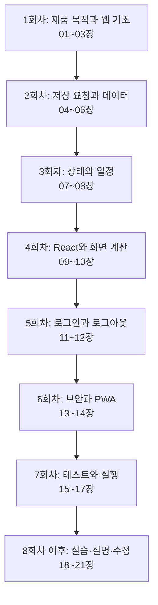

각 회차는 30~60분을 출발점으로 잡되, 시간보다 이해 여부가 기준입니다. 읽다가 막힌 용어는 20장 사전을 보고 돌아옵니다. “다 알아야 다음 개발을 할 수 있다”보다 **한 기능을 끝까지 이해하고 작은 수정을 책임지는 경험**을 쌓습니다.

## 01. 어떤 문제를 해결하는 프로그램인가

**학습 목표:** 기술 이름 없이 서비스의 필요성을 설명합니다.

### 사용자의 문제부터 출발한다

취업 준비를 하면 여러 채용 사이트에서 여러 회사에 지원합니다. 정보가 흩어져 있으면 다음 질문에 답하기 어렵습니다.

- 어느 회사의 어떤 직무에 지원했는가?
- 서류를 언제 제출했고 현재 어떤 단계인가?
- 오늘 면접이나 마감이 있는가?
- 1차·2차 면접을 각각 언제 보는가?
- 끝난 지원과 아직 진행 중인 지원을 어떻게 나눌까?

취준노트는 이 기록을 모아 **다음 행동을 판단할 수 있도록 만드는 개인 도구**입니다. 채용 사이트를 대체하거나 자동 합격 예측을 하는 서비스가 아닙니다.

### 요구사항을 기능과 기술로 연결하기

| 실제 문제 | 기능 | 구현 선택 | 왜 필요한가 |
|---|---|---|---|
| 지원 기록이 흩어짐 | 지원 등록·검색 | Application + CRUD API | 같은 기준으로 기록을 저장 |
| 단계와 약속이 혼동됨 | 상태와 일정 분리 | status + ScheduleEvent | 면접 단계라고 날짜가 확정된 것은 아님 |
| 면접이 여러 번 있음 | 복수 일정 | 지원 1건 : 일정 여러 건 | 날짜 필드 하나로는 부족 |
| 무엇부터 볼지 모름 | 오늘 홈 | 일정 정렬과 공통 집계 함수 | 요약에서 실제 목록으로 이동 |
| 월 전체를 보고 싶음 | 월간 캘린더 | date-fns + CSS Grid | 날짜 경계 계산과 7열 표시 |
| PC와 휴대폰에서 편집 | 충돌 안내 | 요청 version + JPA @Version | 오래된 화면의 덮어쓰기 방지 |
| 자주 앱처럼 열어 봄 | PWA | Manifest + 서비스 워커 | 웹 구현을 재사용하면서 접근 경로 개선 |
| 분실한 기기에서 로그아웃 | 전체 로그아웃 | 서버 세션 + authVersion | 서버에서 인증 효력을 철회 |

### 왜 앱으로까지 만들려고 하는가

앱 출시의 이유는 “앱이 웹보다 멋있어서”가 아닙니다. 일정 확인이 반복되고 모바일 접근 빈도가 높다면 홈 화면 실행, 독립 창, 향후 알림, 스토어에서 찾는 경로가 도움이 될 수 있습니다. 이것은 **제품 가설**입니다. 실제 사용자가 설치하고 자주 사용하는지는 검증해야 합니다.

스토어 설치 파일을 만들었다고 웹의 불편함이나 보안 문제가 사라지지는 않습니다. 사용 빈도가 낮고 브라우저만으로 충분하다면 PWA까지만으로도 가치가 있을 수 있습니다.

### 확인 질문

“취준노트는 React 앱입니다” 대신 사용자 문제 중심으로 한 문장을 만들어 보세요.

<details><summary>예시 답안</summary>

여러 회사의 지원 단계와 면접·마감 일정을 한곳에서 기록하고, 오늘 해야 할 일을 빠르게 확인하도록 돕는 개인 구직 관리 도구입니다.

</details>

## 02. 웹과 언어를 처음부터 연결하기

**학습 목표:** 화면, 서버, DB가 서로 다른 역할이라는 점을 설명합니다.

### 화면에 보이는 것과 저장된 것은 다르다

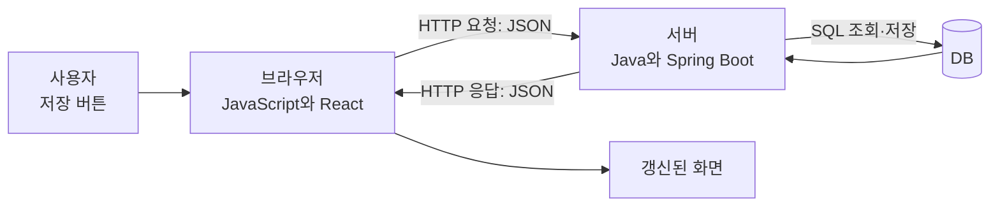

- **브라우저:** 버튼과 입력창을 보여 주고 클릭을 처리합니다. 서버에 있는 Java 코드를 직접 실행하지 않습니다.
- **서버:** 요청자가 누구인지, 이 작업을 허용할지, 무엇을 저장할지 판단합니다.
- **DB:** 서버가 꺼졌다 켜져도 남아야 할 회원·지원·일정을 저장합니다.

입력창에 글자가 보이는 것은 아직 저장 성공이 아닙니다. 저장 요청이 실패하면 화면 입력과 DB 기록이 다를 수 있습니다.

### Java와 JavaScript는 이름만 비슷하다

| 기술 | 어디서 쓰는가 | 이 프로젝트의 예 |
|---|---|---|
| Java | JVM에서 실행되는 백엔드 언어 | MemberService.java |
| JavaScript | 브라우저 로직, Node 도구·테스트 | tracker.js, client.js |
| JSX | JavaScript 안에서 화면 구조를 표현하는 문법 | Pages.jsx |
| HTML | 문서와 요소의 구조 | 버튼·제목·입력 폼 |
| CSS | 크기·색·배치·반응형 스타일 | workspace.css |
| SQL | 관계형 DB를 읽고 변경하는 언어 | 세션 테이블 생성, 조회 |
| YAML / JSON | 설정 또는 데이터 표현 형식 | application.yaml / API 응답 |

TypeScript는 JavaScript에 타입 검사를 더하는 언어입니다. 현재 프론트는 JavaScript입니다. `@types/react`가 설치돼 있다고 코드가 TypeScript로 전환된 것은 아닙니다.

### 코드를 읽는 최소 문법

다음 예시는 **설명용 축약 코드**이며 그대로 붙여 넣을 완성 기능은 아닙니다.

```javascript
const apps = [{ company: '예시회사', status: 'APPLIED' }]
const active = apps.filter(app => app.status === 'APPLIED')
const count = active.length
```

`const`는 변수 바인딩, `[]`는 배열, `{}`는 객체입니다. `filter`는 조건에 맞는 항목으로 새 배열을 만듭니다. `app => ...`는 각 지원을 받아 조건을 검사하는 함수입니다. `length`는 배열의 항목 수입니다. 이 구조가 홈 집계의 출발점입니다.

```java
public Member findById(Long memberId) {
    return memberRepository.findById(memberId)
            .orElseThrow(() -> new IllegalArgumentException("회원을 찾을 수 없습니다."));
}
```

현재 코드에서 발췌한 메서드입니다. `Member`는 반환 타입, `Long memberId`는 입력값의 타입과 이름입니다. Repository의 `findById`는 결과가 없을 수도 있어서 `Optional`을 반환합니다. `orElseThrow`는 없을 때 예외를 발생시킵니다. **예외가 어떻게 HTTP 응답으로 바뀌는지는 06장에서 연결합니다.**

### HTTP와 JSON

HTTP 요청은 대략 **메서드 + 주소 + 헤더 + 필요할 때 본문**으로 구성됩니다.

```http
POST /api/v1/applications
Content-Type: application/json
Cookie: SESSION=<브라우저가 관리하는 값>
X-CSRF-TOKEN: <서버에서 받은 값>

{"company":"예시회사","position":"백엔드","status":"TO_APPLY"}
```

위 세션과 CSRF 값은 자리표시자이며 실제 비밀값을 문서나 Git에 남기면 안 됩니다. JSON은 문자열·숫자·객체·배열 등을 주고받는 형식입니다. Java 객체를 네트워크로 그대로 보내는 것이 아니라 JSON으로 표현하고 반대편에서 해석합니다.

| 메서드 | 보통의 의미 | 실제 예 |
|---|---|---|
| GET | 조회 | 내 지원 목록 |
| POST | 생성 또는 동작 요청 | 지원 등록, 로그인 |
| PUT | 이 API가 정의한 편집 필드 갱신 | 지원·일정 수정 |
| PATCH | 일부 값 변경 | 지원 상태, 닉네임 변경 |
| DELETE | 삭제 | 지원·일정·회원 삭제 |

주소 `/applications/42`의 42는 지원 ID입니다. **ID를 안다는 것이 접근 권한을 뜻하지 않습니다.** 쿼리 문자열 `?view=in-progress`는 화면의 필터 조건이지 로그인 자격증명이 아닙니다.

### origin과 포트

Origin은 스킴·호스트·포트 조합입니다. `http://localhost:5173`과 `http://localhost:8080`은 다른 origin입니다. `localhost`와 `127.0.0.1`도 같은 문자열의 호스트가 아닙니다.

포트는 한 컴퓨터에서 어느 서버로 연결할지 구분합니다. 파일 경로는 소스 위치, URL은 실행 중인 서버의 주소입니다. `C:/.../frontend`를 수정했더라도 다른 폴더에서 실행한 서버를 보고 있다면 화면에 반영되지 않을 수 있습니다.

**공식 보충 자료:** [HTTP 개요](https://developer.mozilla.org/en-US/docs/Web/HTTP/Guides/Overview), [Java 학습](https://dev.java/learn/). 이 장의 요청 예제는 취준노트 API를 바탕으로 작성했습니다.

### 확인 질문

1. 회사명을 입력한 순간 DB에도 저장됐다고 말할 수 있나요?
2. JavaScript에서 가입 버튼을 숨기면 외부에서 가입 API를 호출하지 못하나요?

<details><summary>정답과 이유</summary>

1. 아닙니다. 서버의 저장 성공을 확인해야 합니다.
2. 아닙니다. 브라우저 UI를 거치지 않고 HTTP 요청을 보낼 수 있으므로 검증·권한 검사는 서버에 필요합니다.

</details>

## 03. 왜 이 기술을 사용했는가

**학습 목표:** 기술 하나마다 해결할 문제·대안·비용을 함께 말합니다.

### 기술을 고르는 문장 공식

> “우리에게 **어떤 문제**가 있었고, **어떤 대안**도 있었지만, **현재 조건**에서는 이 선택이 적합했다. 대신 **어떤 비용**을 감수하며, **어떤 상황**이면 바꾸겠다.”

예: “세션을 여러 실행 인스턴스에서 공유하고 재시작 뒤에도 조회해야 해서 JDBC 저장을 사용했습니다. Redis도 가능하지만 현재는 이미 운영할 관계형 DB를 활용해 별도 운영 요소를 늘리지 않았습니다. DB 부하가 실제 문제가 되면 다시 평가하겠습니다.”

### 언어와 큰 구조

| 선택 | 현재 프로젝트에서의 이유 | 대안과 감수한 비용 |
|---|---|---|
| Java 21 유지 | 기존 회원·지원 서버를 활용하고 타입, 예외, 트랜잭션을 학습하기 좋음 | Node.js·Python도 구현 가능. Java/Spring의 설정·추상화를 배워야 함 |
| JavaScript 유지 | 기존 React 코드를 이어서 기능과 규칙을 검증 | TypeScript면 필드 오류를 더 일찍 찾을 수 있음. 현재 런타임 실수 가능성을 테스트로 보완 |
| React 유지 | 화면을 함수형 컴포넌트와 상태로 나눔 | Vue·일반 JS도 가능. 작은 페이지에는 React가 과할 수도 있음 |
| Spring Boot 유지 | 웹·보안·JPA를 기존 구조에 맞춰 연결 | 자동 설정을 이해하지 않으면 오류 원인을 찾기 어려움 |
| 단일 백엔드 프로세스 | 회원·지원·일정이 밀접하며 개인 프로젝트 규모에 맞음 | 마이크로서비스는 배포·인증·트랜잭션 복잡도를 크게 늘림 |

Java 21은 현재 `build.gradle`의 toolchain 기준입니다. “최신이라서”, “대기업도 써서”만으로 선택을 설명하지 않습니다. 기존 자산, 배우려는 역량, 운영 부담이라는 맥락이 중요합니다.

### 서버·DB 도구

| 도구 | 정확한 역할 | 이유 / 한계 |
|---|---|---|
| Spring Security | 인증 상태와 요청 접근 제어 | 필터·세션·CSRF를 직접 모두 구현하지 않음. 업무 소유권은 별도 검사 |
| Spring Session JDBC | HttpSession을 관계형 DB에 저장 | 재시작·인스턴스 공유 기반. DB 읽기·쓰기 비용 발생 |
| BCrypt | 비밀번호 해시 생성·검증 | 원문 복호화 없이 비교. 요청 제한을 대신하지 않음 |
| JPA | 객체와 관계형 DB 매핑 규칙 | SQL 반복을 줄임. SQL 지식이 불필요해지는 것은 아님 |
| Hibernate | JPA 구현체 | 변경 감지·관계·잠금 등을 실제 처리. 쿼리 성능 점검 필요 |
| Spring Data JPA | Repository 구현 지원 | CRUD와 메서드명 기반 조회의 반복 코드 감소 |
| Jakarta Validation | DTO 입력 규칙 검사 | 빈값·길이·날짜 조건을 선언. 애너테이션이 없는 규칙은 자동으로 생기지 않음 |
| Lombok | getter·생성자 코드 생성 | 반복 감소. annotation processor와 IDE 설정을 이해해야 함 |
| Springdoc | OpenAPI 문서 생성 | API 확인 편의. prod에서는 문서 엔드포인트 비활성 |
| JDBC 드라이버 | DB별 통신 구현 | MySQL/PostgreSQL/H2마다 별도 드라이버 사용 |

`Spring Session JDBC`는 현재 JPA 엔티티로 세션을 직접 관리하는 방식이 아닙니다. 세션 저장 라이브러리가 전용 테이블을 이용합니다. 기술 이름에 Spring이 같아도 책임은 다릅니다.

### 화면·도구·검증

| 도구 | 정확한 역할 | 이유 / 한계 |
|---|---|---|
| React Router | URL과 화면 연결 | 상세 직접 접근, 뒤로가기, 필터 상태 표현 |
| Axios | HTTP 클라이언트 | 주소·타임아웃·쿠키·CSRF·오류를 공통 처리. fetch도 대안 |
| date-fns | 날짜 계산·표시 | 월/주 경계와 포맷을 검증된 함수로 처리. 시간대 정책까지 대신 정하지 않음 |
| Lucide React | 아이콘 컴포넌트 | 탐색·수정·삭제 등의 일관된 표식 |
| CSS·변수·Grid | 스타일과 배치 | 현재 화면의 반응형·다크 모드. Tailwind로 되돌려야 할 필연성은 없음 |
| Vite | 개발 서버와 번들 빌드 | 소스 수정 반영, 배포할 JS/CSS 생성. Java 서버가 아님 |
| vite-plugin-pwa / Workbox | Manifest·서비스 워커 생성 | 정적 캐시·업데이트 기반. 푸시는 별도 구현 |
| pnpm | JS 의존성 설치 | lockfile로 실제 해석된 버전을 재현 |
| Gradle Wrapper | Java 빌드 실행 | 저장소에 정한 Gradle 버전 사용 |
| JUnit / Mockito | Java 테스트 / 의존성 대역 | 단위 테스트와 실패 시나리오 검증 |
| MockMvc | 서버 HTTP 계층 테스트 | 컨트롤러와 보안 필터를 포함해 검증. 실제 브라우저 정책까지 증명하지 않음 |
| Node 내장 test | JS 함수 테스트 | 현재 규칙·API 계층 검증에 충분해 별도 테스트 프레임워크를 추가하지 않음 |
| ESLint | 정적 코드 규칙 검사 | 잠재적 실수 탐지. 기능 테스트·보안 감사와 다름 |
| GitHub Actions | 자동 검사 실행 환경 | 변경마다 검사하도록 정의. 설정 파일 존재와 원격 실행 성공은 별개 |

`package.json`의 `^19.2.6`은 정확히 한 버전만 뜻하지 않습니다. 실제 설치 버전은 lockfile·설치 결과와 함께 확인합니다. 문서 작성 시 확인한 주요 계열은 React 19, Vite 8, Spring Boot 3.5.15입니다. 이것을 항상 최신 버전이라는 뜻으로 읽지 않습니다.

### 아직 도입하지 않은 기술을 말하는 방법

- TypeScript: 일정/알림 API 계약부터 점진 도입을 검토합니다. 아직 변환하지 않았습니다.
- Flyway: V1~V3 버전별 SQL을 구현했고 실제 PostgreSQL 마이그레이션·세션 테스트 17개가 CI에서 통과했습니다. 운영 데이터 이전은 별도 작업입니다.
- Redis: 반드시 필요한 것은 아닙니다. 지금은 JDBC 세션을 사용합니다.
- EC2: 사용자가 전환을 시작하지 않았고 비용·운영 요구도 미확정입니다.
- TWA/Capacitor: Android 배포의 후보입니다. 지금 만들어진 패키지는 없습니다.

**코드:** [백엔드 의존성](C:/dev.project/personal.project/job-application-tracker/backend/build.gradle), [프론트 의존성](C:/dev.project/personal.project/job-application-tracker/frontend/package.json).

### 확인 질문

“왜 Redis를 쓰지 않았나요?”에 답해 보세요.

<details><summary>예시 답안</summary>

현재 규모에서는 기존 관계형 DB를 세션 저장소로 활용할 수 있고, Redis를 추가하면 배포·장애·보안 설정 대상이 늘어납니다. JDBC로 먼저 기능을 검증하고 세션 트래픽과 DB 지연을 측정한 뒤 별도 저장소가 필요한지 판단합니다. Redis 자체가 나빠서 제외한 것은 아닙니다.

</details>

## 04. 코드의 지도를 읽는 법

**학습 목표:** 파일 이름을 보고 어디에 책임이 있는지 추측하고 확인합니다.

### 폴더별 책임

```text
job-application-tracker/
  backend/
    src/main/java/com/bin/jobtracker/
      config/        보안과 API 문서 설정
      security/      세션 사용자 표현, 인증 버전 검사
      controller/    HTTP 요청 접수
      dto/           입력·응답의 형태
      service/       업무 규칙, 트랜잭션
      entity/        회원·지원·일정의 영속 객체
      repository/    DB 조회·저장 경계
      exception/     예외와 HTTP 오류 응답
      enums/         지원 상태 등 제한된 값
    src/main/resources/   프로파일 설정, 세션 DDL
    src/test/             Java 테스트와 테스트 DB 설정
  frontend/
    src/workspace/   실제 화면·편집창·PWA 배너
    src/domain/      날짜·집계·필터 등의 순수 계산
    src/api/         공통 HTTP 통신
    src/store/       로그인 상태와 탭 간 변경 알림
    src/App.jsx      URL별 화면 연결
    src/main.jsx     React 시작
  scripts/           로컬 데모 실행·샘플 데이터
  docs/              설계, 구현 상태, 결정 이유
  .github/workflows/ CI 검사 정의
```

위 트리는 상대 구조를 이해하기 위한 지도입니다. 실제 기준 루트는 문서 맨 위의 절대 경로입니다. `.idea`, `node_modules`, `build`, `dist`, `.git`은 각각 IDE 설정, 설치 의존성, 빌드 결과, 배포 결과, 변경 이력이라는 다른 목적을 가집니다.

### 서버 계층을 나누는 이유

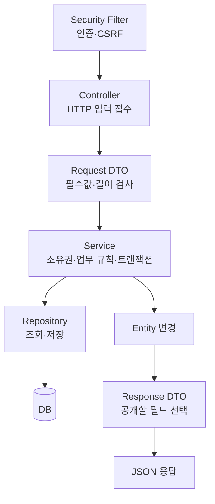

실행 순서를 이해하기 위한 단순화입니다. 입력 JSON을 DTO로 바꾸는 변환, 검증, 트랜잭션 종료 등은 Spring이 주변에서 처리합니다. 필터는 컨트롤러보다 앞에 있으므로 인증·CSRF 실패는 컨트롤러에 도달하기 전에 끝날 수 있습니다.

| 이름 | 쉬운 설명 | 혼동하면 생기는 문제 |
|---|---|---|
| Controller | HTTP 요청을 서비스 호출로 연결 | 여기에 모든 규칙을 쓰면 테스트·재사용이 어려움 |
| Request DTO | 받을 항목과 검사 규칙 | 클라이언트가 마음대로 회원 권한을 지정하게 만들 위험 |
| Service | 작업의 조건과 순서를 결정 | 규칙이 화면마다 달라지면 서버 우회 가능 |
| Entity | DB에 보관할 상태와 관계 | 그대로 응답하면 비밀번호 같은 내부 필드가 노출될 수 있음 |
| Repository | 저장소와 통신 | 단순 조회와 권한 검사를 혼동하면 타인 데이터 노출 |
| Response DTO | 외부에 공개할 값만 선택 | 내부 구조 변경이 API를 쉽게 깨뜨림 |

`Member`에는 비밀번호 해시가 있지만 `MemberResponse`에는 없습니다. “해시니까 공개해도 된다”가 아닙니다. 해시도 공격자가 추측을 검증하는 데 악용할 수 있으므로 응답에서 제외합니다.

### Spring이 객체를 연결하는 방식

`ApplicationController`는 `ApplicationService`가 필요하고, Service는 Repository가 필요합니다. Spring이 이 객체들을 만들고 생성자에 공급하는 것을 **의존성 주입(DI)**이라고 합니다. `@RequiredArgsConstructor`는 `final` 필드용 생성자를 만들어 주는 Lombok 애너테이션입니다.

직접 모든 곳에서 `new ApplicationService(...)`를 반복하지 않아도 됩니다. 테스트에서는 Repository 대신 Mockito 대역을 공급해 “DB에 연결하지 않고 규칙만” 확인할 수 있습니다.

| 코드 표식 | 뜻 |
|---|---|
| `@SpringBootApplication` | 앱 구성과 자동 설정의 시작점 |
| `@RestController` | 반환값을 HTTP 응답 본문으로 처리하는 컨트롤러 |
| `@RequestMapping` / `@PostMapping` | 어떤 주소·메서드에 연결할지 선언 |
| `@RequestBody` | 요청 JSON을 Java 값으로 받음 |
| `@Valid` | DTO에 선언한 입력 검증을 실행 |
| `@Service` | 업무 처리 객체로 등록 |
| `@Transactional` | DB 작업의 트랜잭션 경계 선언 |
| `@Entity` | DB에 매핑되는 클래스 |
| `@AuthenticationPrincipal` | 검증된 인증 정보에서 사용자 값을 얻음 |

애너테이션을 붙이면 모든 문제가 해결되는 것이 아닙니다. 예를 들어 `@Valid`는 선언한 규칙만 검사하고, `@Transactional`은 HTTP 응답 전송까지 롤백하지 않습니다.

**코드:** [앱 시작](C:/dev.project/personal.project/job-application-tracker/backend/src/main/java/com/bin/jobtracker/JobtrackerApplication.java), [회원 응답](C:/dev.project/personal.project/job-application-tracker/backend/src/main/java/com/bin/jobtracker/dto/MemberResponse.java).

## 05. DB와 데이터 모델 이해하기

**학습 목표:** 회원, 지원, 일정을 왜 나눴는지 설명합니다.

### 객체와 테이블

Java의 `Member` 객체 하나는 회원 한 명의 상태를 표현하고, DB의 member 테이블에는 회원별 행이 저장됩니다. 행의 고유 번호가 **기본키(PK)**입니다. 다른 행을 가리키는 번호가 **외래키(FK)**입니다.

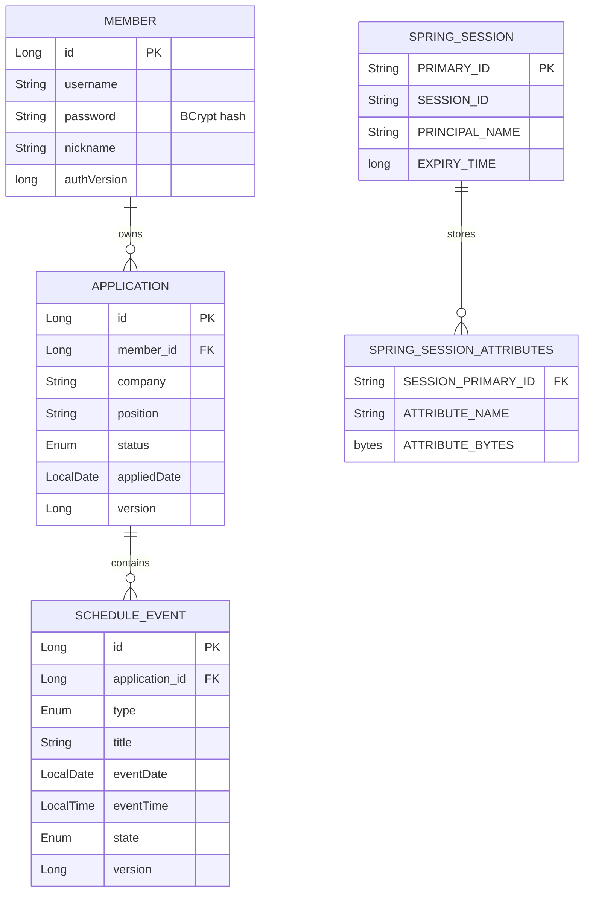

이 그림은 주요 필드만 발췌한 개념도입니다. 세션 테이블의 회원 연결은 `PRINCIPAL_NAME`에 담긴 회원 ID 문자열을 통한 **논리적 연결**이며, member에 대한 DB 외래키를 추가한 구조가 아닙니다. 따라서 회원 삭제만으로 모든 세션이 외래키 연쇄 삭제되는 것은 아니고 별도 정리와 인증 검사가 필요합니다.

### 세 개의 업무 모델

| 모델 | 주요 값 | 이 값이 필요한 이유 |
|---|---|---|
| Member | username, password 해시, nickname, avatar, authVersion | 로그인·표시 이름·인증 폐기 기준 |
| Application | company, position, status, appliedDate, link, memo, version | 한 번의 채용 지원 기록 |
| ScheduleEvent | type, title, eventDate, eventTime, state, version | 특정 지원에 속한 약속·마감 |

`BaseEntity`는 세 모델에 공통인 ID, 생성 시각, 수정 시각을 제공합니다. `@EnableJpaAuditing`과 감사 필드 애너테이션이 시각 기록에 관여합니다. 생성일 `createdAt`과 실제 지원일 `appliedDate`는 다른 사실입니다. 오늘 앱에 입력했더라도 실제 지원은 지난주일 수 있습니다.

`Application.source`와 `externalJobId` 필드가 있다고 외부 채용 API 연동이 구현된 것은 아닙니다. 현재 생성자는 source를 MANUAL로 설정합니다. **필드 존재와 사용자 기능 존재를 혼동하지 않습니다.**

### 지원마다 날짜 필드를 늘리면 안 되나

`interview1Date`, `interview2Date`, `interview3Date`처럼 늘릴 수도 있습니다. 하지만 면접 횟수가 바뀔 때마다 열·DTO·화면을 고쳐야 하고 각 면접의 완료·취소를 따로 표현하기 어렵습니다.

일정을 별도 행으로 만들면 같은 구조를 여러 번 저장할 수 있습니다. 대신 관계 조회·삭제·소유권 관리가 필요합니다. 이 추가 복잡도를 감수할 실제 요구가 “복수 면접”이었습니다.

### 관계와 삭제

```java
@OneToMany(mappedBy = "application", cascade = CascadeType.ALL, orphanRemoval = true)
private List<ScheduleEvent> schedules;
```

실제 선언을 간추린 예입니다.

- `OneToMany`: 한 지원에 여러 일정이 연결됩니다.
- `mappedBy`: 관계를 저장하는 쪽이 일정의 application 필드라는 뜻입니다.
- `cascade`: 지원에 수행한 일부 영속 작업을 일정으로 전파합니다.
- `orphanRemoval`: 지원의 일정 목록에서 제거한 종속 일정을 삭제 대상으로 처리합니다.

JPA의 cascade는 모든 DB 외래키에 자동으로 `ON DELETE CASCADE`를 붙이는 것과 같지 않습니다. 직접 SQL로 삭제할 때의 동작은 실제 DDL을 확인해야 합니다.

### JPA가 SQL을 대신 숨겨 준다는 오해

`findByMemberId` 같은 Repository 메서드는 조회 구현을 줄여 주지만, 실제로는 SQL과 DB I/O가 발생합니다. `LAZY` 관계는 필요한 시점까지 로딩을 미룹니다. 여러 지원의 일정을 하나씩 조회하면 쿼리가 많아지는 N+1 문제가 생길 수 있습니다. 현재 `@BatchSize(size = 50)`는 일정 로딩을 묶는 데 도움을 주지만 모든 쿼리 성능을 보장하지 않습니다.

**코드:** [Member](C:/dev.project/personal.project/job-application-tracker/backend/src/main/java/com/bin/jobtracker/entity/Member.java), [Application](C:/dev.project/personal.project/job-application-tracker/backend/src/main/java/com/bin/jobtracker/entity/Application.java), [ScheduleEvent](C:/dev.project/personal.project/job-application-tracker/backend/src/main/java/com/bin/jobtracker/entity/ScheduleEvent.java), [BaseEntity](C:/dev.project/personal.project/job-application-tracker/backend/src/main/java/com/bin/jobtracker/entity/BaseEntity.java).

### 확인 질문

지원일 체크박스를 끄면 DB에서 어떤 행을 삭제해야 하나요?

<details><summary>정답과 이유</summary>

아무 행도 삭제하지 않습니다. 체크박스는 표시 필터입니다. 지원일은 Application에 그대로 있고, 캘린더에서는 화면용 이벤트로 바꾸어 보여 줄 뿐입니다.

</details>

## 06. 저장 버튼에서 DB까지 한 번 따라가기

**학습 목표:** 지원 등록 한 건을 파일 이름과 연결해서 설명합니다.

### 예시 상황

로그인한 사용자가 예시회사의 백엔드 직무를 “지원 예정”으로 추가합니다. 날짜는 아직 정해지지 않았습니다. 여기서는 존재하지 않는 예시 회사와 날짜만 사용합니다.

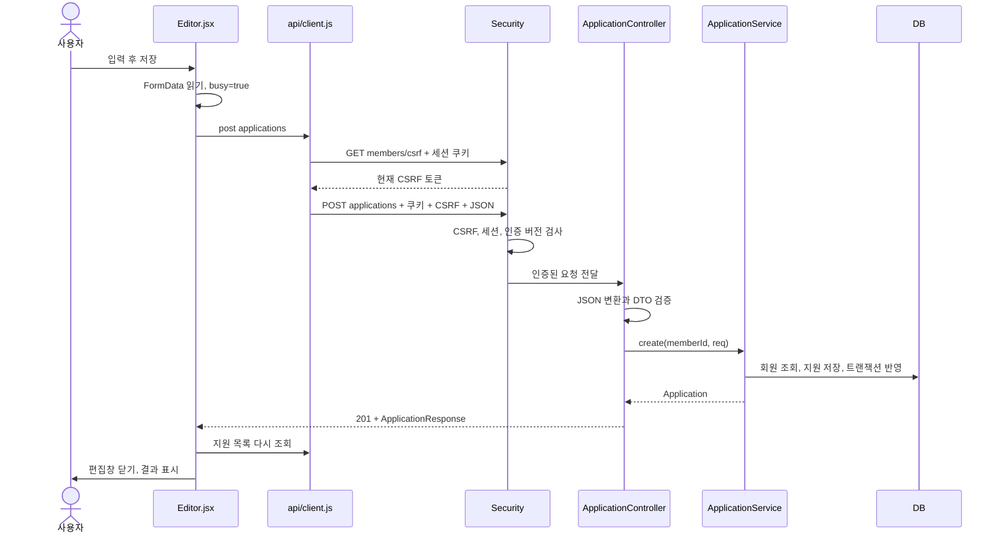

필터의 세부 순서는 11장에서 다룹니다. 위 흐름에서 클라이언트가 `memberId`를 요청 본문에 넣어 소유자를 선택하지 않는 점이 중요합니다.

### 1. Editor: 화면의 입력을 모은다

`Editor.jsx`는 `FormData`를 읽고 종류에 맞는 payload를 만듭니다. 회사명·직무는 trim하고, 빈 선택 날짜는 null로 만듭니다. 저장 중에는 버튼을 비활성화합니다. 지원 등록·수정, 일정, 상태 변경, 삭제 확인에 같은 편집창의 서로 다른 분기를 사용합니다.

왜 공통 편집창인가? 닫기, 저장 중 상태, 오류, 모달 접근성 같은 중복을 줄일 수 있기 때문입니다. 하지만 분기가 계속 늘어나면 읽기 어려워지므로 향후 기능별 폼 분리는 검토할 수 있습니다. “재사용 컴포넌트는 클수록 좋다”는 뜻은 아닙니다.

### 2. API client: 공통 통신 규칙을 붙인다

기본 주소는 `/api/v1`, 타임아웃은 15초이며 쿠키 포함 요청을 사용합니다. GET·HEAD·OPTIONS 이외의 요청 전에는 `/members/csrf`를 조회해 토큰 헤더를 붙입니다.

한 번의 사용자 저장이 항상 한 번의 HTTP 요청인 것은 아닙니다. 현재는 **CSRF 조회 → 저장 → 목록 재조회**가 될 수 있습니다. 단순하고 확인하기 쉽지만 요청 수가 늘어나는 비용이 있습니다.

### 3. Controller: 입력과 HTTP를 연결한다

```java
@PostMapping
public ResponseEntity<ApplicationResponse> create(
        @AuthenticationPrincipal(expression = "memberId") Long memberId,
        @RequestBody @Valid ApplicationCreateRequest req) {
    Application app = applicationService.create(memberId, req);
    return ResponseEntity.status(HttpStatus.CREATED).body(ApplicationResponse.from(app));
}
```

현재 코드의 등록 메서드입니다. `memberId`는 인증 정보에서 얻고, `req`는 요청 본문에서 얻습니다. 입력 출처가 다릅니다. `ApplicationResponse.from`은 외부에 보낼 형태로 변환합니다. `201 Created`는 생성 성공을 뜻합니다.

### 4. DTO: 허용할 데이터인지 검사한다

| 지원 생성·수정 필드 | 현재 서버 검사 |
|---|---|
| company / position | 빈 문자열 금지, 최대 100자 |
| status | 필수, 정의된 enum 값 |
| appliedDate | 미래 날짜 금지. 지원 예정 이외 상태면 필수 |
| link | 최대 255자 |
| memo | 최대 1,000자 |
| version | 전체 수정에서는 필수 |

현재 link의 HTTP/HTTPS 스킴 제한은 주로 프론트 `safeLink`가 담당합니다. DTO가 URL 안전성을 모두 검증한다고 설명하면 틀립니다. 서버 검증과 표시 시 안전 처리의 범위를 나눠 봅니다.

### 5. Service와 Repository: 실제 기록을 만든다

Service는 회원을 찾고 Application 객체를 생성한 뒤 Repository의 save를 호출합니다. 지원 목록 조회는 로그인 회원의 ID로 필터링합니다. 상세·수정·삭제는 `findOwned`로 소유권을 검사합니다.

```java
if (!app.getMember().getId().equals(memberId)) {
    throw new ForbiddenException("본인의 지원만 접근할 수 있습니다.");
}
```

현재 코드에서 발췌했습니다. “로그인한 사람”이라는 인증만으로는 충분하지 않고, “이 지원의 소유자”라는 인가가 필요합니다.

### 트랜잭션: 한 작업을 한 덩어리로 처리하기

트랜잭션은 여러 DB 변경을 하나의 성공·실패 단위로 묶습니다. 예를 들어 과거 면접 날짜를 비우고 새 일정 행을 추가하는 도중 실패하면 날짜만 없어지지 않도록 해야 합니다.

`@Transactional` 경계 안에서 관리되는 엔티티의 값을 바꾸면 Hibernate의 **변경 감지(dirty checking)**로 DB 반영이 일어날 수 있습니다. 모든 setter 뒤에 save를 써야만 저장되는 것은 아닙니다.

`flush()`는 영속 상태를 SQL로 DB에 반영해 제약·버전 충돌 등을 확인하는 시점입니다. **flush와 최종 commit은 같은 뜻이 아닙니다.** 이후 트랜잭션이 실패하면 반영한 SQL도 롤백될 수 있습니다. 예외의 종류와 전파 방식에 따라 롤백 규칙이 달라지며, 기본 설정에서 모든 예외가 무조건 롤백되는 것은 아닙니다.

더 중요한 한계도 있습니다. DB 저장은 성공했는데 응답이 네트워크에서 유실될 수 있습니다. 사용자는 실패처럼 느껴 다시 눌러 중복 등록할 수 있습니다. 화면의 busy 상태는 도움이 되지만 **서버의 멱등성 보장**은 아닙니다. 현재 생성 API의 idempotency key는 구현하지 않았습니다.

**공식 보충 자료:** [Spring Data JPA 트랜잭션](https://docs.spring.io/spring-data/jpa/reference/jpa/transactions.html). 앱별 경계와 flush 설명은 실제 Service 코드와 연결해 읽습니다.

### 실패는 어떻게 화면까지 오는가

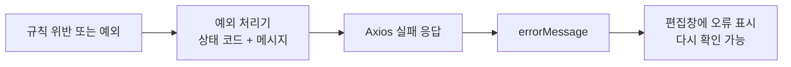

보안 필터의 401·CSRF 403은 컨트롤러 예외 처리기와 다른 경로로 생성될 수 있습니다. 모든 에러가 `GlobalExceptionHandler`에서 시작하는 것은 아닙니다.

| 결과 | 의미 | 현재 앱의 예 |
|---|---|---|
| 200 | 일반 성공 | 조회·수정 응답 |
| 201 | 생성 성공 | 지원·일정 등록 |
| 204 | 성공, 본문 없음 | 로그아웃·삭제 |
| 400 | 입력/업무 조건 위반 | 지원일 누락, 현재 비밀번호 불일치 |
| 401 | 인증 실패/필요 | 로그인 실패, 만료 세션 |
| 403 | 요청 허용 안 됨 | 소유권 위반, CSRF 검증 실패, CORS 거부 |
| 404 | 대상 없음 | 삭제된 일정 |
| 409 | 충돌 | 오래된 version으로 수정 |
| 429 | 요청 과다를 표현하는 표준 상태 | 인증 요청 제한에서 Retry-After와 함께 반환 |
| 응답 없음 | 서버/네트워크에 연결 못함 등 | 프론트 연결 실패 안내 |

**코드 따라가기:** [Editor](C:/dev.project/personal.project/job-application-tracker/frontend/src/workspace/Editor.jsx) → [client](C:/dev.project/personal.project/job-application-tracker/frontend/src/api/client.js) → [Controller](C:/dev.project/personal.project/job-application-tracker/backend/src/main/java/com/bin/jobtracker/controller/ApplicationController.java) → [Service](C:/dev.project/personal.project/job-application-tracker/backend/src/main/java/com/bin/jobtracker/service/ApplicationService.java) → [Repository](C:/dev.project/personal.project/job-application-tracker/backend/src/main/java/com/bin/jobtracker/repository/ApplicationRepository.java).

### 확인 질문

저장 응답이 오지 않았습니다. 무조건 같은 POST를 자동으로 재전송하면 안전한가요?

<details><summary>정답과 이유</summary>

아닙니다. DB 저장 뒤 응답만 유실됐을 수 있습니다. 현재 클라이언트도 CSRF 403 뒤 변경 요청을 자동 재시도하지 않습니다. 조회·상태 확인과 사용자 안내, 필요하면 서버 멱등성 설계가 있어야 합니다.

</details>

## 07. 지원 상태와 지원일

**학습 목표:** 상태, 지원일, 일정이 서로 다른 데이터인 이유를 설명합니다.

### 여섯 가지 상태

| 코드 값 | 화면 표시 | 진행 중 집계 |
|---|---|---|
| TO_APPLY | 지원 예정 | 제외 |
| APPLIED | 지원 완료 | 포함 |
| DOC_PASSED | 서류 합격 | 포함 |
| INTERVIEW | 면접 | 포함 |
| ACCEPTED | 최종 합격 | 제외 |
| REJECTED | 불합격 | 제외 |

이 상태들은 가능한 현재 단계입니다. 현재 서버는 “지원 완료 → 서류 합격 → 면접” 순서만 허용하는 엄격한 상태 머신을 구현하지 않았습니다. 사용자가 기존 기록을 정정하거나 지난 단계를 한 번에 기록할 수 있도록 선택을 허용합니다.

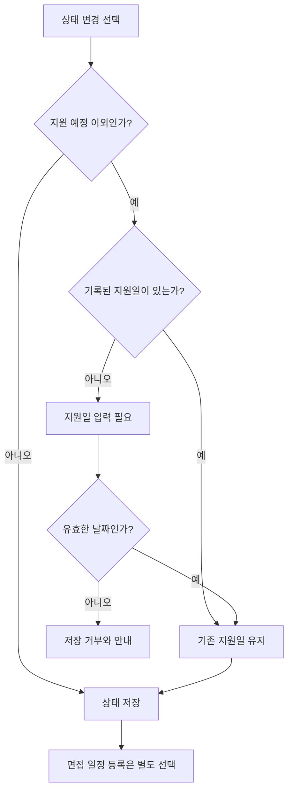

### 왜 면접 상태 변경과 일정 추가를 분리했는가

회사가 면접 대상이라고 알려 왔어도 날짜는 협의 중일 수 있습니다. 이때 상태는 INTERVIEW지만 일정 행은 없을 수 있습니다. 반대로 이미 일정을 입력했어도 지원 상태를 아직 바꾸지 않았을 수 있습니다.

현재 UI는 면접 상태로 바꾼 다음 일정 추가를 이어갈 수 있게 합니다. **두 HTTP 요청을 하나의 DB 트랜잭션으로 묶은 것은 아닙니다.** 상태 변경은 성공하고 이후 일정 저장이 실패할 수 있으므로 화면과 API 결과를 각각 확인해야 합니다.

### 지원일은 무엇을 기록하는가

지원일은 서류를 실제 제출한 날짜입니다. 상태가 바뀔 때마다 오늘로 덮으면 언제 지원했는지 잃게 됩니다. 그래서 상태 변경 API에서는 이미 있는 지원일을 유지하고, 없을 때만 입력을 요구합니다.

다만 “지원일은 절대 수정 불가”는 아닙니다. 지원 전체 편집에서는 잘못 입력한 지원일을 정정할 수 있습니다. **상태 변경 중 보존**과 **전체 편집에서 수정 가능**을 구분해야 합니다.

오늘 이전의 지원을 뒤늦게 기록할 수 있습니다. 미래의 지원일은 서버 검증으로 거부합니다. 마감일·면접일은 미래일 수 있으므로 같은 규칙을 적용하면 안 됩니다.

### 직접 설명해 보기

“면접 상태가 3건인데 면접 예정 카드가 2건인 것은 버그인가요?”

<details><summary>예시 답안</summary>

항상 버그는 아닙니다. 면접 예정은 진행 중 지원 중에서 아직 예정된 미래 면접이 있는 지원을 셉니다. 날짜가 없거나 면접이 완료·취소됐거나 이미 시간이 지났다면 면접 상태라도 예정 집계에서 제외될 수 있습니다.

</details>

## 08. 복수 일정과 안전한 수정

**학습 목표:** 일정의 생성·완료·취소·삭제와 버전 충돌을 구분합니다.

### 일정 한 건의 모양

```json
{
  "type": "INTERVIEW",
  "title": "1차 직무 면접",
  "date": "2026-10-02",
  "time": "14:00",
  "state": "SCHEDULED"
}
```

설명용 등록 요청입니다. 수정에는 서버에서 받은 최신 version도 보내야 합니다.

| 필드 | 허용 내용 | 이유 |
|---|---|---|
| type | INTERVIEW / DEADLINE | 면접과 마감 구분 |
| title | 필수, 최대 80자 | 1차·2차·과제 제출 등 구별 |
| date | 필수 LocalDate | 캘린더에 놓을 날짜 |
| time | 선택 LocalTime | 시간 미정 일정 허용 |
| state | SCHEDULED / COMPLETED / CANCELLED | 예정·완료·취소 구분 |
| version | 수정에서 최신 값 비교 | 예전 화면의 편집 감지 |

완료는 “실행했다”, 취소는 “더 이상 실행하지 않는다”, 삭제는 “기록에서 제거한다”는 뜻입니다. 캘린더는 취소를 제외하지만 완료는 표시할 수 있고, 상세는 취소도 보여 줍니다. 화면 목적에 따라 필터가 다릅니다.

### 레거시 날짜를 왜 바로 삭제하지 않았는가

기존 Application에는 `interviewDate`, `interviewTime`, `deadline`이 있습니다. 새 버전은 이를 즉시 폐기하지 않습니다.

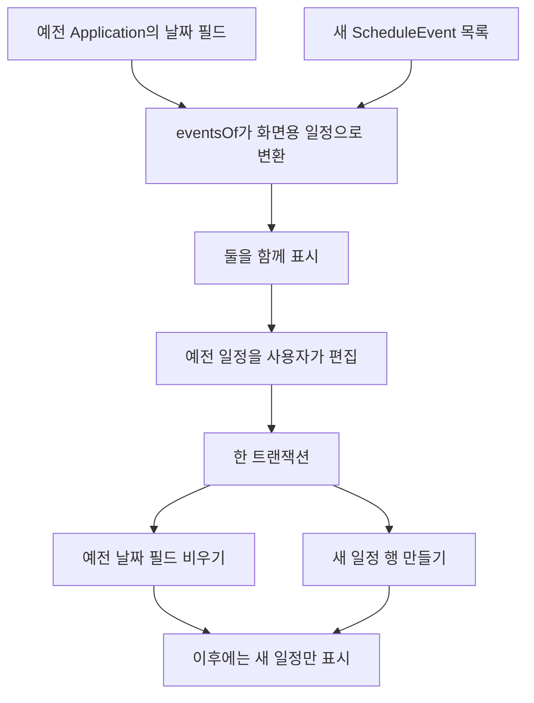

화면용 ID `legacy-interview`·`legacy-deadline`은 새 DB 행의 실제 ID가 아닙니다. Editor는 이 ID를 보고 `/legacy-schedules/...` API로 보냅니다. 일반 일정은 숫자 scheduleId로 수정합니다.

이 방식은 이전 데이터를 보존하면서 점진적으로 전환하기 위한 선택입니다. 대신 한동안 두 표현을 함께 처리하는 복잡도를 감수합니다. 전체 운영 데이터 마이그레이션이 끝났다는 뜻은 아닙니다.

### 동시에 편집하면 어떻게 되는가

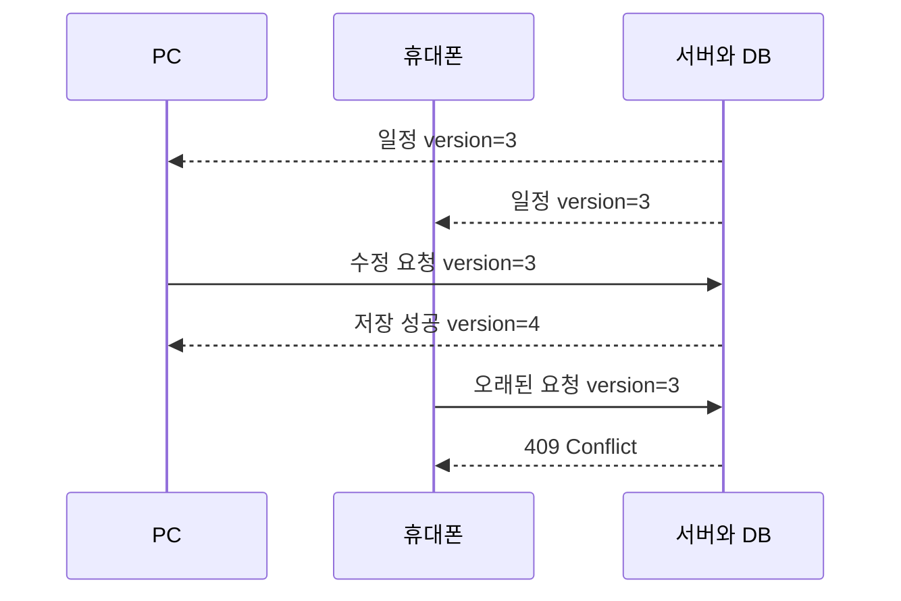

두 가지 검사가 서로 보완합니다.

1. 요청의 version과 서버가 읽은 version 비교: 오래전에 열어 둔 화면을 감지합니다.
2. JPA `@Version`: 두 요청이 거의 동시에 같은 DB 버전을 읽고 수정할 때 DB 반영 단계의 충돌을 감지합니다.

**현재 적용 범위는 지원 전체 수정과 일정 수정입니다.** 상태 변경·삭제 등 모든 API에 요청 version 검사를 붙인 것은 아닙니다. 충돌 시 자동 병합하지 않고 다시 조회해 확인하도록 안내합니다.

### 낙관적 잠금과 비관적 잠금

| 구분 | 비유 | 현재 사용 |
|---|---|---|
| 낙관적 잠금 | 각자 편집하되 저장할 때 원본 버전을 비교 | Application·ScheduleEvent의 @Version |
| 비관적 잠금 | 중요한 수정 동안 같은 회원 행의 수정을 대기시킴 | MemberRepository.findForUpdate |

일반 지원 편집은 충돌이 드물 것이라는 전제로 version을 사용합니다. 비밀번호·authVersion처럼 동시에 덮어쓰면 인증 폐기에 영향을 주는 회원 변경은 같은 회원 행 잠금을 사용합니다. 잠금은 대기·경합 비용이 있으므로 모든 조회에 무조건 붙이지 않습니다.

**코드:** [일정 DTO](C:/dev.project/personal.project/job-application-tracker/backend/src/main/java/com/bin/jobtracker/dto/ScheduleRequest.java), [일정 처리](C:/dev.project/personal.project/job-application-tracker/backend/src/main/java/com/bin/jobtracker/service/ApplicationService.java), [회원 행 잠금](C:/dev.project/personal.project/job-application-tracker/backend/src/main/java/com/bin/jobtracker/repository/MemberRepository.java).

### 확인 질문

`@Version`과 `authVersion`은 같은 역할인가요?

<details><summary>정답과 이유</summary>

아닙니다. `@Version`은 엔티티의 동시 편집 충돌을 감지하는 JPA 기능입니다. `authVersion`은 회원 인증을 폐기했는지 세션의 스냅샷과 비교하기 위해 직접 둔 업무 필드입니다. 이름에 version이 있어도 목적과 갱신 방식이 다릅니다.

</details>

## 09. React 화면은 어떻게 움직이는가

**학습 목표:** 화면의 상태와 서버의 영구 데이터를 구분합니다.

### 컴포넌트·props·state

컴포넌트는 화면 일부를 표현하는 함수입니다. `props`는 바깥에서 받은 입력이고, `state`는 컴포넌트가 기억하는 값입니다. state가 바뀌면 React는 새 상태에 맞는 화면을 계산합니다.

예를 들어 Editor는 `app`을 props로 받아 기존 회사명을 채우고, `busy`와 `error`를 state로 관리합니다. busy가 true이면 저장 버튼을 누를 수 없고, 오류가 생기면 메시지를 보여 줍니다.

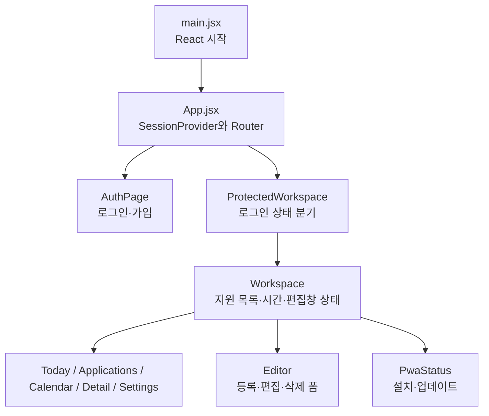

### 주요 상태의 저장 장소

| 값 | 보관 장소 | 새로고침 후 |
|---|---|---|
| 지원·일정의 영구 기록 | 서버 DB | 로그인해서 다시 조회 |
| 현재 화면의 apps 배열 | React 메모리 | 사라지고 API로 재조회 |
| 현재 편집창·오류·busy | React state | 일반적으로 초기화 |
| 검색·보기·정렬 | URL query | 주소에 남음 |
| 다크 모드·캘린더 표시 종류 | localStorage | 같은 브라우저에 남음 |
| 세션 ID | HttpOnly 쿠키 | 브라우저·만료 정책에 따라 유지 |
| 로그인 상태 상세 | 서버 세션 + 프론트의 /me 조회 결과 | 서버에 다시 확인 |

화면 테마를 localStorage에 저장하는 것과 로그인 자격증명을 저장하는 것은 위험도가 다릅니다. 현재는 이전 `access_token` 키를 제거하며, 탭 간 알림용 무작위 값만 저장합니다. 이 값은 로그인 토큰이 아닙니다.

### Context는 무엇인가

여러 화면이 같은 데이터를 필요로 할 때 공통 상위 컴포넌트가 제공하는 통로입니다.

- `SessionContext`: 로그인 상태, 회원, 다시 조회하는 함수.
- Router의 `Outlet context`: 지원 배열, 현재 시간, 새로고침, 편집창 열기, 알림 메시지.

Context는 DB도 아니고 보안 경계도 아닙니다. 브라우저의 편리한 공유 수단일 뿐입니다. 서버는 Context 내용을 믿지 않고 쿠키와 소유권을 검증합니다.

### useEffect와 비동기 처리

`useEffect`는 서버 조회, 이벤트 구독, 타이머 같은 외부 시스템과 연결할 때 쓰입니다. cleanup은 화면이 바뀔 때 타이머·리스너를 정리합니다. 그렇지 않으면 같은 이벤트가 여러 번 처리될 수 있습니다.

`await api.get(...)`는 네트워크 결과를 기다리는 표현입니다. 기다리는 동안 사용자가 다른 화면으로 이동하거나 더 새로운 조회가 시작될 수 있습니다. `SessionProvider`의 revision 카운터는 늦게 도착한 예전 응답이 최신 로그인 판단을 덮어쓰지 못하게 합니다. 이 카운터도 DB의 authVersion과 별개입니다.

### 로그인 상태는 단순한 true/false가 아니다

| 상태 | 화면의 대응 |
|---|---|
| checking | 로그인 확인 중 표시 |
| authenticated | 회원 ID 기준 Workspace 표시 |
| anonymous | 로그인 화면으로 이동 |
| error | 서버 연결 문제와 재시도 표시 |

연결 실패를 “회원이 아니다”로 단정하면 사용자를 불필요하게 로그아웃시킬 수 있습니다. 현재 보호 화면은 오류를 별도로 보여 줍니다. 로그인 만료는 이후 요청 또는 재확인 시 발견되며, 모든 기기에 서버가 즉시 화면 이벤트를 푸시하는 구조는 아닙니다.

### 화면 설계의 이유

오늘·지원·일정·내 정보는 반복 작업의 목적에 맞춘 네 영역입니다. 모바일은 하단 탐색으로 접근 거리를 줄이고, 넓은 화면은 좌측 탐색을 사용합니다. 상태는 select, 종류 필터는 체크박스, 이동·수정은 아이콘 버튼을 사용합니다.

기존 디자인을 단순히 새 색으로 바꾼 것이 아니라 **요약을 눌러 실제 작업으로 이어지는 구조**로 바꿨습니다. 다만 더 실용적이라는 판단은 실사용 시간·오류·불편 피드백으로 계속 검증해야 합니다.

**공식 보충 자료:** [Thinking in React](https://react.dev/learn/thinking-in-react). 구성·상태의 일반 개념을 읽은 뒤 위의 실제 파일 구조와 비교하세요.

**코드:** [App](C:/dev.project/personal.project/job-application-tracker/frontend/src/App.jsx), [Workspace](C:/dev.project/personal.project/job-application-tracker/frontend/src/workspace/Workspace.jsx), [SessionProvider](C:/dev.project/personal.project/job-application-tracker/frontend/src/store/SessionProvider.jsx).

## 10. 홈 집계·검색·월간 캘린더

**학습 목표:** 화면 숫자를 손으로 계산한 뒤 함수 결과와 비교합니다.

### 서버에서 받은 사실과 화면에서 계산한 값

현재 프론트는 본인의 전체 지원 목록을 한 번 받아서 필터·정렬·집계를 수행합니다. “진행 중 3건”이라는 숫자를 별도 영구 기록으로 저장하지 않습니다. 원본 배열에서 계산합니다.

```javascript
export const isActive = app =>
  ['APPLIED', 'DOC_PASSED', 'INTERVIEW'].includes(app.status)
```

현재 규칙입니다. `.includes`는 목록에 값이 있는지 검사합니다. 같은 함수를 홈과 목록이 공유하므로 둘의 정의가 어긋나는 것을 줄입니다.

### 면접 일정 수와 면접 예정 지원 수

오늘을 2026-09-24 오전 10시라고 가정합니다.

| 지원 | 상태 | 일정 | 진행 중 | 면접 예정 지원 |
|---|---|---|---|---|
| A | INTERVIEW | 내일 1차 + 다음 주 2차 | 1 | 1 |
| B | DOC_PASSED | 오늘 14시 면접 | 1 | 1 |
| C | APPLIED | 면접 없음 | 1 | 0 |
| D | ACCEPTED | 내일 면접 기록이 남아 있음 | 0 | 0 |
| E | TO_APPLY | 내일 마감 | 0 | 0 |

홈의 진행 중은 3건, 면접 예정은 2건입니다. A의 면접이 두 개라도 지원 한 건만 셉니다. `some`은 “조건에 맞는 항목이 하나라도 있는가”를 확인하므로 이 요구에 맞습니다.

### 예정 판단의 정확한 경계

- 일정 state가 SCHEDULED여야 합니다.
- 내일 이후 날짜면 미래입니다.
- 오늘이면 시간이 없거나 현재 분 이상인 시간을 예정으로 봅니다.
- 완료·취소는 예정에서 제외합니다.
- 면접 예정 **지원** 집계에는 isActive 조건도 필요합니다.

현재 분 단위 비교이므로 14:00에는 14:00 일정이 포함되고 14:01에는 제외됩니다. 시간 없는 오늘 일정은 그날 동안 예정으로 취급합니다. `now`를 인자로 받는 함수는 테스트에서 시간을 고정하기 쉽습니다.

### 오늘의 일정은 또 다른 필터다

오늘 화면의 일정은 진행 중 또는 지원 예정인 지원에서, APPLIED 표시용 이벤트를 제외하고, 오늘 날짜의 SCHEDULED를 보여 줍니다. **오늘 이미 시간이 지난 미완료 일정도 남습니다.** 반면 면접 예정 집계는 시간 경계를 적용합니다. 서로 다른 목적의 목록이므로 정의를 읽어야 합니다.

다가오는 목록은 내일 이후의 예정 일정을 날짜순으로 최대 6개 보여 줍니다. 현재 구현은 “무조건 7일 이내만” 제한하는 함수가 아닙니다. 계획서의 표현보다 실제 코드를 우선합니다.

### URL에 필터를 저장한 이유

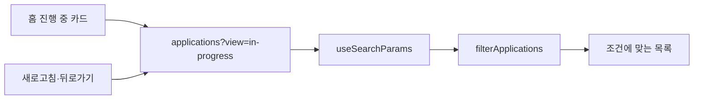

`q`, `view`, `status`, `sort`를 URL에 표현합니다. 주소로 화면의 조건을 재현하기 쉽습니다. 검색어를 타이핑할 때마다 뒤로가기 이력이 쌓이지 않도록 q 변경에는 replace를 사용합니다.

현재 검색은 회사·직무의 부분 문자열 검색이고 서버 검색·페이지네이션은 아닙니다. 개인 기록 규모에서 단순하지만 데이터가 커지면 전송량·렌더링 시간을 측정하고 서버 검색을 검토해야 합니다. 기존 `/applications/stats`는 DB의 GROUP BY·COUNT를 쓰지만 새 홈 카드의 직접 데이터 원천은 아닙니다.

### 캘린더를 만드는 순서

1. 보고 있는 월의 첫날을 계산합니다.
2. 그 날짜가 속한 주의 시작과 월 마지막 날이 속한 주의 끝을 구합니다.
3. 그 사이 날짜를 배열로 만듭니다. 항상 42칸이라고 가정하지 않습니다.
4. CSS Grid 7열에 날짜 버튼을 놓습니다.
5. 각 날짜와 같은 날짜 문자열의 일정을 모아 표시합니다.
6. 선택한 날짜의 목록을 아래에 보여 주고 일정 추가 시 기본 날짜로 전달합니다.

지원일·면접·마감의 표시 선택은 localStorage에 저장됩니다. 지원일은 기본 숨김입니다. `eventsOf()`는 적용일을 별도 DB 일정으로 복사하지 않고 화면용 APPLIED 이벤트로 만듭니다. 캘린더에는 완료 이력도 보이지만 취소 일정은 제외합니다.

### 날짜와 시간대의 한계

서버는 LocalDate와 LocalTime, 프론트는 로컬 날짜·시간을 주로 사용합니다. `yyyy-MM-dd`처럼 자릿수가 고정된 문자열은 날짜 순서를 비교하기 편하지만, 임의의 날짜 문자열에 이 성질을 기대하면 안 됩니다.

현재는 시간대 없는 약속을 한국 사용 기준으로 검증했습니다. “서울 오후 2시”를 해외에서도 정확히 변환하려면 ZoneId·Instant·사용자 시간대 정책 등을 별도로 설계해야 합니다. date-fns를 쓴 것만으로 해외 시간대가 해결된 것은 아닙니다.

**코드:** [tracker.js](C:/dev.project/personal.project/job-application-tracker/frontend/src/domain/tracker.js), [화면 계산](C:/dev.project/personal.project/job-application-tracker/frontend/src/workspace/Pages.jsx).

### 확인 질문

A 지원의 1차 면접을 완료했지만 다음 주 2차 면접은 예정입니다. 면접 예정 지원 수에서 A가 빠지나요?

<details><summary>정답과 이유</summary>

지원 상태가 진행 중이라면 빠지지 않습니다. 예정된 미래 면접이 하나라도 남아 있으면 `some`이 true입니다. 모든 면접이 완료·취소됐거나 과거가 됐을 때 제외됩니다.

</details>

## 11. 회원가입과 세션 로그인

**학습 목표:** 회원가입, 인증, 세션, CSRF를 서로 다른 책임으로 설명합니다.

### 먼저 네 단어를 나눈다

| 단어 | 질문 | 예 |
|---|---|---|
| 회원가입 | 계정을 새로 만들 수 있는가? | 아이디 중복·비밀번호 규칙 검사 |
| 인증(Authentication) | 누구인가? | 비밀번호 확인, 로그인 세션 확인 |
| 인가(Authorization) | 이것을 해도 되는가? | 이 지원의 소유자인가 |
| 세션(Session) | 다음 요청에서도 로그인을 어떻게 기억할까? | 쿠키의 ID로 서버 DB의 로그인 상태 조회 |

### 회원가입과 BCrypt

현재 가입 규칙은 아이디 소문자/숫자 4~20자, 영문·숫자를 포함한 비밀번호 8~30자, 닉네임 1~10자입니다. 중복 확인 API는 있지만 새 가입 화면에는 별도 중복 확인 버튼이 없고, 가입 처리에서도 중복을 검사합니다.

회원가입은 원문 비밀번호를 DB에 저장하지 않습니다. `BCryptPasswordEncoder.encode()`로 해시를 만들고, 로그인 때 `matches()`로 입력값이 맞는지 비교합니다. 해시는 복호화해서 원문으로 되돌리는 암호화와 다릅니다. BCrypt의 salt 때문에 같은 비밀번호라도 저장 문자열이 다를 수 있습니다.

비밀번호는 로그인 요청 본문으로 서버에 전달되므로 **전송 중 보호에는 HTTPS가 필요**합니다. “DB에는 해시로 저장하니 HTTP로 보내도 된다”는 설명은 틀립니다. 비밀번호를 로그에 출력하지 않는 것도 별도 규칙입니다.

현재 복잡도 규칙이 최종적인 보안 정답은 아닙니다. 길이·유출 비밀번호 차단·추측 공격 제한·사용성의 균형을 재검토할 수 있습니다. 가입의 길이 제한과 로그인/현재 비밀번호 입력의 길이 제한도 동일하게 구현돼 있지 않습니다.

가입 성공 후 프론트가 로그인 API를 별도로 호출합니다. 두 요청은 하나의 트랜잭션이 아니므로 가입은 성공하고 자동 로그인이 실패할 수 있습니다. 이때 계정이 없는 것으로 단정하지 말고 일반 로그인으로 확인합니다.

### 예전 JWT 방식: 지금은 과거 설명이다

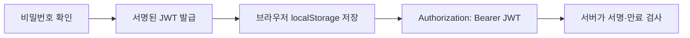

JWT는 서명으로 변조를 검사할 수 있는 토큰 형식입니다. 일반적인 서명 JWT의 payload가 암호화돼 숨겨진다는 뜻은 아닙니다. JWT 자체가 localStorage를 요구하지도 않습니다. **우리의 과거 구현이 JWT를 localStorage에 보관했던 것**입니다.

과거에는 브라우저의 토큰을 지우는 로그아웃이었고, 이미 복사된 토큰의 서버 폐기 체계가 없었습니다. JWT도 폐기 목록·회원 버전·refresh token 회전 등을 설계해 보완할 수 있지만 관리할 상태와 코드가 늘어납니다.

현재는 JJWT 의존성과 JwtProvider·JwtAuthenticationFilter·LoginResponse의 accessToken 구조를 제거했습니다. 이전 학습 노트의 JWT 파일 링크를 현재 구현으로 따라가면 안 됩니다.

### 현재 방식: 브라우저에는 ID, 서버에는 로그인 상태

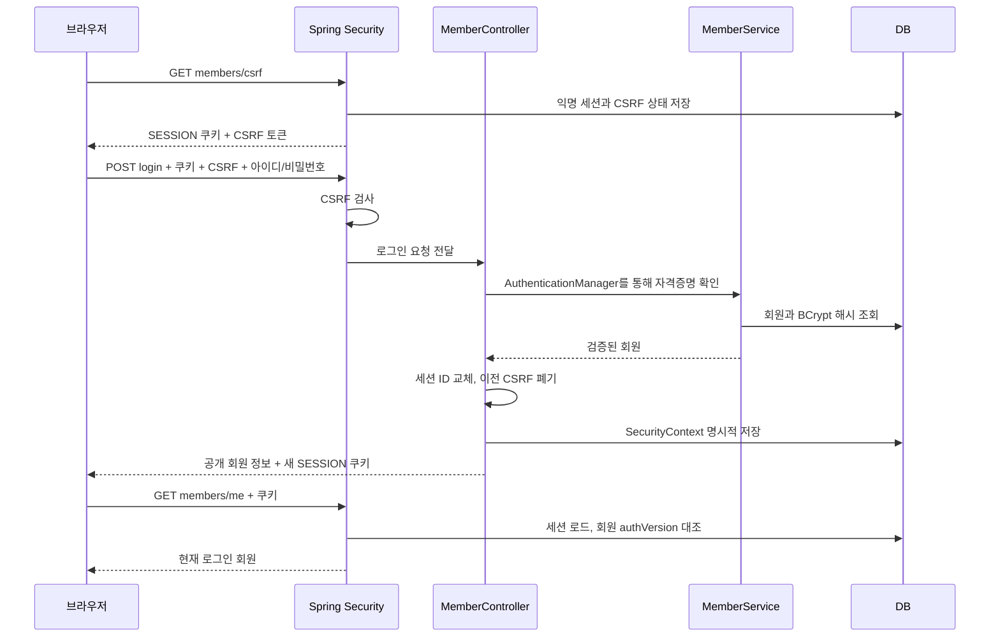

### 실제 로그인 처리의 연결

1. `AuthPage`가 입력값을 API client에 전달합니다.
2. client가 CSRF 토큰을 조회하고 login POST에 붙입니다.
3. `MemberController.login`이 AuthenticationManager를 호출합니다.
4. 현재 AuthenticationManager는 MemberService.login을 이용하는 작은 구현입니다. 모든 인증 프레임워크 기능을 자동으로 사용한 것은 아닙니다.
5. 로그인 성공 시 `SessionPrincipal(memberId, authVersion)`을 인증 정보에 넣습니다. 여기에 원문 비밀번호를 저장하지 않습니다.
6. `ChangeSessionIdAuthenticationStrategy`로 세션 ID를 교체하고 `CsrfAuthenticationStrategy`로 이전 CSRF 토큰을 폐기합니다.
7. `SecurityContextHolder`에 현재 요청의 인증 정보를 설정하고 `SecurityContextRepository.saveContext`로 이후 요청에서도 사용할 수 있게 저장합니다.
8. 반환값은 회원 공개 정보입니다. accessToken을 JSON으로 주지 않습니다.

**왜 saveContext가 필요한가?** 이번 구성은 명시적 저장을 사용합니다. 현재 요청의 메모리에 인증됐다고 적는 것과 다음 요청에서도 그 인증 상태를 복구할 수 있도록 저장하는 것은 다릅니다. 직접 작성한 로그인 컨트롤러에서 이 연결을 빼먹으면 로그인 성공 응답 뒤 `/me`가 401이 될 수 있습니다. [Spring Security 세션 관리](https://docs.spring.io/spring-security/reference/6.5/servlet/authentication/session-management.html)

### 일반 API 요청에서 일어나는 일

DB 세션이 복원된 뒤 SecurityContext에서 인증 정보를 얻습니다. 현재 별도 SessionValidityFilter는 CSRF 필터 뒤에서 회원 존재 여부와 authVersion을 비교합니다. Controller는 `@AuthenticationPrincipal(expression = "memberId")`로 회원 ID를 받습니다.

실패 이유에 따라 먼저 적용되는 검사가 다릅니다. 만료된 쿠키로 CSRF 없는 POST를 보냈다면 인증 실패 401보다 CSRF 실패 403을 먼저 볼 수도 있습니다. “인증이 없으면 어떤 요청이든 반드시 401”이라고 외우지 않습니다.

### 쿠키 속성은 각각 무엇을 막는가

| 설정 | 현재 값 | 의미와 한계 |
|---|---|---|
| HttpOnly | true | 페이지 JavaScript의 쿠키 읽기를 막음. 악성 스크립트의 사용자 대행 요청까지 차단하지 않음 |
| Secure | prod에서 true | 브라우저가 HTTPS 연결에서 쿠키를 보내도록 제한. 로컬 HTTP 개발은 false |
| SameSite | Lax | 일부 다른 사이트 문맥의 쿠키 전송을 제한. CSRF 토큰을 대체하지 않음 |
| Path | / | 앱 경로에서 쿠키를 사용 |
| Domain | 따로 지정하지 않음 | 발급 호스트 기준. 임의로 모든 하위 도메인에 확장하지 않음 |
| 쿠키 Max-Age | 7일 | 정상 브라우저의 저장 수명 |
| 서버 비활성 만료 | 7일 | 요청이 오지 않은 기간 기준의 세션 만료 |

**심화 주의:** 브라우저 쿠키의 7일과 서버의 7일 비활성 만료는 “탈취된 세션도 로그인 후 정확히 7일이면 무조건 끝난다”는 보장이 아닙니다. 공격자는 브라우저의 쿠키 만료를 따르지 않고 ID를 재사용할 수 있고, 사용 중인 서버 세션은 비활성 기준이 연장될 수 있습니다. 별도의 서버 절대 만료 정책은 현재 구현하지 않았습니다.

### CSRF를 쉬운 상황으로 이해하기

사용자가 취준노트에 로그인한 채 다른 사이트를 열었다고 가정합니다. 브라우저는 조건에 맞으면 요청에 로그인 쿠키를 자동 첨부합니다. 공격자는 이를 이용해 사용자가 의도하지 않은 변경 요청을 보내게 할 수 있습니다. 이것이 CSRF의 핵심입니다.

현재는 서버 세션에 연결된 CSRF 토큰을 받고, 변경 요청 헤더에 실어 검증합니다. 다른 사이트가 그 값을 읽고 정상 요청을 구성하기 어렵게 만드는 방어입니다. 로그인·가입·로그아웃도 예외로 빼지 않았습니다. Spring의 기본 XOR 처리와 토큰 검증을 이용하며 직접 암호 알고리즘을 구현하지 않았습니다. [Spring Security CSRF](https://docs.spring.io/spring-security/reference/6.5/servlet/exploits/csrf.html)

CSRF 토큰은 JavaScript가 읽어야 할 값이지만 **로그인 세션 ID와는 다른 값**입니다. CSRF 토큰만으로 로그인한 회원이 되는 것이 아닙니다. 반대로 XSS가 같은 origin의 스크립트를 실행할 수 있으면 CSRF 방어도 우회할 수 있으므로 XSS 방어가 여전히 필요합니다.

### 왜 매번 변경 요청 전에 CSRF를 조회하는가

로그인·로그아웃 후 토큰이 바뀌므로 과거 값을 재사용하지 않으려는 단순한 선택입니다. 캐싱·갱신 최적화도 가능하지만 현재는 명확한 흐름과 테스트 가능성을 택했습니다. 토큰을 받지 못하면 변경 요청을 보내지 않고 실패를 전달합니다. 자동 재시도로 사용자 동작이 중복되는 것을 피합니다.

### 왜 JDBC이고 Redis가 아닌가

DB에 세션을 저장하면 같은 저장소와 호환되는 서버가 세션을 조회할 수 있고 프로세스 재시작에도 메모리처럼 즉시 사라지지 않습니다. 이미 사용하는 관계형 DB를 활용하므로 새로운 서버 운영을 늘리지 않는 장점이 있습니다. 대신 DB 장애가 인증 장애로 이어지고 요청마다 조회·갱신 비용이 듭니다. **영속 세션은 무중단 운영이나 무한 확장성을 보장하지 않습니다.** [Spring Session JDBC](https://docs.spring.io/spring-session/reference/configuration/jdbc.html)

**코드:** [SecurityConfig](C:/dev.project/personal.project/job-application-tracker/backend/src/main/java/com/bin/jobtracker/config/SecurityConfig.java), [MemberController](C:/dev.project/personal.project/job-application-tracker/backend/src/main/java/com/bin/jobtracker/controller/MemberController.java), [SessionPrincipal](C:/dev.project/personal.project/job-application-tracker/backend/src/main/java/com/bin/jobtracker/security/SessionPrincipal.java), [SessionValidityFilter](C:/dev.project/personal.project/job-application-tracker/backend/src/main/java/com/bin/jobtracker/security/SessionValidityFilter.java).

### 확인 질문

1. 쿠키를 JavaScript에서 읽지 못하는데 Axios는 어떻게 보낼 수 있나요?
2. CSRF 토큰을 가지고 있으면 비밀번호 없이 내 정보를 조회할 수 있나요?

<details><summary>정답과 이유</summary>

1. 쿠키 전송은 조건에 맞을 때 브라우저가 담당합니다. JavaScript가 쿠키 값을 읽어 헤더 문자열을 직접 만드는 구조가 아닙니다.
2. 아닙니다. CSRF 토큰은 의도하지 않은 변경 요청을 방어하는 값입니다. 로그인된 서버 세션은 별도로 필요합니다.

</details>

## 12. 로그아웃·비밀번호 변경·탈퇴

**학습 목표:** 화면을 이동하는 것과 인증을 폐기하는 것의 차이를 이해합니다.

### 현재 기기 로그아웃

`POST /members/logout`에 올바른 CSRF를 전송하면 SecurityContextLogoutHandler가 현재 인증·세션을 정리합니다. Spring Session의 응답 처리와 함께 쿠키 삭제가 전달됩니다. 이후 같은 세션 ID를 재사용하는 테스트도 거부되는지 확인했습니다.

성공한 뒤 프론트는 로그인 상태 변경 이벤트를 보내고 로그인 화면으로 이동합니다. 서버 요청이 실패했는데 무조건 성공한 것처럼 안내하지는 않습니다. 같은 브라우저의 여러 탭은 보통 쿠키를 공유하므로 “현재 탭만 로그아웃”과도 다릅니다.

### 모든 기기 로그아웃의 두 겹 처리

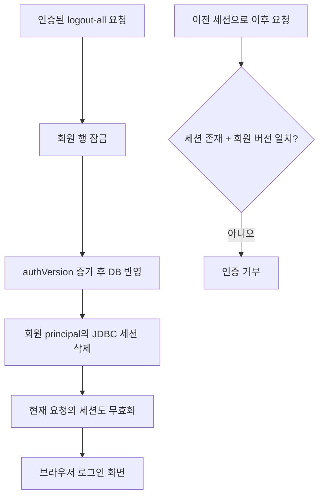

세션 삭제와 다른 요청의 저장이 경합하면 이전 세션이 남거나 다시 저장되는 상황을 고려해야 합니다. 그래서 회원 DB에 authVersion을 두고, 로그인 시 SessionPrincipal에 담은 버전과 다음 요청에서 비교합니다. 단순히 세션 행을 지우는 것에만 의존하지 않습니다.

이미 검사를 통과하고 실행 중인 요청을 시간을 거슬러 취소하는 것은 아닙니다. “즉시 폐기”는 이후 인증 검사에서 효력이 없어지도록 한다는 뜻으로 이해합니다.

### 비밀번호 변경의 순서

1. 현재 로그인과 CSRF를 확인합니다.
2. 회원 행을 잠그고 현재 비밀번호를 BCrypt로 확인합니다.
3. 새 비밀번호가 기존과 같으면 거부합니다.
4. 새 비밀번호 해시 저장과 authVersion 증가를 같은 회원 트랜잭션 안에서 수행합니다.
5. 회원의 JDBC 세션을 정리하고 현재 요청도 로그아웃합니다.
6. 프론트는 변경 완료 안내가 있는 로그인 화면으로 이동합니다.

현재 비밀번호 확인은 이미 로그인돼 있어도 민감한 작업을 다시 확인하기 위한 절차입니다. 이는 별도의 MFA 구현이라는 뜻은 아닙니다.

**트랜잭션 경계 주의:** 회원 정보 변경과 모든 JDBC 세션 삭제, HTTP 응답 전송 전체를 하나의 원자적 작업으로 묶지는 않았습니다. 회원 변경 후 세션 정리가 실패할 수도 있습니다. 인증 버전 검사가 남아 있는 오래된 세션을 거부하는 데 도움이 되지만, 실패 응답·재로그인 안내·운영 오류 감시는 여전히 중요합니다.

### 닉네임 변경에도 왜 행 잠금을 사용하나

JPA가 읽은 회원 객체를 수정해 저장하는 동안 다른 요청이 비밀번호·authVersion을 바꾸면, 오래된 회원 상태를 다시 저장할 위험을 고려해야 합니다. 현재 회원 수정 경로는 같은 `findForUpdate` 잠금을 사용해 순서를 맞춥니다. 일반 프로필 변경이 예전 인증 버전을 복원하지 않도록 하기 위한 선택입니다. 실제 PostgreSQL의 경합·부하 테스트는 후속 검증입니다.

### 회원 탈퇴

현재 비밀번호와 삭제 동의 UI를 확인합니다. 서버는 회원의 지원을 삭제하고 그에 연결된 일정을 정리한 뒤 회원을 삭제합니다. 이후 세션도 정리하고 회원 존재 검사가 오래된 세션을 거부합니다.

이 작업은 단순히 로그인 상태만 지우는 로그아웃과 다릅니다. 백업 안의 개인정보 보존 기간, 운영 로그, 향후 Push 구독 삭제는 별도 정책과 구현이 필요합니다. 계정 삭제 API 하나가 개인정보 처리의 모든 의무를 자동 충족하는 것은 아닙니다.

### 다른 탭과 다른 기기는 어떻게 알게 되나

프론트는 같은 origin의 다른 탭에 localStorage 변경 이벤트로 재확인을 유도합니다. 창에 다시 포커스가 오거나 온라인으로 돌아와도 `/me`를 조회합니다. API의 401도 만료 처리에 연결합니다.

다른 물리적 기기에 즉시 “화면을 닫으라”는 실시간 메시지를 보내는 기능은 없습니다. 해당 기기가 다음 요청을 하거나 로그인 상태를 다시 확인하면 거부됩니다. **서버 접근 차단과 이미 화면에 그려진 정보의 제거는 다른 문제**입니다.

아바타 수정 API는 남아 있지만 새 화면에서 아바타 편집 UI는 아직 이식하지 않았습니다. 다크 모드와 캘린더 표시 설정은 계정 DB가 아닌 해당 브라우저에 저장하므로 다른 기기와 자동 동기화되지 않습니다.

**코드:** [MemberService](C:/dev.project/personal.project/job-application-tracker/backend/src/main/java/com/bin/jobtracker/service/MemberService.java), [SessionService](C:/dev.project/personal.project/job-application-tracker/backend/src/main/java/com/bin/jobtracker/service/SessionService.java), [탭 간 알림](C:/dev.project/personal.project/job-application-tracker/frontend/src/store/auth.js), [계정 UI](C:/dev.project/personal.project/job-application-tracker/frontend/src/workspace/Pages.jsx).

### 확인 질문

모든 기기에서 로그아웃했는데 다른 휴대폰 화면에 회사명이 아직 보입니다. 서버 인증 폐기가 실패했다고 단정할 수 있나요?

<details><summary>정답과 이유</summary>

단정할 수 없습니다. 화면에 이미 그려진 데이터는 메모리에 남아 있을 수 있습니다. 다음 보호 API 요청이 거부되는지 확인해야 합니다. 현재 다른 기기의 화면을 즉시 지우는 실시간 통신 기능은 없습니다.

</details>

## 13. 보안: 무엇을 막았고 무엇이 남았는가

**학습 목표:** “Spring Security를 썼으니 안전하다” 대신 위협과 방어를 연결합니다.

### 보호해야 하는 자산

비밀번호, 로그인 세션, 지원 회사·직무·메모·면접 일정, 운영 DB, 비밀 환경변수, 서비스 가용성이 보호 대상입니다. 지원 기록도 개인의 취업 활동 정보이므로 공개 예제 데이터와 다르게 취급합니다.

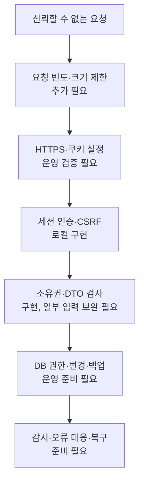

이것은 실제 필터의 정확한 실행 순서가 아니라 **방어 영역의 지도**입니다. 한 영역이 다른 영역을 대체하지 않습니다.

### 공격 상황과 현재 방어

| 상황 | 무엇이 문제인가 | 현재 대응 | 남은 확인 |
|---|---|---|---|
| 타인의 지원 ID로 조회 | 로그인해도 소유자가 아님 | findOwned와 소유권 테스트 | 모든 신규 API에도 일관 적용 |
| 비밀번호 DB 유출 | 원문·해시가 공격에 이용됨 | BCrypt, 응답 DTO에서 제외 | DB 권한·백업·비밀값 유출 대응 |
| 악성 외부 사이트의 변경 요청 | 쿠키 자동 첨부 악용 | CSRF + SameSite | 실제 프록시와 배포에서 검증 |
| 세션 ID 고정 유도 | 공격자가 알고 있는 ID로 로그인 | 로그인 시 ID 교체 | 실제 쿠키 수명주기 검증 |
| 분실 기기의 세션 사용 | 과거 로그인이 계속 유효 | 전체 폐기 + authVersion | 운영 DB·다중 인스턴스 검증 |
| 스크립트 주입(XSS) | 화면 문맥에서 악성 코드 실행 | React 텍스트 출력, 링크 스킴 제한 | 문서 CSP 등 추가 방어·동적 점검 |
| 이전 계정 데이터가 캐시에 남음 | 계정 간 개인정보 노출 | API no-store, SW NetworkOnly | CDN·브라우저·계정 전환 실제 확인 |
| 비밀번호 무작위 대입 | 반복 추측으로 계정 탈취 시도 | 일반 실패 메시지, Bucket4j 요청 제한 | 프록시·다중 인스턴스 제한 검증 |
| 익명 세션 대량 생성 | DB·CPU·용량 소모 | 세션 만료/정리, 인증 경로 요청 제한 | 운영 용량·분산 제한 검증 |

보안 헤더의 CSP(Content Security Policy)는 어떤 스크립트·리소스를 허용할지 브라우저에 알려 주는 방어입니다. API 응답에만 설정하고 실제 HTML 문서에는 적용하지 않으면 기대한 효과가 없을 수 있습니다. 정책을 과하게 조이면 정상 PWA·스크립트도 깨질 수 있어 보고·검증 단계가 필요합니다.

### CORS는 인증이 아니다

CORS는 브라우저가 다른 origin 응답을 읽는 것을 통제하는 규칙입니다. 서버에 직접 요청하는 프로그램까지 “허용 사이트가 아니다”라는 이유로 차단하는 인증 체계가 아닙니다. CORS를 설정했어도 세션·CSRF·소유권 검사와 요청 제한이 따로 필요합니다.

현재 와일드카드 허용은 제거했고 운영 origin을 명시하도록 했습니다. 하지만 설정 파일과 실제 배포 결과는 다를 수 있습니다. 잘못된 origin 설정은 정상 변경 요청의 403 원인이 됩니다.

### 구현한 방어와 운영 전에 보완할 부분

**1. 로그인·가입·세션 발급의 요청 제한**

비밀번호 해시는 계산 비용이 있어 추측 공격을 어렵게 하지만, 서버도 검증 비용을 지불합니다. 현재 Bucket4j 기반 인증 요청 제한과 429/Retry-After 응답을 구현했습니다. 단일 서버의 메모리 기반 제한이므로 프록시의 실제 IP 처리와 다중 서버 합산 제한은 별도 검증이 필요합니다. IP만 쓰면 공유망 사용자가 함께 제한될 수 있고, 계정을 영구 잠그면 공격자가 남의 계정을 잠그는 서비스 거부를 만들 수 있습니다. [OWASP 인증 지침](https://cheatsheetseries.owasp.org/cheatsheets/Authentication_Cheat_Sheet.html)

**2. 입력 길이·본문 크기·데이터 개수 제한**

로그인·비밀번호 입력 길이와 인증 JSON 본문 크기 제한을 추가했습니다. 생성 가능한 지원·일정·익명 세션 수 등은 여전히 운영 기준이 필요합니다. 프론트의 maxlength만으로 서버를 보호할 수 없습니다. 구체적인 범위는 [추가 학습 노트](../LEARNING_2026-09-28.md)를 함께 읽습니다.

**3. HTTPS와 실제 프록시 검증**

운영 Secure 쿠키 설정은 있지만 실제 HTTPS 배포에서 로그인·변경·로그아웃·캐시 분리를 검증하지 않았습니다. 현재 저장소의 Vercel rewrite는 SPA fallback 중심이며 실제 API 전달 구성이 필요합니다. CORS를 무조건 풀거나 Secure를 꺼서 오류를 없애는 것은 해결이 아닙니다.

**4. 비밀값·의존성·운영 보안 확인**

`.gitignore`는 이미 커밋된 비밀을 과거 이력에서 지우지 않습니다. 노출이 확인되면 실제 비밀값을 교체하는 절차가 필요합니다. 의존성 취약점 보고는 버전·사용 경로·패치 영향을 함께 확인해야 하며 “경고 0개”도 완전한 안전 보장은 아닙니다. 이번 노트 작성에서 전체 Git 이력이나 운영 비밀값을 감사하지 않았습니다.

**5. 백업·복구·보안 이벤트 관측**

로그인 실패 폭증, 403/500 증가, DB 세션 증가 등을 알아차릴 수 있어야 합니다. 비밀번호·쿠키·CSRF 토큰은 로그에 남기지 않으면서 필요한 사건은 식별해야 합니다. 백업 파일 존재보다 실제로 복원해 본 경험이 중요합니다.

### 계정 존재 여부는 숨겨졌나

로그인 실패는 없는 아이디와 틀린 비밀번호를 같은 공개 메시지로 처리합니다. 그러나 현재 아이디 중복 확인 API와 가입 중복 메시지는 계정 존재 여부를 알려 줍니다. 따라서 “계정 존재 정보가 모든 경로에서 숨겨진다”고 말하면 안 됩니다. 사용자 편의와 정보 노출의 균형, 요청 제한을 함께 검토합니다.

### XSS와 CSRF를 구분하는 연습

- XSS: 공격자의 스크립트가 우리 화면의 문맥에서 실행되는 문제.
- CSRF: 다른 사이트에서 사용자의 로그인 쿠키가 실린 의도하지 않은 요청을 유도하는 문제.
- HttpOnly: 쿠키를 스크립트가 직접 읽기 어렵게 함.
- CSRF 토큰: 의도하지 않은 변경 요청을 검증하는 추가 값.

같은 방어가 아닙니다. HttpOnly가 있어도 악성 스크립트가 로그인된 브라우저를 통해 요청할 수 있습니다. [OWASP 세션 관리](https://cheatsheetseries.owasp.org/cheatsheets/Session_Management_Cheat_Sheet.html)

### 현재 보안 판정

**로컬 개발을 계속할 기본 방어는 갖췄지만 공개 출시를 승인할 수준의 검증을 끝낸 상태는 아닙니다.** 코드가 작성됐다는 사실, 테스트 시나리오가 통과했다는 사실, 실제 배포가 안전하다는 판단은 별개의 증거가 필요합니다. 현재 일반 백엔드 55개와 별도 PostgreSQL 17개 테스트가 통과했지만 모두 보안 공격 테스트인 것은 아닙니다.

### 확인 질문

다른 사이트에서 데이터를 읽을 수 없도록 CORS를 제한했습니다. 이제 비밀번호 무작위 대입도 막힌 건가요?

<details><summary>정답과 이유</summary>

아닙니다. 공격자는 브라우저 밖에서도 요청할 수 있고 정상적인 CSRF 조회·로그인 절차를 반복할 수 있습니다. CORS와 CSRF는 요청 빈도 제한을 대신하지 않습니다.

</details>

## 14. PWA와 원스토어: 설치와 오프라인을 구분하기

### PWA는 새로운 언어가 아니다

PWA는 기존 웹에 설치 정보와 서비스 워커 같은 기능을 결합하는 접근입니다. React를 Android 언어로 자동 번역하는 기술이 아닙니다. 지금의 Java 서버와 React 화면을 유지하면서 홈 화면에서 실행하는 경험을 만들 수 있다는 점이 선택 이유입니다.

| 구성 요소 | 이 프로젝트의 구현 | 맡지 않는 일 |
|---|---|---|
| Web App Manifest | 이름, 아이콘, 시작 URL, standalone 표시 | 로그인·DB 저장 |
| Service Worker | 브라우저가 관리하는 별도 실행 문맥에서 캐시·네트워크 처리 | 상시 실행되는 서버 |
| Workbox | 캐시 작업을 위한 검증된 도구 | 데이터 충돌 정책 자동 설계 |
| vite-plugin-pwa | 빌드 과정에서 manifest·서비스 워커 생성 및 등록 지원 | 앱스토어 심사 통과 보장 |
| PwaStatus | 설치 가능 이벤트와 업데이트 안내 처리 | 모든 브라우저에서 동일한 설치 버튼 보장 |

관련 코드: [vite.config.js](C:/dev.project/personal.project/job-application-tracker/frontend/vite.config.js). 서비스 워커의 역할은 [MDN Service Worker API](https://developer.mozilla.org/en-US/docs/Web/API/Service_Worker_API), 빌드 통합은 [Vite PWA 안내](https://vite-pwa-org.netlify.app/guide/)를 참고합니다.

### 무엇이 캐시되고 무엇이 캐시되지 않는가

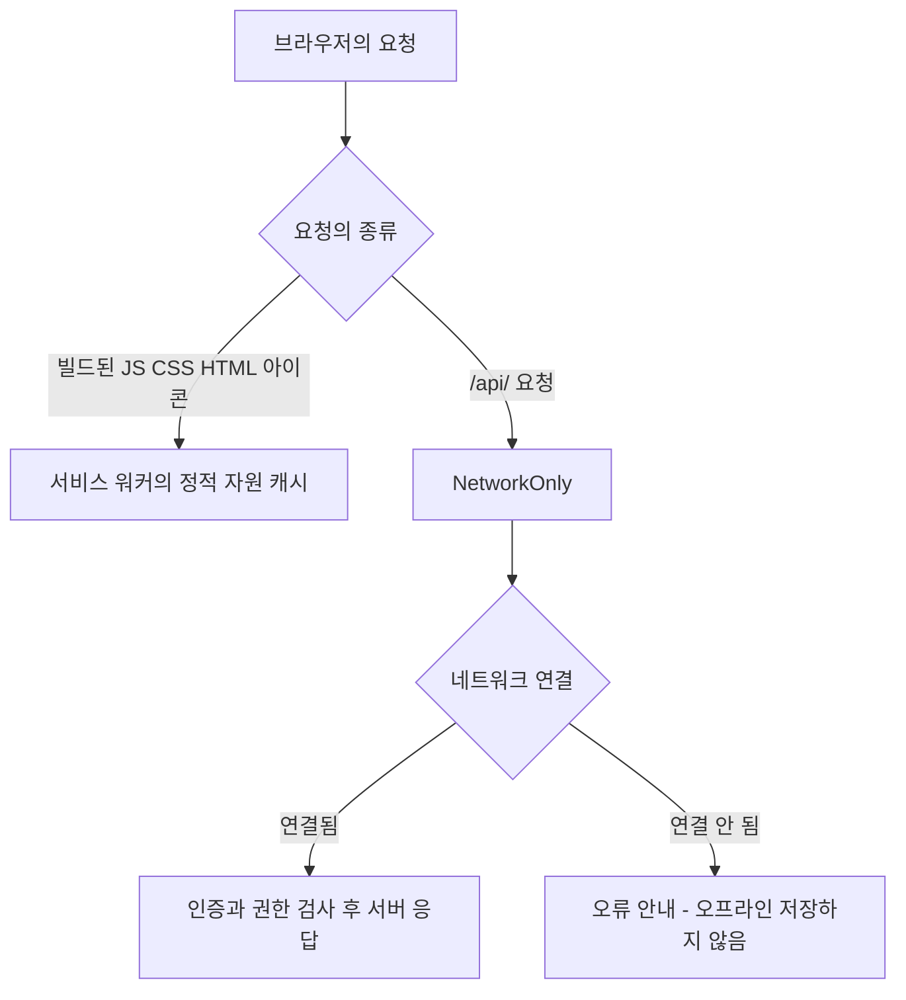

현재 설정은 정적 파일을 사전 캐시하고 API 경로에는 `NetworkOnly`를 사용합니다. API 경로를 HTML 탐색 fallback에서도 제외합니다. API 응답에는 서버 쪽 `no-store` 설정도 있습니다.

이것은 **취업 지원 정보가 서비스 워커 캐시에 남지 않도록 범위를 제한한 설계**입니다. 브라우저 메모리에 이미 표시된 내용까지 마법처럼 지워 주는 기능은 아닙니다. 로그인 확인 자체가 네트워크를 필요로 하므로, 비행기 모드에서 기존 모든 화면을 자유롭게 사용할 수 있다고 보장하지도 않습니다.

### 오프라인 쓰기를 아직 넣지 않은 이유

버튼 입력을 기기에 보관했다가 온라인일 때 보내려면 다음 문제를 먼저 풀어야 합니다.

1. 로그아웃 뒤에도 개인 메모를 기기에 보관할 것인가?
2. 같은 지원서를 다른 기기에서 수정했다면 어느 값을 보존할 것인가?
3. 네트워크 재시도 때문에 같은 지원서가 두 번 생성되지 않게 할 수 있는가?
4. 사용자는 지금 보는 값이 서버에 저장됐는지 구분할 수 있는가?

따라서 현재는 “설치 가능한 온라인 중심 앱”입니다. 오프라인 큐·동기화·충돌 해결은 **미구현**이며, 지원 관리라는 제품에 실제로 필요한지 확인한 뒤 투자합니다.

### 업데이트는 왜 사용자에게 알리는가

`registerType: 'prompt'`는 새 버전을 적용할 시점을 사용자에게 안내하는 방식입니다. 새로운 JS와 이전 화면 상태가 섞이는 문제를 줄이려는 목적입니다. 다만 현재 업데이트 적용은 새로고침으로 이어질 수 있으며 **작성 중인 폼의 미저장 내용에 대한 별도 보호가 완성됐다고 볼 수 없습니다**. 출시 전 업데이트 중 작성 내용이 사라지지 않는지 확인해야 합니다.

### 원스토어에 앱으로 내는 이유와 비용

앱 출시의 가능한 가치는 익숙한 설치 경로, 홈 화면 접근, 재방문 경험입니다. “스토어에 있다는 사실만으로 취업에 유리해서”보다 **사용자에게 설치 방식이 실제로 편리한가**를 근거로 삼는 것이 좋습니다.

| 선택 | 장점 | 추가 부담 | 현재 상태 |
|---|---|---|---|
| 웹만 운영 | 배포 경로가 단순함 | 설치·재방문 경험이 브라우저에 의존 | 현재 웹 기반 |
| PWA | 웹 코드 재사용, 설치형 창 | 브라우저·OS 지원 차이, 캐시 수명 관리 | 기본 구현 |
| TWA 기반 Android 패키지 | 검증된 웹 출처를 Android 앱 형태로 제공 | 도메인 연계, 서명, 패키지·스토어 검증 | 검토 대상 |
| Capacitor 기반 패키지 | 웹 코드와 네이티브 기능 연계 | 플러그인·브리지·빌드 유지보수 | 대안, 미도입 |
| 별도 네이티브 앱 | 플랫폼에 맞춘 깊은 제어 | 별도 UI·인력·검증 비용 | 현재 선택하지 않음 |

[Chrome TWA 공식 설명](https://developer.chrome.com/docs/android/trusted-web-activity)은 기술 구조를 이해하는 자료입니다. **TWA를 만들 수 있다는 것과 원스토어에서 현재 정책에 맞게 승인된다는 것은 다른 문제**입니다. 실제 출시 시점에 제출 형식·대상 SDK·개인정보 관련 요구사항·서명·도메인 검증을 공식 안내로 다시 확인해야 합니다. 현재 스토어 등록·심사·배포는 완료되지 않았습니다.

### 푸시 알림은 아직 없다

아래는 현재 코드가 아니라 향후 설계 예시입니다.

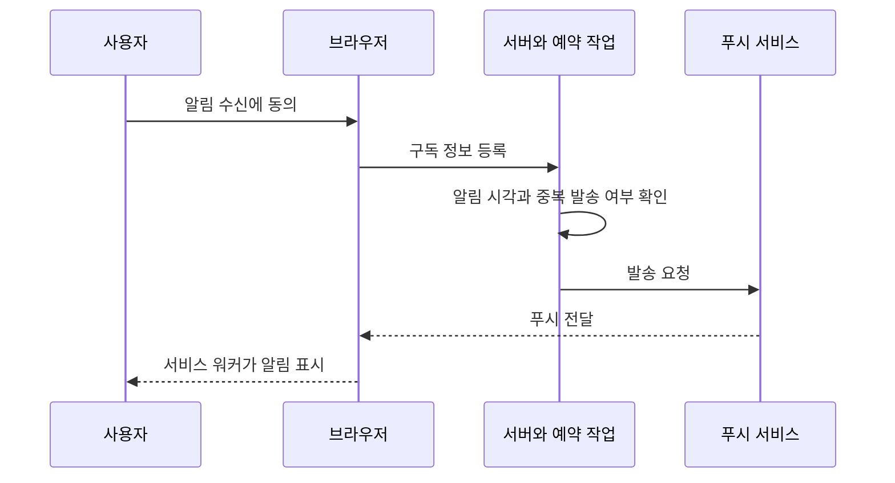

권한 동의, 시간대, 구독 만료, 중복 발송, 알림 내용의 개인정보 노출, 취소된 일정 처리까지 필요합니다. 화면의 시간이 갱신되는 것과 서버가 예약 알림을 보내는 것은 다릅니다.

### 확인 질문

PWA로 설치했으니 네트워크 없이 지원서를 작성해도 서버에 나중에 자동 저장될까요?

<details><summary>정답과 이유</summary>

아닙니다. 설치와 오프라인 쓰기는 다른 기능입니다. 현재 API는 NetworkOnly이고 오프라인 작업 큐가 없습니다. 연결 실패 시 저장 실패를 인식해야 합니다.

</details>

## 15. 테스트: 동작한다는 말을 증거로 바꾸기

### 세 종류의 질문

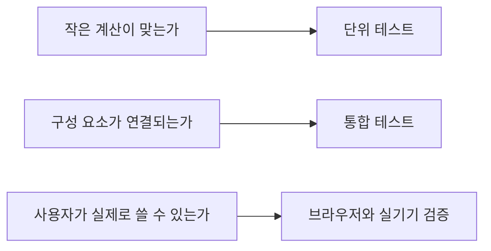

단위 테스트는 좁은 규칙을 빠르게 확인합니다. 통합 테스트는 실제 설정과 여러 계층의 연결을 확인합니다. 브라우저 검증은 화면·쿠키·네트워크·모바일 동작을 다룹니다. 어느 한 종류로 전부 대체할 수 없습니다.

### 현재 테스트 수와 의미

아래 수치는 최근 세션 인증 작업에서 기록된 통과 결과입니다. **이 학습 노트 작성 작업에서 애플리케이션 테스트를 새로 실행한 결과는 아닙니다.** 테스트 추가·삭제 후에는 다시 계산해야 합니다.

| 백엔드 테스트 클래스 | 개수 | 공부할 내용 |
|---|---:|---|
| ApiIntegrationTest | 12 | 회원·지원 API의 기본 동작과 실패 처리 |
| ScheduleIntegrationTest | 7 | 일정·지원일·버전 충돌 흐름 |
| SessionSecurityIntegrationTest | 11 | 실제 CSRF 조회와 세션 쿠키를 이용한 인증 보안 흐름 |
| SecureSessionCookieTest | 1 | Secure 쿠키 설정 확인 |
| JobtrackerApplicationTests | 1 | 테스트 설정으로 애플리케이션 구성 로딩 |
| ApplicationServiceTest | 8 | 서비스의 업무 규칙 |
| MemberServiceTest | 5 | 회원 서비스의 규칙 |
| **합계** | **45** | 전부가 보안 테스트라는 뜻은 아님 |

프론트는 Node 테스트 러너로 순수 도메인 함수 6개와 세션 API 클라이언트 4개, 총 10개를 검증했습니다. 린트·빌드·PWA 빌드 검증도 별도로 수행된 기록이 있습니다. 이것은 실제 갤럭시 S25 Ultra에서 설치부터 장기 사용까지 확인한 결과는 아닙니다.

### 단위 테스트의 Mock은 가짜 데이터와 다르다

Mockito의 Mock은 Repository 등의 행동을 통제하는 대역입니다. 예를 들어 “id 1을 찾으면 이 지원서를 반환한다”를 지정하고 서비스가 소유자를 확인하는지 볼 수 있습니다. DB가 없어도 규칙을 빠르게 검사할 수 있지만 **실제 SQL·트랜잭션·DB 제약까지 증명하지는 않습니다**.

`MockMvc`는 Spring MVC 요청 처리를 테스트하지만 실제 브라우저는 아닙니다. 쿠키 속성 문자열을 확인할 수 있어도, 배포 도메인의 SameSite 정책을 브라우저가 어떻게 적용하는지까지 대신 검증하지 않습니다.

### CSRF 테스트를 읽을 때 중요한 차이

기존 API 통합 테스트에는 Spring Security의 테스트용 `csrf()` 도우미를 사용하는 경로가 있습니다. 이는 업무 API를 테스트할 때 유용하지만, 프론트가 `/csrf`로 토큰을 얻고 쿠키와 함께 보내는 실제 연결을 그대로 검증하는 것은 아닙니다.

세션 보안 통합 테스트는 실제 CSRF 엔드포인트에서 응답과 쿠키를 받아 후속 요청에 전달합니다. 로그인 뒤 세션 ID 교체, 이전 CSRF 토큰 거절, 로그아웃 후 재사용 거절, 모든 기기 로그아웃·비밀번호 변경·탈퇴에 따른 폐기, 만료 및 잘못된 출처 등을 확인하는 이유입니다.

### 테스트 한 개를 읽는 순서

1. **Given:** 어떤 사용자·지원서·세션을 준비했는가?
2. **When:** 어떤 입력이나 요청을 보냈는가?
3. **Then:** 상태 코드뿐 아니라 DB·응답·후속 요청에서 무엇을 확인했는가?

예를 들어 “로그아웃 요청이 204다”만으로는 불충분합니다. 같은 옛 세션으로 `/me`를 호출했을 때 더 이상 인증되지 않는지까지 확인해야 로그아웃 목적에 가까운 테스트가 됩니다.

### 프론트 테스트는 왜 React 밖으로 꺼냈나

진행 중 판정, 일정 추출, 필터링을 `domain/tracker.js`에 두면 DOM을 만들지 않고 계산을 검증할 수 있습니다. API 클라이언트도 생성 함수로 분리해 요청 순서와 재시도 여부를 확인합니다. 이는 “파일 수를 늘리기”가 아니라 **규칙을 UI와 분리해 테스트 비용을 낮추려는 선택**입니다.

현재 Node 테스트만으로 버튼의 접근성, 모달 포커스, 잘리는 문구, 실제 새로고침 후 쿠키 동작까지 검증되지는 않습니다. 이 부분은 브라우저 및 실기기 검증이 필요합니다.

### CI와 CD를 혼동하지 않기

- CI: 변경한 코드를 자동으로 빌드·검사·테스트하는 과정.
- CD: 검증된 결과를 배포 환경에 전달하거나 실제 배포하는 과정.

저장소의 GitHub Actions 설정이 존재해도 해당 커밋의 원격 실행 성공을 확인하지 않았다면 “원격 CI도 통과했다”고 말하면 안 됩니다. CI 파일이 있다는 이유만으로 배포·DB 마이그레이션이 자동 완성되지도 않습니다.

### 남은 검증

일반 백엔드 55개, 프론트 10개, PostgreSQL 17개, 워크플로 테스트 13개와 실제 Chrome 주요 흐름이 통과했습니다. [CI 실행과 증거](../DEV_INTEGRATION_2026-09-28.md)를 참고합니다. HTTPS와 프록시 뒤 쿠키, 다중 서버 세션·요청 제한, 운영 데이터 복구, 실제 S25 Ultra 설치·업데이트·백그라운드 복귀, 접근성, 장기 데이터 증가 검증은 남아 있습니다. 테스트 수보다 **중요한 실패 상황을 얼마나 다루는지**가 중요합니다.

## 16. 실행·빌드·배포와 DB 변경

### 실행 버튼 뒤에서 일어나는 일

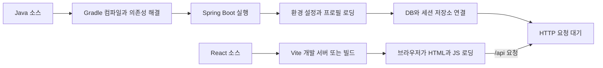

프론트 서버가 켜졌다는 사실만으로 백엔드·DB가 정상이라는 뜻은 아닙니다. 백엔드의 시작 로그만으로 실제 사용자 작업이 전부 성공한다는 뜻도 아닙니다.

### 현재 프로필의 차이

| 프로필 | 주된 DB | 스키마 정책 | 용도와 주의 |
|---|---|---|---|
| 기본 로컬 | MySQL | Hibernate update, 세션 테이블 초기화 설정 | 실제 로컬 DB를 변경할 수 있음 |
| demo | 파일 기반 H2 | 데모 설정으로 생성·갱신 | 학습용 별도 데이터, 파일 경로 주의 |
| test | 메모리 H2 | 테스트 전용 초기화 | 실제 운영 DB와 엔진이 다름 |
| prod | PostgreSQL | Hibernate validate, 세션 자동 초기화하지 않음 | 테이블·컬럼을 미리 준비해야 함 |

정확한 설정은 [application.yaml](C:/dev.project/personal.project/job-application-tracker/backend/src/main/resources/application.yaml), [application-demo.yaml](C:/dev.project/personal.project/job-application-tracker/backend/src/main/resources/application-demo.yaml), [테스트 application.yml](C:/dev.project/personal.project/job-application-tracker/backend/src/test/resources/application.yml), [application-prod.yaml](C:/dev.project/personal.project/job-application-tracker/backend/src/main/resources/application-prod.yaml)을 함께 읽습니다. 실행 시 환경변수와 IDE 설정이 값을 덮어쓸 수 있습니다. 테스트 환경은 별도 resources의 설정을 사용하므로, 위 표의 test는 테스트 실행 환경을 가리키며 반드시 이름이 test인 Spring 프로필을 뜻하지는 않습니다.

### update와 validate는 무엇이 다른가

`update`는 엔티티 정의에 맞춰 DB 구조를 바꾸려는 설정입니다. 편리하지만 변경 이력·검토·데이터 변환·롤백 전략을 대신하지 않습니다. `validate`는 구조가 기대와 맞는지 확인하고 맞지 않으면 시작을 실패시킵니다. **validate로 바꿨다고 운영 DB 변경 스크립트가 저절로 생기지 않습니다.**

이 프로젝트는 Flyway V1~V3 SQL과 PostgreSQL 마이그레이션·세션 테스트를 구현했습니다. 실제 PostgreSQL CI 17개가 통과했고 백업·복원과 체크섬 검증도 포함됩니다. 다만 운영 데이터로 이전 리허설을 하거나 실제 배포를 완료한 것은 아닙니다. [프로젝트 이전 절차](../POSTGRES_MIGRATION.md), [Flyway 마이그레이션 개념](https://documentation.red-gate.com/flyway/flyway-concepts/migrations)

앞으로 DB를 변경할 때도 지켜야 할 흐름은 아래와 같습니다.

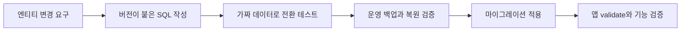

MySQL에서 PostgreSQL로 바꾸는 일은 URL만 바꾸는 일이 아닙니다. 날짜·타입·인덱스·제약·ID 시퀀스·대소문자·SQL 호환성·실제 데이터 이관을 검토해야 합니다.

### 학습용 실행 절차

**처음에는 진짜 계정과 실제 MySQL 데이터로 연습하지 마세요.** 아래는 Windows PowerShell에서 각각 실행하는 예입니다. 포트 8093과 5176은 예시이므로 이미 사용 중이면 다른 포트를 고릅니다. 알 수 없는 프로세스를 임의로 종료하지 않습니다.

포트 확인:

```powershell
Get-NetTCPConnection -LocalPort 8093,5176 -ErrorAction SilentlyContinue
```

백엔드용 터미널에서:

```powershell
Set-Location 'C:\dev.project\personal.project\job-application-tracker\backend'
.\gradlew.bat bootRun --args='--spring.profiles.active=demo --server.port=8093'
```

프론트용 별도 터미널에서:

```powershell
Set-Location 'C:\dev.project\personal.project\job-application-tracker\frontend'
$env:API_PROXY_TARGET = 'http://127.0.0.1:8093'
pnpm dev --host 127.0.0.1 --port 5176 --strictPort
```

브라우저에서 `http://127.0.0.1:5176`으로 접속합니다. 이 명령은 프론트 의존성이 설치되어 있고 Java 21·pnpm이 준비되어 있다는 전제입니다. `demo`도 파일 DB이므로 이전 데모 데이터가 남을 수 있습니다. 고유한 가짜 계정을 사용하고 실제 비밀번호를 재사용하지 않습니다.

개발 프록시는 `/api` 요청을 백엔드로 전달합니다. `API_PROXY_TARGET`을 바꿨다면 Vite를 재시작해야 합니다. 프록시 없이 백엔드의 다른 origin을 직접 호출하도록 구조를 바꾸면 CORS·쿠키 설정을 별도로 맞춰야 합니다.

### 검증 명령의 의미

백엔드 폴더에서:

```powershell
.\gradlew.bat test
```

프론트 폴더에서 각각 실행:

```powershell
pnpm test
pnpm lint
pnpm build
```

| 명령 | 알려 주는 것 | 알려 주지 않는 것 |
|---|---|---|
| gradlew test | 정의된 백엔드 테스트 결과 | 실제 운영 DB와 배포 전체의 안전 |
| pnpm test | 정의된 JS 테스트 결과 | 모든 화면의 사용성 |
| pnpm lint | 정적 코드 규칙 위반 | 모든 업무 규칙의 정답 |
| pnpm build | 배포 자원을 생성할 수 있는지 | 실제 API 연결·스토어 출시 성공 |

테스트 설정에 외부 DB 환경변수를 강제로 주입하거나 `prod`를 활성화하지 않습니다. 학습 단계에서는 테스트 클래스와 test 프로필을 먼저 읽고 실행합니다.

### 로컬 프록시와 운영 프록시는 다르다

Vite의 `server.proxy`와 `preview.proxy`는 Vite를 실행할 때의 기능입니다. 빌드한 정적 파일을 업로드했다고 같은 프록시가 운영에 생기지 않습니다. 현재 `vercel.json`은 SPA 경로를 `index.html`로 돌리는 설정이며, 그 자체로 운영 `/api` 프록시가 완성된 것은 아닙니다.

```mermaid
flowchart LR
  U[사용자 HTTPS 접속] --> P[운영 도메인과 리버스 프록시 - 구성 필요]
  P -->|정적 화면| F[프론트 배포 파일]
  P -->|/api| B[Spring Boot]
  B --> D[PostgreSQL과 세션 테이블]
```

위 그림은 목표 배포 구조입니다. EC2 전환은 아직 진행하지 않았습니다. 같은 origin 구성을 우선 검토하면 쿠키·CORS 복잡성을 줄일 수 있지만, 인증·CSRF·TLS·접근 제어가 필요 없어진다는 뜻은 아닙니다.

### .codex-merge-backup과 DB 백업

`.codex-merge-backup`은 병합 과정의 파일 보관용 폴더입니다. **현재 프로그램을 실행하는 소스 폴더와 다르고, MySQL/PostgreSQL DB의 복구 가능한 백업이라고 보장할 수 없습니다.** 어떤 파일이 언제 백업됐는지 실제 내용과 기록으로 확인해야 합니다.

현재 작업 기준 소스는 `C:\dev.project\personal.project\job-application-tracker`입니다. 다른 위치의 예전 실행 복사본이나 열린 브라우저 주소가 이 경로의 최신 파일을 실행한다는 증거는 아닙니다. 서버의 작업 디렉터리와 실행 명령을 확인해야 합니다.

## 17. 오류를 읽는 방법

### 실패한 층을 먼저 찾는다

```mermaid
flowchart TD
  A[문제 발생] --> B{서버가 시작했는가}
  B -->|아니오| C[컴파일 JDK 프로필 DB 포트 확인]
  B -->|예| D{브라우저 요청이 전송되는가}
  D -->|아니오| E[JS 오류 이벤트 폼 검증 확인]
  D -->|예| F{응답은 무엇인가}
  F -->|연결 실패| G[주소 포트 프록시 네트워크 확인]
  F -->|4xx| H[인증 권한 CSRF 입력 충돌 확인]
  F -->|5xx| I[서버 로그와 DB 오류 확인]
  F -->|2xx| J[응답 데이터와 화면 상태 갱신 확인]
```

### IntelliJ의 module not specified

Java 파일이 보인다고 IntelliJ가 Gradle 모듈을 올바르게 가져온 것은 아닙니다. `backend/build.gradle`을 Gradle 프로젝트로 연결했는지, Gradle JVM이 Java 21인지, 의존성 동기화가 끝났는지, 실행 설정의 모듈과 메인 클래스가 맞는지 확인합니다. 메인 클래스는 `com.bin.jobtracker.JobtrackerApplication`입니다.

### Spring 시작 로그를 읽는 순서

1. 어느 프로필로 실행됐는지 확인합니다.
2. DB 연결 실패나 테이블 검증 실패가 있는지 확인합니다.
3. `Started ...`와 실제 포트를 확인합니다.
4. 이후 요청에서 오류가 발생하지 않는지 확인합니다.

예외 로그는 긴 첫 줄보다 원인의 연결을 봅니다. `Caused by`의 마지막 부분에 단서가 있을 수 있지만, 무조건 마지막 한 줄만 보면 잘못 판단할 수 있습니다. 앞뒤 맥락과 첫 실패 시점을 함께 확인합니다. 로그 공유 전 비밀번호·접속 문자열의 비밀값·쿠키·토큰을 제거합니다.

### 401과 403을 기계적으로 해석하지 않기

401은 일반적으로 인증이 유효하지 않은 경우입니다. 403은 권한 또는 CSRF 등 요청 허용 조건을 통과하지 못했을 수 있습니다. 특히 현재 CSRF 필터가 세션 유효성 검사보다 먼저 동작하므로 인증되지 않은 변경 요청이 CSRF 부족으로 먼저 403을 받을 수 있습니다.

409는 중복 아이디 또는 수정 버전 충돌처럼 여러 원인이 있습니다. 상태 코드만 보지 말고 **어느 API인지, 응답 메시지와 기존 상태가 무엇인지** 함께 확인합니다.

### 금지하고 싶은 습관

- 로그인 오류를 없애려고 CSRF를 통째로 끄기.
- CORS 오류를 없애려고 모든 출처를 허용하기.
- DB 시작 오류를 없애려고 실제 데이터베이스를 삭제하기.
- 오래된 값으로 강제 저장해서 충돌을 감추기.
- 로그의 비밀값을 그대로 공개 저장소나 질문 게시판에 올리기.

대신 **재현 절차 → 예상 결과 → 실제 결과 → 관찰 증거 → 작은 가설 → 한 가지 변경 → 회귀 테스트**를 기록합니다. 이것이 디버깅 경험을 포트폴리오의 설명 가능한 경험으로 바꾸는 방법입니다.

## 18. 직접 해 보는 학습 실습

이 장은 읽기만 하는 노트를 자신의 지식으로 바꾸는 부분입니다. 모든 변경 실습은 별도 브랜치 또는 안전한 복사본과 가짜 계정·demo/test 데이터로 진행합니다. 답부터 펼치지 말고 예상 결과를 한 문장 써 보세요.

### 실습 1. 코드에서 주소 찾기

**목표:** 화면 주소와 API 주소를 구분합니다. 준비: 02·04장.

`App.jsx`에서 지원 목록 화면 경로를 찾고 `ApplicationController`의 클래스·메서드 매핑을 합쳐 목록 API 주소를 써 봅니다. 각각 실행하는 주체도 적습니다.

<details><summary>예상 답과 확인 기준</summary>

화면 `/applications`는 React Router가 담당합니다. 데이터 목록 `GET /api/v1/applications`는 Spring MVC가 담당합니다. 브라우저 주소창의 화면 이동과 개발자 도구 Network의 데이터 요청은 같은 일이 아닙니다.

</details>

### 실습 2. 지원 저장 요청 추적

**목표:** 계층을 이름만 외우지 않고 연결합니다. 준비: 06장, 가짜 계정.

회사명을 `학습회사`로 입력해 한 건을 저장합니다. 개발자 도구에서 메서드·URL·응답 상태·JSON 필드를 확인합니다. 비밀값은 복사하지 않습니다. Editor → API → Controller → Service → Repository/Entity → Response 순서로 해당 파일을 찾아 적습니다.

<details><summary>예상 답과 확인 기준</summary>

지원 생성은 POST, 성공은 201입니다. 프론트가 보낸 회사명과 서버가 응답한 회사명·ID를 비교합니다. CSRF 조회가 먼저 발생할 수 있습니다. 생성 응답뿐 아니라 목록 재조회에 새 데이터가 있는지도 확인합니다. 실패했다면 폼 검증, API 응답, 프록시 연결을 구분합니다.

</details>

### 실습 3. 진행 중 숫자 손으로 계산

**목표:** 제품 용어를 코드 조건으로 바꿉니다. 준비: 07·10장.

TO_APPLY 2건, APPLIED 3건, DOC_PASSED 1건, INTERVIEW 2건, ACCEPTED 1건, REJECTED 4건이 있습니다. 전체와 진행 중 숫자를 각각 계산하고 `isActive`와 대조합니다.

<details><summary>예상 답과 확인 기준</summary>

전체는 13건, 진행 중은 6건입니다. 진행 중은 APPLIED·DOC_PASSED·INTERVIEW만 포함합니다. 면접 예정은 INTERVIEW 상태 개수만으로 계산할 수 없습니다. 활성 지원에 속한 미래의 예약 면접 일정이 필요합니다.

</details>

### 실습 4. 지원일 표시 스위치의 범위

**목표:** 표시 상태와 서버 데이터를 구분합니다. 준비: 05·10장.

가짜 지원서에 지원일을 넣습니다. 캘린더에서 지원일을 보였다가 숨기고 지원 상세의 지원일을 확인합니다. Network에서 이때 지원서 삭제 요청이 발생하는지도 관찰합니다.

<details><summary>예상 답과 확인 기준</summary>

지원일 표시 설정은 필터이므로 지원서의 appliedDate를 삭제하지 않습니다. 표시 선호는 localStorage에 남을 수 있지만 서버 데이터는 그대로입니다. 데이터 수정 버튼과 표시 체크박스를 구분해 설명할 수 있으면 통과입니다.

</details>

### 실습 5. 상태와 일정을 독립적으로 다루기

**목표:** 지원 진행 상태와 시간 약속의 차이를 이해합니다. 준비: 07·08장.

가짜 지원서 상태를 면접으로 바꾸되 일정을 추가하지 않은 경우와, 미래 면접 일정을 추가한 경우를 비교합니다. 일정 하나를 취소한 뒤 상세·캘린더·면접 예정 숫자를 비교합니다.

<details><summary>예상 답과 확인 기준</summary>

상태만 면접이라고 미래 면접 예약이 생기지 않습니다. 취소된 일정은 상세에서 확인할 수 있지만 캘린더의 표시와 예정 판정에서는 제외됩니다. 한 지원서에 다른 유효한 미래 면접이 남아 있으면 면접 예정 지원 건수는 여전히 1일 수 있습니다.

</details>

### 실습 6. 쿠키와 토큰 역할 구분

**목표:** 인증 자료를 저장 장소로 설명합니다. 준비: 11장.

개발자 도구 Application/Storage에서 SESSION 쿠키의 속성 이름만 확인합니다. localStorage의 설정 키와 구분하고 `/csrf` 응답 필드 이름을 확인합니다. 실제 값은 노트·스크린샷·Git에 남기지 않습니다.

<details><summary>예상 답과 확인 기준</summary>

SESSION은 서버 세션을 가리키는 쿠키이며 HttpOnly입니다. CSRF 응답은 변경 요청 검증에 사용할 headerName과 token을 제공합니다. 테마·캘린더 표시 설정 및 탭 동기화 신호는 로그인 증명 자체가 아닙니다. 운영 Secure 설정과 로컬 HTTP 설정은 다를 수 있습니다.

</details>

### 실습 7. 현재 기기와 모든 기기 로그아웃

**목표:** 쿠키 제거와 서버 폐기를 구분합니다. 준비: 12장.

가짜 계정으로 일반 창과 별도 브라우저 프로필에 로그인합니다. 먼저 일반 로그아웃이 다른 프로필에 미치는 영향을 관찰합니다. 다시 로그인하고 모든 기기 로그아웃 뒤 다른 프로필에서 서버 요청을 발생시킵니다.

<details><summary>예상 답과 확인 기준</summary>

일반 로그아웃은 현재 세션을 종료합니다. 모든 기기 로그아웃은 authVersion 변경과 세션 정리로 다른 세션도 더 이상 유효하지 않게 합니다. 다른 기기의 열린 화면이 즉시 지워지는 서버 푸시 기능은 없으므로 다음 서버 요청에서 확인합니다. 같은 프로필의 두 탭은 같은 쿠키를 공유하므로 서로 다른 기기 실험과 다릅니다.

</details>

### 실습 8. 버전 충돌 테스트 읽기

**목표:** 오래된 저장이 거절되는 이유를 설명합니다. 준비: 08·15장.

ScheduleIntegrationTest에서 버전 충돌을 다루는 테스트를 찾습니다. 읽은 버전, 먼저 저장한 버전, 나중 요청이 보낸 버전을 종이에 적습니다. 테스트 데이터로 실행해 409가 예상대로 발생하는지 확인합니다.

<details><summary>예상 답과 확인 기준</summary>

처음 version 0을 읽은 두 편집자 중 한 명이 저장해 현재 버전이 바뀌면, 나머지 편집자의 version 0 요청은 오래된 정보입니다. 새 값을 다시 읽고 사용자가 수정 내용을 재검토해야 합니다. 요청 version을 무조건 최신으로 덮어써서 재시도하면 보호 목적을 훼손할 수 있습니다.

</details>

### 실습 9. 입력 검증 경계 추가하기

**목표:** 작은 변경을 테스트와 함께 소유합니다. 준비: 06·15장.

연습 브랜치에서 회사명 최대 길이 경계에 대한 테스트를 찾아 읽거나 추가합니다. 현재 한도인 100자와 초과한 101자를 사용합니다. 서버와 화면의 제한 위치를 각각 확인합니다. 이 실습에서는 제품의 제한값을 임의로 바꿀 필요가 없습니다.

<details><summary>예상 답과 확인 기준</summary>

유효한 나머지 필드와 인증·CSRF가 준비되어 있다면 100자는 길이 조건을 만족하고 101자는 서버 검증에서 거절되어야 합니다. 프론트에서 입력을 막아도 서버 검증은 필요합니다. 테스트가 403이면 길이보다 CSRF/권한 준비가 먼저 실패했을 가능성이 있습니다.

</details>

### 실습 10. PWA를 비행기 모드에서 관찰

**목표:** 캐시와 저장 성공을 구분합니다. 준비: 14장, 빌드 결과를 실행하는 안전한 로컬 환경.

설치 가능한 환경에서 정상 접속 후 개발자 도구의 오프라인 모드를 사용합니다. 앱 껍데기 표시, 로그인 확인, 목록 요청, 저장 시도 결과를 구분해 기록합니다. 작업 후 오프라인 모드를 반드시 해제합니다.

<details><summary>예상 답과 확인 기준</summary>

정적 파일은 캐시에서 제공될 수 있지만 API는 네트워크가 필요합니다. 접속 이력·서비스 워커 활성 상태·현재 메모리에 따라 화면은 달라질 수 있습니다. 핵심은 저장 성공으로 오인하지 않는지이며, 현재 자동 동기화를 기대하면 안 됩니다. Vite 개발 모드만으로 운영 PWA 동작을 모두 확인할 수 없습니다.

</details>

### 실습 11. 오류 보고서 작성

**목표:** 도움을 요청할 수 있을 만큼 상황을 구조화합니다. 준비: 17장.

가짜 데이터 환경에서 백엔드 주소를 잘못 설정한 프론트를 실행해 연결 실패를 관찰합니다. 재현 단계, 기대 결과, 실제 결과, 포트와 프로필, 비밀을 제거한 메시지를 정리한 뒤 설정을 원래대로 복구하고 재시작합니다.

<details><summary>예상 답과 확인 기준</summary>

연결 실패는 잘못된 비밀번호의 401과 다릅니다. 주소/포트/프록시를 확인해야 하며 CSRF를 끄는 해결책은 맞지 않습니다. 같은 절차로 정상 복구를 확인할 수 있어야 실습이 끝납니다.

</details>

### 실습 12. 한 기능을 3분 동안 설명하기

**목표:** AI 설명을 자신의 설명으로 바꿉니다. 준비: 지금까지 읽은 장.

“면접 일정 수정” 하나를 골라 화면 입력, 요청 필드, 인증·소유권 확인, 버전 충돌, DB 저장, 응답 후 화면 갱신, 실패 안내를 그림 한 장과 함께 설명합니다. 처음에는 노트를 봐도 됩니다. 다음에는 코드 위치만 보고 설명합니다.

<details><summary>자기 평가 기준</summary>

용어를 많이 말했는지보다 왜 그런 경계를 두었는지 설명했는지 봅니다. 상대가 “다른 사람의 일정 ID를 보내면?”, “다른 탭이 먼저 저장하면?”, “응답만 끊기면?”이라고 물었을 때 구현과 한계를 구분할 수 있으면 좋습니다. 모르겠는 부분은 표시하고 해당 테스트를 다시 읽습니다.

</details>

## 19. 기술 선택을 설명하고 다음 개발을 결정하기

### 이유를 나중에 꾸며 내지 않기

처음 모든 언어와 도구를 직접 비교해 선택한 것이 아니라면 그렇게 말할 필요가 없습니다. “기존 Java/Spring·React 프로젝트를 이어받아 구조를 분석했고, 이 요구에는 기존 생태계를 유지하는 편이 변경 비용이 낮아 유지했다. 이후 세션·일정 모델 등의 대안을 비교하고 테스트했다”는 설명이 더 정확합니다.

AI를 활용했다는 사실보다 중요한 것은 **어떤 제안을 받아들였고 무엇을 검증했으며 어떤 위험을 인지하는가**입니다. 이 문서를 읽었다는 사실만으로 모든 코드의 저자가 되거나 숙련도가 증명되는 것은 아닙니다. 실습과 작은 수정의 기록을 쌓으면 자신이 책임지고 설명할 수 있는 범위가 커집니다.

### 면접 답변 예시와 후속 질문

| 질문 | 이 프로젝트에 맞는 답변의 뼈대 | 이어서 준비할 질문 |
|---|---|---|
| 왜 Java/Spring인가요? | 기존 서버와 타입·계층 구조를 유지하고 Security/JPA 생태계를 활용했습니다 | 어떤 규칙을 컴파일러가 못 막나요? |
| 왜 React인가요? | 폼·필터·달력처럼 상호작용이 많은 화면을 상태와 컴포넌트로 구성했습니다 | 서버 상태와 화면 상태는 어떻게 다른가요? |
| 왜 세션으로 바꿨나요? | 로그인 폐기와 기기별 세션을 서버에서 관리하고 JS 저장 토큰을 없애려 했습니다 | CSRF·DB 조회 비용은 어떻게 처리하나요? |
| 왜 Redis를 안 썼나요? | 현재 규모에서는 기존 DB를 사용하는 JDBC 세션으로 별도 운영 요소를 줄였습니다 | 부하가 커지면 무엇을 측정하나요? |
| 왜 일정 테이블을 나눴나요? | 지원 한 건에 여러 면접·마감과 각 상태가 필요했습니다 | 이전 단일 날짜는 어떻게 유지하나요? |
| 왜 낙관적 잠금인가요? | 오래된 편집의 덮어쓰기를 탐지하면서 긴 사용자 편집 동안 DB 잠금을 잡지 않으려 했습니다 | 모든 변경 API에 적용됐나요? |
| 왜 PWA인가요? | 기존 웹을 재사용하며 반복 접근의 설치 경험을 검증하려 했습니다 | 오프라인 저장과 푸시는 구현됐나요? |
| 보안은 충분한가요? | 요청 제한 등 기본 방어와 회귀 테스트는 있지만 출시 전 프록시·다중 서버·운영 검증이 남아 있습니다 | 가장 먼저 막을 위험은 무엇인가요? |

답을 그대로 외우기보다 실제 코드 한 곳과 테스트 한 개를 각 답에 붙여 보세요.

### 남은 일의 우선순위

| 순서 | 작업 | 완료 증거 | 아직 선택하지 않을 이유 |
|---|---|---|---|
| 1 | 현재 흐름 학습·문서와 코드 일치 유지 | 실습 1~8을 설명하고 재현 | 이해 없이 새 기술을 더하면 추적이 어려움 |
| 2 | 구현한 요청 제한·입력 제한의 운영 검증 | 프록시·부하·다중 인스턴스 조건 테스트 | 단일 서버 테스트만으로 충분하다고 가정하지 않기 |
| 3 | 구현한 Flyway·백업 복원의 운영 데이터 리허설 | 별도 운영 복제 DB 전환과 복구 | CI 테스트만으로 배포하지 않기 |
| 4 | HTTPS 동일 출처 배포·쿠키 검증 | 실제 도메인에서 로그인·폐기·CSRF 테스트 | 로컬 프록시 결과로 운영 성공을 추정하지 않기 |
| 5 | S25 Ultra PWA 사용성·업데이트 검증 | 설치·재접속·오프라인 실패·작성 중 업데이트 기록 | 설치만 확인하고 완성이라 하지 않기 |
| 6 | 관측·오류 대응·접근성·개인정보 운영 정리 | 복구 절차와 사용자 흐름 검증 | 운영 책임도 제품 일부임 |
| 7 | 스토어 패키징 방식 확정 및 제출 준비 | 실제 정책 대조·서명·테스트 트랙 검증 | 아직 등록·출시 완료 아님 |
| 8 | 푸시·동기화·외부 공고 연동 등 확장 | 사용자 필요와 유지비에 대한 근거 | 기능 수를 늘리는 것 자체가 목적 아님 |

EC2·Redis·TypeScript를 도입한다면 각각 별도 결정 기록을 남깁니다. Flyway 선택 이유는 [ADR 0003](../adr/0003-release-foundation.md)에 기록했습니다. “취업에 좋아 보이는 이름”만으로 추가하지 않습니다. 사용자가 늘기 전에도 필요한 보안·복구 작업과, 실제 부하를 보고 결정할 규모 확장 작업을 구분합니다.

### 작은 개발 기록 양식

```text
문제: 사용자가 어떤 상황에서 불편하거나 위험한가?
현재 동작: 관련 화면 / API / 데이터 / 테스트
대안: 적어도 두 가지와 유지보수 비용
선택: 지금의 제약에서 선택한 이유
구현: 바꾼 파일과 주요 규칙
검증: 성공 / 실패 / 경계 상황의 증거
남은 한계: 아직 보장하지 않는 것
다시 검토할 조건: 규모 / 요구 / 장애 / 비용의 변화
```

## 20. 헷갈리는 용어 사전

| 용어 | 이 프로젝트에서의 뜻 | 연결 장 |
|---|---|---|
| 클라이언트 | 화면을 실행하고 API를 요청하는 브라우저 | 02 |
| 서버 | 요청을 받고 규칙을 적용하는 Spring Boot 프로세스 | 02 |
| HTTP | 요청과 응답을 주고받는 규약 | 02 |
| HTTPS | TLS로 전송 구간을 보호하는 HTTP | 13·16 |
| Origin | 스킴·호스트·포트의 조합 | 02·13 |
| API | 클라이언트가 서버 기능을 호출하는 계약 | 04·21 |
| JSON | 요청·응답에 사용하는 데이터 표현 형식 | 02 |
| JavaScript | 브라우저의 상호작용과 프론트 로직을 작성한 언어 | 02 |
| Java | 서버 로직을 작성한 별개의 언어 | 02 |
| JSX | JS 코드 안에서 UI 구조를 표현하는 문법 | 02·09 |
| 컴포넌트 | 화면 일부와 그 동작을 묶는 단위 | 09 |
| Props | 부모가 자식 컴포넌트에 전달하는 입력 | 09 |
| State | 변화에 따라 화면을 다시 계산하게 하는 값 | 09 |
| Effect | 외부 시스템과 동기화하는 React 처리 | 09 |
| Context | 컴포넌트 트리에 값을 공유하는 통로 | 09 |
| Router | 화면 URL에 맞는 컴포넌트를 선택하는 도구 | 09·10 |
| DTO | 요청·응답의 공개 데이터 형식 | 04 |
| Entity | DB에 영속되는 도메인 객체의 매핑 | 05 |
| Controller | HTTP 입력·출력과 서비스 호출을 연결하는 계층 | 04 |
| Service | 업무 규칙과 트랜잭션 경계를 맡는 계층 | 04·06 |
| Repository | DB 조회·저장 접근을 추상화한 계층 | 04 |
| DI | 필요한 객체를 외부에서 제공하는 방식 | 04 |
| Annotation | 프레임워크 등에 의미를 전달하는 Java 메타데이터 | 04 |
| ORM | 객체와 관계형 DB 사이를 매핑하는 방식 | 03·05 |
| JPA | Java 영속성 관련 표준 API | 03 |
| Hibernate | 이 프로젝트에서 JPA를 구현하는 라이브러리 | 03 |
| PK / FK | 행의 식별자 / 다른 테이블 행을 가리키는 키 | 05 |
| Transaction | 여러 DB 작업의 성공·실패를 묶는 단위 | 06 |
| Dirty Checking | 관리 중인 엔티티의 변경을 감지하는 기능 | 06 |
| Flush / Commit | SQL 반영 시도 / 트랜잭션 확정 | 06 |
| Lazy Loading | 연관 데이터가 필요할 때 조회하는 방식 | 05 |
| N+1 | 기본 조회 뒤 항목마다 추가 조회가 생기는 현상 | 05 |
| Cascade / orphanRemoval | 객체 연관 작업 전파 / 관계에서 제거된 자식 삭제 | 05 |
| @Version | 오래된 데이터 편집 충돌을 탐지할 엔티티 버전 | 08 |
| authVersion | 회원 세션의 유효성을 비교하는 인증 세대 값 | 11·12 |
| Authentication | 누구인지 확인하는 인증 | 11 |
| Authorization | 해당 작업을 허용할지 판단하는 인가 | 06·11 |
| Principal | 인증된 사용자의 식별 정보 | 11 |
| Session | 서버가 유지하는 로그인 등의 상태 | 11 |
| Cookie | 브라우저가 규칙에 따라 저장·전송하는 작은 값 | 11 |
| HttpOnly | JavaScript의 직접 쿠키 읽기를 제한하는 속성 | 11 |
| Secure | 쿠키를 보안 연결에서 전송하도록 제한하는 속성 | 11 |
| SameSite | 사이트 간 요청의 쿠키 전송을 제한하는 속성 | 11 |
| CSRF | 로그인된 브라우저의 원치 않는 변경 요청 유도 | 11·13 |
| XSS | 공격자 스크립트가 서비스 문맥에서 실행되는 문제 | 13 |
| CORS | 브라우저의 교차 출처 응답 접근에 관한 정책 | 13 |
| BCrypt | 비밀번호 검증용 해시 알고리즘 | 11 |
| JWT | 서명된 클레임을 담는 토큰 형식, 현재 인증 방식 아님 | 11 |
| localStorage | 같은 origin에서 JS로 접근하는 기기 내 저장소 | 09 |
| Optimistic Lock | 충돌이 드물다고 보고 버전으로 충돌을 탐지하는 방식 | 08 |
| Pessimistic Lock | 동시 DB 작업을 잠금으로 직렬화하는 방식 | 12 |
| Idempotency | 같은 요청을 반복해도 의도한 효과가 중복되지 않는 성질 | 06 |
| PWA | 웹에 설치·서비스 워커 등의 경험을 결합하는 접근 | 14 |
| Manifest | 웹 앱의 이름·아이콘·실행 정보 | 14 |
| Service Worker | 페이지와 별도로 브라우저가 관리하는 스크립트 | 14 |
| Cache | 재사용을 위해 저장해 둔 응답 또는 자원 | 14 |
| TWA | 검증된 웹 출처를 Android 앱에서 제공하는 기술 | 14 |
| Profile | 실행 환경에 따라 선택하는 Spring 설정 묶음 | 16 |
| Migration | DB 구조·데이터 변경을 관리하는 절차 | 16 |
| CI / CD | 자동 통합 검증 / 배포 전달·실행 과정 | 15 |
| Mock | 테스트에서 동작을 통제하는 대역 | 15 |
| Regression | 변경으로 과거의 정상 동작이 깨지는 현상 | 15·17 |

## 21. API와 코드 찾아보기

### 회원 API

아래 경로의 공통 접두사는 `/api/v1/members`입니다. 공개 API라도 변경 메서드의 CSRF 검증은 별개입니다. 실제 실패 코드는 입력·CSRF·인증 중 어느 단계가 먼저 실패했는지에 따라 달라질 수 있습니다.

| 메서드·경로 | 로그인 필요 | 정상 응답 | 목적 |
|---|---|---|---|
| GET /csrf | 아니오 | 200, headerName·token | 변경 요청에 사용할 CSRF 조회 |
| GET /check-username?username=... | 아니오 | 200 또는 중복 409 | 아이디 중복 확인 |
| POST /join | 아니오, CSRF 필요 | 201 | 회원가입 |
| POST /login | 아니오, CSRF 필요 | 200, 회원 정보 | 인증 후 세션 저장 |
| POST /logout | 아니오, CSRF 필요 | 204 | 현재 세션 종료 |
| POST /logout-all | 예, CSRF 필요 | 204 | 전체 세션 폐기 |
| GET /me | 예 | 200, 회원 정보 | 로그인 상태와 프로필 확인 |
| PATCH /me/nickname | 예, CSRF 필요 | 200, 회원 정보 | 닉네임 변경 |
| PATCH /me/avatar | 예, CSRF 필요 | 200, 회원 정보 | 아바타 변경, 현재 화면 편집 UI는 없음 |
| PATCH /me/password | 예, CSRF 필요 | 204 | 현재 비밀번호 확인 후 변경·세션 폐기 |
| DELETE /me | 예, CSRF 필요 | 204 | 현재 비밀번호 확인 후 탈퇴 |

### 지원·일정 API

공통 접두사는 `/api/v1/applications`입니다. 모두 로그인 필요, 모든 변경 요청에 CSRF 필요, 개별 데이터 작업에 회원 소유권 확인이 필요합니다. 아래의 `id`는 지원 ID입니다.

| 메서드·경로 | 정상 응답 | 핵심 |
|---|---|---|
| GET / | 200, 지원 목록 | 로그인 회원의 전체 지원 목록 |
| POST / | 201, 지원 정보 | 지원 생성 |
| GET /stats | 200, 상태별 개수 | 서버 통계, 현재 홈 계산은 프론트 기반 |
| GET /{id} | 200, 지원 정보 | 개별 조회 |
| PUT /{id} | 200, 지원 정보 | 전체 편집, version 확인 |
| PATCH /{id}/status | 200, 지원 정보 | 상태 변경, 지원일 규칙 적용 |
| DELETE /{id} | 204 | 지원 삭제 |
| POST /{id}/schedules | 201, 지원 정보 | 일정 추가 |
| PUT /{id}/schedules/{scheduleId} | 200, 지원 정보 | 일정 편집, version 확인 |
| DELETE /{id}/schedules/{scheduleId} | 204 | 일정 삭제 |
| PUT /{id}/legacy-schedules/{type} | 200, 지원 정보 | 기존 날짜 필드를 새 일정으로 대체 |
| DELETE /{id}/legacy-schedules/{type} | 204 | 기존 날짜 필드 제거 |

목록·생성의 `/` 표기는 컨트롤러 루트라는 뜻입니다. 실제 클라이언트는 `/api/v1/applications`를 사용하며 끝 슬래시의 허용 여부를 임의로 가정하지 않습니다. 일정 추가·수정은 일정 하나만이 아니라 갱신된 지원 정보를 응답합니다.

### 공부할 파일의 순서

모든 파일을 처음부터 끝까지 읽는 것보다 질문에 맞는 세로 흐름을 읽습니다.

| 질문 | 시작 파일 | 함께 볼 위치 |
|---|---|---|
| 화면은 어디로 이동하나? | [App.jsx](C:/dev.project/personal.project/job-application-tracker/frontend/src/App.jsx) | pages, components |
| 숫자와 달력 조건은 어디 있나? | [tracker.js](C:/dev.project/personal.project/job-application-tracker/frontend/src/domain/tracker.js) | 같은 폴더 테스트 |
| 요청은 어떻게 인증되나? | [SecurityConfig.java](C:/dev.project/personal.project/job-application-tracker/backend/src/main/java/com/bin/jobtracker/config/SecurityConfig.java) | security 패키지, MemberController |
| 로그인은 무엇을 저장하나? | [MemberController.java](C:/dev.project/personal.project/job-application-tracker/backend/src/main/java/com/bin/jobtracker/controller/MemberController.java) | MemberService, SessionPrincipal, SessionService |
| 저장 규칙은 어디 있나? | [ApplicationService.java](C:/dev.project/personal.project/job-application-tracker/backend/src/main/java/com/bin/jobtracker/service/ApplicationService.java) | ApplicationController, dto, entity, repository |
| 데이터 구조는 무엇인가? | [Application.java](C:/dev.project/personal.project/job-application-tracker/backend/src/main/java/com/bin/jobtracker/entity/Application.java) | Member, ScheduleEvent, BaseEntity |
| 현재 비밀번호 변경은 어떻게 하나? | [MemberService.java](C:/dev.project/personal.project/job-application-tracker/backend/src/main/java/com/bin/jobtracker/service/MemberService.java) | MemberRepository의 잠금, SessionService |
| PWA는 무엇을 보관하나? | [vite.config.js](C:/dev.project/personal.project/job-application-tracker/frontend/vite.config.js) | PwaStatus, public/icons |
| 라이브러리 버전은 어디 있나? | [build.gradle](C:/dev.project/personal.project/job-application-tracker/backend/build.gradle), [package.json](C:/dev.project/personal.project/job-application-tracker/frontend/package.json) | pnpm-lock.yaml, Gradle 의존성 결과 |
| 자동 검증은 무엇을 실행하나? | [ci.yml](C:/dev.project/personal.project/job-application-tracker/.github/workflows/ci.yml) | backend/src/test, frontend/src의 test 파일 |

주요 DTO를 읽을 때는 이름만 보지 말고 `@NotBlank`, `@Size`, `@NotNull`, `@PastOrPresent`, `@AssertTrue`와 필드별 조건을 비교합니다. `ApplicationCreateRequest`, `ApplicationUpdateRequest`, `StatusUpdateRequest`, `ScheduleRequest`, `JoinRequest`, `LoginRequest`, `PasswordUpdateRequest`, `AccountDeleteRequest`가 좋은 출발점입니다.

`source`, `externalJobId` 같은 필드가 있다는 사실만으로 외부 채용 API 연동이 구현됐다고 판단하지 않습니다. API·서비스·실제 호출·테스트까지 연결되어 있어야 기능 구현의 증거가 됩니다.

## 22. 이전 노트 반영표와 학습 체크리스트

### 이전 학습 노트의 내용은 어디로 갔나

이전 `PROJECT_STUDY_GUIDE.md`의 주제를 누락하지 않되, 현재 코드와 충돌하는 부분은 현재 사실로 바꾸고 과거 방식은 비교 설명으로 남겼습니다. 아래 표는 문장 단위 복사가 아니라 **주제별 통합·보강 위치**입니다. 이전 문서는 역사 자료로 보존하며 현재 동작의 기준은 이 노트와 실제 코드입니다.

| 이전 노트 주제 | 새 노트 위치 | 보강한 점 |
|---|---|---|
| 1. 프로젝트 목적 | 00·01 | 사용 문제와 기술 선택을 연결 |
| 2. 전체 구조 | 02·04·06 | 웹 기초와 요청 시퀀스 추가 |
| 3. 기술 스택 | 03·19 | 대안·비용·유지 이유 추가 |
| 4. 데이터 모델 | 05·08 | 세션 테이블·두 종류 버전 구분 |
| 5. 회원가입·JWT 로그인 | 11·12 | JWT는 과거, 현재 JDBC 세션·CSRF 설명 |
| 6. 지원 CRUD·상태 | 06·07 | 검증·소유권·트랜잭션·실패 처리 |
| 7. 복수 일정 | 08 | 기존 데이터 호환·동시 수정 범위 |
| 8. 홈 집계·검색 | 09·10 | 상태·URL·정확한 집계 조건 |
| 9. 캘린더 | 10 | 지원일 표시와 데이터 저장 구분 |
| 10. 설정 | 09·12 | 전체 로그아웃·탈퇴·기기 간 차이 |
| 11. 충돌·오류 | 06·08·17 | flush와 commit, 재현 절차 |
| 12. PWA·앱 출시 | 14·19 | 구현/미구현과 선택 비용 분리 |
| 13. DB·실행 | 16 | prod validate와 마이그레이션 공백 |
| 14. 테스트·보안 | 13·15 | 최근 테스트 범위와 운영 위험 |
| 15. 변경 전후 | 00·11·22 | 과거 JWT와 현재 세션 명확화 |
| 16. 학습 질문·자료 | 각 장·18·20·22 | 실습 12개, 해설, 용어 사전 |

### 지금 기준으로 고쳐 기억할 내용

| 과거 설명 또는 쉬운 오해 | 현재 정확한 이해 |
|---|---|
| localStorage JWT가 현재 인증이다 | 현재는 HttpOnly 세션 쿠키와 서버 JDBC 세션 |
| CSRF는 비활성화돼 있다 | 현재 변경 요청의 CSRF 검증이 활성화됨 |
| 비밀번호를 바꿔도 기존 인증은 그대로다 | authVersion 갱신과 세션 정리로 기존 로그인 폐기 |
| 운영 DB는 자동 update면 된다 | 현재 prod는 validate, 마이그레이션 준비는 별도 필요 |
| 백엔드 33개·프론트 6개가 최신 결과다 | 현재 일반 백엔드 55개·프론트 10개, 별도 PostgreSQL 17개·워크플로 13개 통과 |
| 모든 Vercel 출처를 허용한다 | 현재 정확한 출처 목록과 운영 환경값 필요 |
| 모든 변경에 버전 충돌 방지가 있다 | 지원 전체 수정·일정 수정 중심, 다른 경로까지 일반화하면 안 됨 |
| 7일 쿠키는 서버의 절대 7일 로그인 한도다 | 서버는 유휴 만료 기준, 절대 수명 제한은 미구현 |
| PWA 설치가 되니 오프라인 저장·푸시도 된다 | 현재 정적 캐시·설치·업데이트 안내, 나머지는 별도 기능 |
| 구현됐으니 공개 서비스로 안전하다 | 실제 운영 배포·부하·분산 제한·운영 데이터 복구·실기기 검증이 남음 |

### 공식 문서를 읽는 순서

1. [Java 학습](https://dev.java/learn/): 타입·클래스·메서드를 이해할 때.
2. [HTTP 개요](https://developer.mozilla.org/en-US/docs/Web/HTTP/Guides/Overview): 요청·응답을 연결할 때.
3. [Thinking in React](https://react.dev/learn/thinking-in-react): 컴포넌트·상태 경계를 나눌 때.
4. [Spring Data JPA 트랜잭션](https://docs.spring.io/spring-data/jpa/reference/jpa/transactions.html): 저장 범위를 이해할 때.
5. [Spring Security 6.5 세션 관리](https://docs.spring.io/spring-security/reference/6.5/servlet/authentication/session-management.html): 인증 결과의 저장·세션 교체를 읽을 때.
6. [Spring Security 6.5 CSRF](https://docs.spring.io/spring-security/reference/6.5/servlet/exploits/csrf.html): 쿠키 인증의 요청 보호를 읽을 때.
7. [Spring Session JDBC](https://docs.spring.io/spring-session/reference/configuration/jdbc.html): 세션을 DB에 저장하는 구성을 읽을 때.
8. [OWASP Authentication Cheat Sheet](https://cheatsheetseries.owasp.org/cheatsheets/Authentication_Cheat_Sheet.html): 실패 메시지·요청 제한 등 보안 검토 시.
9. [OWASP Session Management Cheat Sheet](https://cheatsheetseries.owasp.org/cheatsheets/Session_Management_Cheat_Sheet.html): 쿠키·수명·폐기 검토 시.
10. [Vite PWA](https://vite-pwa-org.netlify.app/guide/), [서비스 워커](https://developer.mozilla.org/en-US/docs/Web/API/Service_Worker_API), [TWA](https://developer.chrome.com/docs/android/trusted-web-activity): 설치·캐시·패키징을 구분할 때.

공식 문서의 최신 예제가 현재 프로젝트의 정확한 의존성 버전과 항상 같지는 않습니다. 오류가 나면 프로젝트 버전과 문서 버전을 먼저 대조합니다. 외부 문서의 설명은 원문을 통째로 옮기지 않았으며, 이 노트의 프로젝트 동작 설명은 로컬 소스 검토를 기준으로 작성했습니다.

### 스스로 표시하는 학습 단계

각 항목에 `아직 낯섦 / 노트를 보면 설명 가능 / 코드로 설명 가능 / 수정하고 검증 가능` 중 하나를 적습니다. 처음부터 마지막 단계일 필요는 없습니다.

- [ ] 화면 URL과 API URL을 구분한다.
- [ ] 지원 저장을 브라우저부터 DB까지 따라간다.
- [ ] DTO·Entity·Service·Repository를 나눈 이유를 설명한다.
- [ ] 지원 상태·지원일·면접 일정을 구분한다.
- [ ] 홈 숫자와 캘린더의 조건을 손으로 계산한다.
- [ ] React state·URL·localStorage·DB의 역할을 구분한다.
- [ ] 인증·인가·CSRF·CORS를 구분한다.
- [ ] 세션 ID·CSRF 토큰·authVersion·@Version을 구분한다.
- [ ] 로그아웃·모든 기기 로그아웃·비밀번호 변경의 차이를 설명한다.
- [ ] 테스트 하나에서 준비·행동·검증을 찾는다.
- [ ] PWA의 현재 기능과 미구현 기능을 구분한다.
- [ ] 로컬 실행·빌드·운영 배포의 차이를 설명한다.
- [ ] 아직 안전하다고 보장하지 못하는 부분을 숨기지 않고 설명한다.
- [ ] 작은 변경 하나를 직접 수행하고 회귀 테스트를 남긴다.

**마지막으로:** 이 프로그램의 모든 줄을 한 번에 외우는 것이 목표는 아닙니다. 중요한 기능을 설명하고, 의심이 생기면 코드와 테스트에서 확인하고, 변경의 영향을 예상할 수 있는 능력이 목표입니다. 모르는 부분을 정확히 짚을 수 있게 되는 것부터 이미 학습의 진전입니다.
